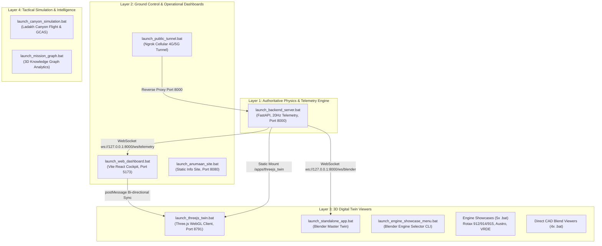

# VOLUME 09 // STARTUP, RUNTIME ORCHESTRATION & BATCH LAUNCHER ENCYCLOPEDIA
## DRDO MALE UAV Aero-Piston Engine Digital Twin (SIH Problem Statement 26054)

---

## 1. Executive Summary & Orchestration Topology
Project ANUMAAN is an enterprise-grade cyber-physical digital twin designed for Smart India Hackathon (SIH) Problem Statement 26054. Because the platform bridges high-frequency numerical engine physics (20 Hz), deep learning prognostics, 3D WebGL / Blender visualization, ground control station telemetry, and tactical mission simulation, it is structured into modular runtimes.

The repository provides **23 automated Windows batch launchers (`.bat`)** that handle environment verification, dependency resolution, port collision detection, UTF-8 console enforcement, GPU flag injection, and process orchestration.

---

## 2. Recommended Startup Order for Demo & Evaluation

For a seamless demonstration to DRDO scientists, DGQA certifiers, or hackathon judges, launch components in the following chronological sequence:

### Sequence Step 1: The Core Backend Server
* **Launcher:** `launch_backend_server.bat`
* **Command:** `uvicorn backend.server.main:app --host 0.0.0.0 --port 8000`
* **Role:** Initializes the 20 Hz multi-engine physics daemon, the Bayesian/LSTM prognostic pipeline, fault injection engine, audio synthesis subsystem, and the WebSocket telemetry broadcaster.
* **Health Check:** Open `http://127.0.0.1:8000/api/health` or `http://127.0.0.1:8000/docs`.

### Sequence Step 2: The Tactical Web Cockpit & Ground Control Station
* **Launcher:** `launch_web_dashboard.bat`
* **Command:** `npm run preview -- --host 0.0.0.0 --port 5173` (with fallback to `npm run dev`)
* **Role:** Serves the responsive React TypeScript GCS. Includes real-time dial gauges, multi-engine runtime console, voice copilot, fault injection trigger bar, and the embedded 3D WebGL Digital Twin viewport.
* **Access Point:** `http://127.0.0.1:5173` on desktop or laptop; available on local LAN Wi-Fi for tablets/smartphones.

### Sequence Step 3: High-Fidelity 3D Visualizer (Choose One)
* **Choice 3A (Embedded WebGL):** Simply use the 3D viewport already embedded inside the Web GCS at `http://127.0.0.1:5173`.
* **Choice 3B (Dedicated Three.js Window):** Run `launch_threejs_twin.bat`. Launches an isolated GPU-accelerated window on port 8791 with full Draco-compressed CAD geometry and thermal gradient shaders.
* **Choice 3C (Photorealistic Native Blender Twin):** Run `launch_engine_showcase_menu.bat` or `launch_standalone_app.bat` to drive Blender's EEVEE real-time viewport directly via the live telemetry WebSocket.

---

## 3. Comprehensive Reference of All 23 Batch Files

Below is the complete dictionary of every batch file in the repository, detailing its purpose, port assignments, prerequisites, and runtime options:

### 1. `launch_backend_server.bat`
* **Component:** Authoritative FastAPI Digital Twin Server & Multi-Engine Hub.
* **Address:** `http://127.0.0.1:8000` (Localhost) and `http://0.0.0.0:8000` (LAN).
* **Dependencies:** Python 3.10+, `fastapi`, `uvicorn`, `websockets`, `pydantic`.
* **Features:**
  - Enforces `PYTHONUTF8=1` to prevent Unicode encoding crashes on Windows cmd.
  - Automatically executes `scripts\check_backend_port.ps1` to detect and safely clear stale processes occupying port 8000.
  - Exposes REST routes, OpenAPI documentation at `/docs`, and WebSocket channels `/ws/telemetry` and `/ws/blender`.
  - Statically serves Three.js twin (`/apps/threejs_twin/`), 3D models (`/assets/`), and flight logs (`/reports/`).

### 2. `launch_web_dashboard.bat`
* **Component:** React + Vite Tactical Ground Control Station (GCS) Cockpit.
* **Address:** `http://127.0.0.1:5173`.
* **Dependencies:** Node.js 18+, npm packages in `frontend/`.
* **Features:**
  - Verifies `node_modules` existence; executes `npm install` if missing.
  - Compiles optimized production bundle via `npm run build` and serves with `vite preview` for maximum framerate stability.
  - Contains tactile aircraft controls: Master Ignition, Starter, FADEC Lane A/B Selectors, Throttle Lever, Voice Copilot, and Multi-Engine Switcher.

### 3. `launch_threejs_twin.bat`
* **Component:** Dedicated Three.js WebGL Hardware-Accelerated 3D Visualizer.
* **Address:** `http://localhost:8791`.
* **Arguments Supported:**
  - `--engine <id>`: Specifies initial engine (`rotax_912is`, `rotax_914`, `rotax_915is`, `austro_ae300`, `vrde_jayem_2_2l`).
  - `--port <number>`: Overrides default port 8791.
  - `--kiosk`: Launches in borderless fullscreen kiosk mode.
  - `--max`: Launches window maximized.
  - `--uncapped-fps`: Disables browser VSync cap for high-refresh displays.
  - `--quality ultra|high|medium|low`: Controls MSAA samples and shadow resolution.
* **Features:**
  - Launches Chrome or Edge in clean app mode (`--app=http://localhost:8791`) with discrete GPU priority flags (`--force_high_performance_gpu`).
  - Automatically starts lightweight Python HTTP server on port 8791.
  - Listens to bi-directional `postMessage` events (`SELECT_ENGINE`, `SELECT_STATION`, `SET_FAULT`, `TOGGLE_THERMAL`, `TOGGLE_EXPLODED`).

### 4. `launch_anumaan_site.bat`
* **Component:** Project ANUMAAN Static Presentation Site & Documentation Portal.
* **Address:** `http://localhost:8080`.
* **Features:**
  - Serves static assets from `web/site/` using Python's built-in `http.server`.
  - Automatically opens default web browser to the homepage.
  - Provides presentation slides, system architecture diagrams, and problem statement documentation.

### 5. `launch_public_tunnel.bat`
* **Component:** Ngrok Global Public Internet Tunnel.
* **Target:** Bridges local port 8000 to public HTTPS URL (`https://*.ngrok-free.app`).
* **Features:**
  - Allows mobile devices anywhere in the world over 4G/5G cellular networks to connect to the backend server without requiring local Wi-Fi pairing.
  - Uses `tools\ngrok.exe` if present, with automatic fallback to `npx -y ngrok http 8000`.

### 6. `launch_engine_showcase_menu.bat`
* **Component:** Interactive Console Engine Selector for Native Blender Showcases.
* **Features:**
  - Displays a clean ANSI CLI menu to launch any of the 5 aero engines into Blender.
  - Option [1]: Rotax 912 iS Sport (100 HP)
  - Option [2]: Rotax 914 F Turbocharged (115 HP)
  - Option [3]: Rotax 915 iS Turbo / Intercooled (141 HP)
  - Option [4]: Austro Engine AE300 Turbodiesel (180 HP)
  - Option [5]: DRDO VRDE / Jayem 2.2L Indigenous Turbodiesel (180 HP)
  - Option [6]: Master Showcase (Interactive Switcher)
  - Option [7]: Opens offline renders directory in Windows Explorer.

### 7. `launch_standalone_app.bat`
* **Component:** Master Blender 3D Digital Twin Client (`standalone_digital_twin_app.py`).
* **Target Asset:** `assets/blender/rotax_912_is_sport.blend`.
* **Features:**
  - Discovers installed Blender versions (Blender 5.2, 5.1, 5.0, 4.2 or system PATH).
  - Pings `http://127.0.0.1:8000/api/health`; automatically launches `launch_backend_server.bat` in a background window if offline.
  - Connects to `ws://127.0.0.1:8000/ws/blender` to receive 20 Hz telemetry and drive real-time propeller rotation, cylinder temperature thermal coloring, and fault highlighting.
  - Viewport Hotkeys: `1`-`5` Focus Subsystems, `0` Reset Assembly, `T` Toggle Thermal Mode, `ESC` Exit.

### 8. `launch_rotax_912is_showcase.bat`
* **Component:** Rotax 912 iS Sport 3D Technical Showcase in Blender.
* **Target Blend:** `assets/blender/anumaan_master_twin.blend` (Engine ID: `rotax_912is`).
* **Inspection Stations:**
  - `[1]` Propeller Reduction Gearbox (2.43:1 ratio) & Overload Clutch.
  - `[2]` Dual Airbox, Throttle Body & Twin Injectors per Cylinder.
  - `[3]` Stainless 4-into-2 Tuned Scavenging Exhaust Headers.
  - `[4]` Dual-Channel Rockwell Collins / Rotax ECU (Lane A / Lane B).
  - `[5]` Dry Sump Lubrication Tank & External Oil Radiator.

### 9. `launch_rotax_914_showcase.bat`
* **Component:** Rotax 914 F Turbocharged 3D Technical Showcase in Blender.
* **Target Blend:** `assets/blender/anumaan_master_twin.blend` (Engine ID: `rotax_914`).
* **Inspection Stations:**
  - `[1]` Reduction Gearbox & Aircraft Mounting Flange.
  - `[2]` Dual Induction Manifold & Composite Airbox.
  - `[3]` Stainless Equal-Length Scavenging Exhaust Runners.
  - `[4]` Integrated Garrett Turbocharger & Electric Servomotor Wastegate.
  - `[5]` Rotax Turbo Control Unit (TCU) & Telemetry Sensors.

### 10. `launch_rotax_915is_showcase.bat`
* **Component:** Rotax 915 iS Turbocharged/Intercooled 3D Showcase in Blender.
* **Target Blend:** `assets/blender/anumaan_master_twin.blend` (Engine ID: `rotax_915is`).
* **Inspection Stations:**
  - `[1]` Reinforced Prop Reduction Gearbox (2.54:1 ratio).
  - `[2]` Air-to-Air Intercooler Subsystem & High-Pressure Charge Piping.
  - `[3]` Dual Tuned Stainless Inconel Exhaust Manifolds.
  - `[4]` High-Pressure Ratio Turbocharger Subsystem.
  - `[5]` Fully Redundant FADEC ECU with Triple Sensor Cross-Checking.

### 11. `launch_austro_ae300_showcase.bat`
* **Component:** Austro Engine AE300 / AE330 Turbodiesel Showcase in Blender.
* **Target Blend:** `assets/blender/anumaan_master_twin.blend` (Engine ID: `austro_ae300`).
* **Inspection Stations:**
  - `[1]` Bosch 1600 bar Common Rail High-Pressure Injection Subsystem.
  - `[2]` Variable Geometry Turbocharger (VGT) & Electronic Actuator.
  - `[3]` Dual Redundant EECS (Electronic Engine Control System).
  - `[4]` Liquid-Cooled Cylinder Head & Integrated Oil/Water Heat Exchanger.
  - `[5]` Integrated Heavy-Fuel Aircraft Gearbox & Torsional Vibration Damper.

### 12. `launch_vrde_jayem_2_2l_showcase.bat`
* **Component:** DRDO VRDE / Jayem 2.2L Indigenous Turbodiesel Showcase in Blender.
* **Target Blend:** `assets/blender/anumaan_master_twin.blend` (Engine ID: `vrde_jayem_2_2l`).
* **Inspection Stations:**
  - `[1]` Indigenous Common Rail High-Pressure Fuel Rail (Military Heavy Fuel).
  - `[2]` High-Altitude Sequential 2-Stage Turbocharger Subsystem.
  - `[3]` Mil-Spec Dual Redundant FADEC (MIL-STD-1553B / ARINC 429 Bus).
  - `[4]` Integrated Starter-Generator (ISG) & 28V DC Mil-Power Bus.
  - `[5]` Structural Dry Sump Oil Pan & Scavenge Pump Array.

### 13-17. Engine Quick-Launch Aliases
* **`launch_rotax_912is.bat`**: Direct shortcut to boot master twin with `rotax_912is`.
* **`launch_rotax_914.bat`**: Direct shortcut to boot master twin with `rotax_914`.
* **`launch_rotax_915is.bat`**: Direct shortcut to boot master twin with `rotax_915is`.
* **`launch_austro_ae300.bat`**: Direct shortcut to boot master twin with `austro_ae300`.
* **`launch_vrde_jayem_2_2l.bat`**: Direct shortcut to boot master twin with `vrde_jayem_2_2l`.

### 18-21. Direct CAD Blender Viewports
* **`launch_rotax_914_cad.bat`**: Opens `assets\blender\rotax_914.blend` in Blender GUI.
* **`launch_rotax_915_cad.bat`**: Opens `assets\blender\rotax_915is.blend` in Blender GUI.
* **`launch_austro_ae300_cad.bat`**: Opens `assets\blender\austro_ae300.blend` in Blender GUI.
* **`launch_vrde_jayem_2_2l_cad.bat`**: Opens `assets\blender\vrde_jayem_2_2l.blend` in Blender GUI.

### 22. `launch_canyon_simulation.bat`
* **Component:** Tactical Ladakh Canyon MALE UAV Flight Simulator (Native Blender).
* **Script:** `apps/blender_twin/standalone_canyon_flight_app.py` over `assets/models/terrain.blend`.
* **Features:**
  - Real-time rigid-body flight aerodynamics and 3D terrain collision detection.
  - Ground Collision Avoidance System (Auto-GCAS) that actively pulls up if the UAV approaches canyon walls or valley floor below 200 ft AGL.
  - Dynamically computes high-altitude density altitude effects (15,000 ft Himalayan Ladakh plateau) on turbocharger wastegate duty cycle and manifold air pressure.
  - Flight Controls: `W/S` Pitch, `A/D` Turn, `E/Q` Throttle, `7/8/9/0` Speed presets, `C` Copilot, `R` Reset, `ESC` Exit.

### 23. `launch_mission_graph.bat`
* **Component:** 3D Post-Mission Knowledge Graph Explorer (Native Blender).
* **Script:** `apps/mission_graph_viewer/standalone_mission_graph_app.py`.
* **Features:**
  - Scans `report_dump/` for post-mission flight telemetry and failure logs.
  - Renders an interactive 3D node-link knowledge graph visualizing relationships between Mission Sorties, Sensor Outliers, Anomaly Signatures, MIL-STD-1553 Failures, and Maintenance Rectifications.
  - Controls: Left Mouse Drag to Orbit, Left Click Node to inspect metadata, Scroll Wheel to Zoom, `R` to rescan folder.

---

## 4. Operational Checklist Before Demonstration

1. **Verify Python & Node Environments:**
   - Run `python --version` (should be Python 3.10, 3.11, or 3.12).
   - Run `node --version` (should be Node.js 18+).
2. **Confirm Network Binding:**
   - Both `launch_backend_server.bat` and `launch_web_dashboard.bat` bind to `0.0.0.0`, allowing any tablet or smartphone on the same Wi-Fi access point to connect directly via your computer's LAN IP.
3. **Audio Check for Voice Copilot:**
   - Ensure system speakers or headphones are enabled to hear real-time synthetic speech alerts and audio engine acoustic signatures.
