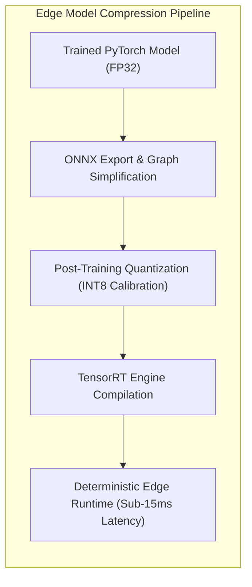

# Volume VI: Avionics Hardware, Edge AI & System Interfaces
**Embedded Systems, Sensor Observability, CAN Communication & Aerospace Edge Deployment**

---

## 1. Avionics Data Communication Buses

Real-world military UAVs utilize a tiered hierarchy of avionics data buses balancing deterministic timing, fault tolerance, noise immunity, and payload throughput.

```mermaid
graph TD
    subgraph AvionicsBusHierarchy["UAV Avionics Bus Architecture"]
        EngineECU["Rotax Engine FADEC / TCU"] <-->|CAN 2.0B / CAN-FD<br/>(500 kbps - 1 Mbps)| OnboardEdge["Onboard Edge AI Computer<br/>(SocketCAN Linux / RTOS)"]
        FlightSensors["Airframe Sensors & IMU"] <-->|RS-422 / ARINC 429| Autopilot["Flight Control Computer (FCC)"]
        
        OnboardEdge <-->|Ethernet 100BASE-T1 / UDP| Autopilot
        Autopilot <-->|High-Level Telemetry| DatalinkModem["Tactical Datalink Modem<br/>(C-Band LOS / SATCOM)"]
        
        DatalinkModem -.->|RF Link (STANAG 4586)| GroundAntenna["GCS Tactical Terminal"]
        GroundAntenna -->|Ethernet TCP/IP| GCS_DT["GCS Digital Twin Workstation"]
    end
```

### 1.1 The CAN Bus Protocol (ISO 11898-1/2 & SocketCAN)
The Controller Area Network (CAN) bus is the standard physical interface for aero-piston engine ECUs:
* **Physical Layer (ISO 11898-2)**: Differential two-wire twisted pair (`CAN_H` and `CAN_L`) terminated with $120 \text{ }\Omega$ resistors at each end. High common-mode noise rejection, critical in aircraft where ignition spark coils generate massive electromagnetic interference (EMI).
* **Signaling**:
  - Dominant State (Bit 0): `CAN_H` driven to $3.5 \text{ V}$, `CAN_L` pulled to $1.5 \text{ V}$ ($\Delta V = 2.0 \text{ V}$).
  - Recessive State (Bit 1): Both lines float at $2.5 \text{ V}$ ($\Delta V = 0.0 \text{ V}$).
* **Arbitration**: Non-destructive bitwise arbitration based on message identifiers. Lower numerical IDs have higher priority (e.g. `0x100` emergency engine shutdown preempts `0x350` oil temperature gauge).
* **CAN 2.0B vs. CAN-FD**:
  - *CAN 2.0B*: 11-bit standard or 29-bit extended ID; maximum payload of **8 bytes per frame**; fixed bit rate up to $1 \text{ Mbps}$.
  - *CAN-FD (Flexible Data-rate)*: Payload expanded up to **64 bytes per frame**; data phase can switch up to $5 \text{ Mbps}$, drastically reducing bus load and latency.
* **The Linux SocketCAN Subsystem**:
  In modern Linux-based edge computers, CAN controllers are integrated into the Linux network protocol stack as network devices (`can0`, `can1`). Telemetry acquisition uses standard BSD socket APIs (`AF_CAN`, `SOCK_RAW`), providing zero-copy ring buffering, multi-threaded access, and DBC (Database Container) schema parsing via libraries such as `cantools`.

---

## 2. Sensor Observability & Minimum Viable Sensor Suite

An engine fault cannot be diagnosed unless it produces a measurable disturbance in the sensor observability subspace. The following matrix details the definitive sensor suite for MALE UAV aero-piston engines:

| Sensor Type | Physical Parameter | Meas. Range | Bandwidth / Sampling Rate | Precision / Tolerance | Physical Placement | Primary Fault Observability | Redundancy Architecture |
| :--- | :--- | :--- | :--- | :--- | :--- | :--- | :--- |
| **Hall-Effect / Variable Reluctance** | Engine Speed (RPM) & Crank Angle | 0 to 7,000 RPM | 60 pulses/rev (Trigger Wheel) | $\pm 1 \text{ RPM}$ | Crankshaft flywheel nose | Misfire, torsional vibration, governor hunting, power loss. | **Dual Lane** (Independent Lane A / Lane B pick-up coils). |
| **Piezoresistive Transducer** | Manifold Absolute Pressure (MAP) | 0.2 to 2.5 bar abs | 10 to 50 Hz | $\pm 0.01 \text{ bar}$ | Intake manifold plenum | Turbo wastegate failure, air filter clogging, induction leak. | Dual redundant sensors with cross-plausibility checking. |
| **Type-J / RTD Thermocouple** | Cylinder Head Temperature (CHT 1–4) | $-40^\circ\text{C}$ to $+200^\circ\text{C}$ | 1 to 5 Hz | $\pm 1.5^\circ\text{C}$ | Cylinder head spark plug well / coolant jacket | Thermal runaway, cooling pump cavitation, localized boiling. | 4 independent channels (1 per head); analytical observer fallback. |
| **Type-K Inconel Thermocouple** | Exhaust Gas Temperature (EGT 1–4) | $+200^\circ\text{C}$ to $+1,000^\circ\text{C}$| 5 to 10 Hz | $\pm 3.0^\circ\text{C}$ | Exhaust runner (75 mm from exhaust port) | Injector clogging, lean/rich misfire, valve burning, ignition slip. | 4 independent channels (1 per runner); cross-cylinder parity. |
| **Piezoresistive Isolated Transducer**| Oil Pressure | 0 to 10 bar | 10 to 50 Hz | $\pm 0.05 \text{ bar}$ | Main crankcase oil gallery | Journal bearing failure, relief valve sticking, pump aeration. | Critical safety redline; dual sensor channels recommended. |
| **NTC Thermistor / PT100** | Oil Temperature | $-20^\circ\text{C}$ to $+150^\circ\text{C}$ | 1 to 5 Hz | $\pm 0.5^\circ\text{C}$ | Oil tank exit / main gallery inlet | Thermal oxidation, oil cooler thermostat failure, bearing heat. | Single primary channel + cross-correlation with CHT trend. |
| **Pelton Turbine / Coriolis** | Fuel Flow Rate | 2 to 50 Liters/hr | 5 to 10 Hz | $\pm 0.5\%$ of reading | In-line fuel feed before fuel rail | Fuel pump degradation, vapor lock, systemic leak, BSFC drift. | In-line flowmeter backed by ECU injector pulse-width integrator. |
| **Tri-Axial High-Temp Piezoelectric**| Structural Vibration (Accelerometry)| $\pm 50 \text{ g}$ | 5 kHz to 20 kHz | $\pm 2.0\%$ | Crankcase top spine & reduction gearbox casing | Propeller unbalance ($1\times$), bearing spalling, piston slap, gear pitting.| Onboard edge processing (FFT/Kurtosis extraction); raw bursts. |
| **Hall Current Sensor / Voltage Divider**| Battery Voltage & Alternator Current | 0–32 V / $\pm 50 \text{ A}$ | 10 to 20 Hz | $\pm 0.1 \text{ V} / \pm 0.5 \text{ A}$| Main avionics DC bus & alternator stator feed | Alternator rectifier failure, battery cell degradation, brownout. | Dual battery bus monitoring. |

---

## 3. Edge Computing vs. GCS Allocation (SWaP-C Optimization)

A critical architectural decision is **where the intelligence runs**: onboard the UAV in real time, or at the Ground Control Station (GCS) via telemetry downlink.

```mermaid
graph LR
    subgraph OnboardEdge["Onboard UAV Edge Computing (SWaP-C Constrained)"]
        RawCAN["High-Speed CAN & Vibration (10 kHz)"] --> FastProc["Edge DSP & Feature Extraction"]
        FastProc --> MisfireEdge["Deterministic Misfire & Knock Detector (Real-Time Safety)"]
        FastProc --> Compress["Data Compression & Health Vector Encoding"]
    end

    subgraph Downlink["Tactical Datalink"]
        Compress -->|Downlink Stream (9.6 - 64 kbps)| RF["RF / SATCOM"]
    end

    subgraph GCSCompute["Ground Control Station (High Compute Server)"]
        RF --> Jitter["Jitter Buffer & Decoder"]
        Jitter --> FullTwin["Full-Fidelity 0D/1D Thermodynamic Digital Twin"]
        FullTwin --> DeepAI["Deep Transformers, RUL Survival Models & XAI"]
        DeepAI --> HMI["Operator Dashboard & 3D Mission Replay"]
    end
```

### 3.1 The SWaP-C Trade-Off Matrix
* **Onboard Edge Constraints (Size, Weight, Power, and Cost)**:
  - Weight: $\le 1.5 \text{ kg}$ (avionics bay allocation).
  - Power: $\le 25 \text{ W}$ continuous DC draw (drawn from $28 \text{ V}$ aircraft bus).
  - Cooling: Conduction cooling via aluminum casing mounted to aircraft frame; zero cooling fans (fans fail at high altitudes due to low air density).
  - Hardware: NVIDIA Jetson Orin Nano / NX, NXP i.MX8M Plus, or Xilinx Zynq UltraScale+ MPSoC (FPGA + ARM Cortex-A53).
* **Onboard Edge Tasks**:
  1. High-frequency vibration spectral analysis (running FFT and spectral kurtosis onboard, because transmitting $20 \text{ kHz}$ raw waveform over a $32 \text{ kbps}$ datalink is impossible).
  2. Immediate, deterministic misfire and knock protection (sub-50 ms intervention).
  3. Feature extraction and lossy compression of telemetry vectors for downlink.
* **GCS Server Tasks**:
  1. Full-fidelity 0D/1D thermodynamic digital twin execution.
  2. Multi-hour RUL degradation modeling using deep Temporal Transformers and survival models.
  3. Interactive 3D mission replay and human-machine interface rendering.
  4. Fleet-level multi-engine aggregation and historical trend databases.

---

## 4. Edge AI Model Optimization & Real-Time Determinism

To run deep learning models (such as autoencoders and 1D-CNNs) on an embedded edge computer without violating real-time execution deadlines, models undergo strict mathematical optimization:



### 4.1 Post-Training Quantization (INT8 Affine Quantization)
Deep learning parameters and activations are mapped from 32-bit floating point to signed 8-bit integers:
$$q = \text{clamp}\left( \text{round}\left( \frac{x}{S} \right) + Z, \; -128, 127 \right)$$
* **Impact**: Reduces model memory footprint by **75%** (e.g. from 120 MB down to 30 MB) and enables execution on hardware Tensor Cores.
* **Accuracy Preservation**: By using Kullback-Leibler (KL) divergence minimization during quantization calibration on representative flight logs, model accuracy drops by less than $0.5\%$.

---

## 5. Datalinks, Bandwidth Constraints & Cybersecurity

### 5.1 Tactical Datalink Protocols (STANAG 4586)
* **STANAG 4586**: The NATO and international standard for Unmanned Control System (UCS) interoperability.
* **Telemetry Bandwidth Allocation**: In military MALE UAVs, the primary datalink bandwidth is monopolized by high-definition video feeds (FLIR/EO/IR turrets) and SAR radar streams. The bandwidth allocated for flight control and propulsion telemetry is strictly throttled to **$9.6 \text{ kbps to } 64 \text{ kbps}$**.
* **Telemetry Serialization**: Telemetry frames are serialized using Google Protocol Buffers (Protobuf) or FlatBuffers, compressing multi-channel sensor vectors down to 64 bytes per packet at 10 Hz, consuming only $5.12 \text{ kbps}$ of channel capacity.

### 5.2 Cybersecurity & Adversarial Robustness
In contested electronic warfare environments, propulsion telemetry is a high-value target for hostile electronic interception, jamming, and spoofing.
1. **Sensor Replay / Spoofing Defense**: Adversaries injecting false CAN messages claiming normal oil pressure while the physical engine is seizing. The digital twin detects this via **Physical Plausibility Cross-Checking**: injected false sensor states violate thermodynamic conservation laws ($P_{\text{oil}}$ cannot remain at 5.0 bar if $T_{\text{oil}} = 150^\circ\text{C}$ and RPM is decaying).
2. **Cryptographic Integrity**: Telemetry packets transmitted over RF datalinks are authenticated using **HMAC-SHA256** and encrypted with **AES-256-GCM**, providing authenticated encryption that prevents packet injection or man-in-the-middle manipulation.
