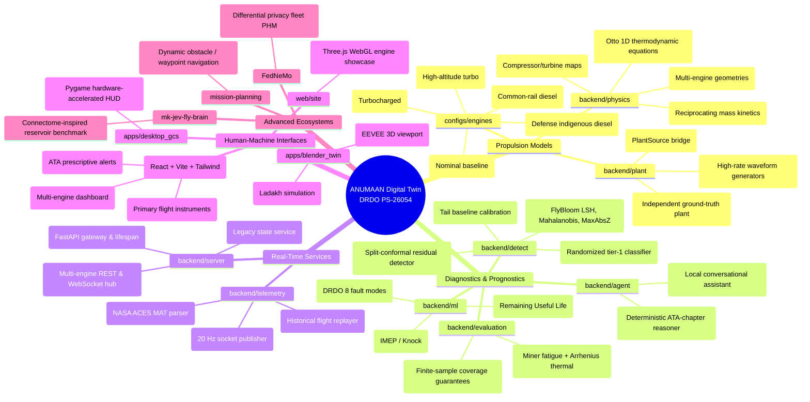

# ANUMAAN — Component Correlation Matrix & Universal Mind Maps
**DRDO / SIH Problem Statement ID: 26054**

---

## Universal Project Mind Map

The visual diagram below maps every major directory and functional package in the repository into its respective systems engineering domain:

---

## Detailed Cross-Module Traceability Matrix

The following matrix provides comprehensive architectural correlation, mapping each subsystem's inputs, outputs, execution rate, and internal dependencies:

| Subsystem / Module | Source File(s) | Upstream Producer (Inputs) | Downstream Consumer (Outputs) | Cadence / Trigger | Data Contract | Primary Role in System |
|---|---|---|---|---|---|---|
| **Virtual Plant** | [`backend/plant/virtual_engine.py`](file:///e:/backup-llm/backup-no-llm/3d_engine/backend/plant/virtual_engine.py) | Operator control levers (throttle, altitude, OAT) + Injected fault modes | `RuntimeHub` & `PlantSource` | 20 Hz (simulated 1s/tick) | `Frame` + `TruthRecord` | Generates ground-truth physics with independent manufacturing variation and sensor noise. |
| **Thermodynamic Observer** | [`backend/physics/thermo_model.py`](file:///e:/backup-llm/backup-no-llm/3d_engine/backend/physics/thermo_model.py) | Raw `Frame` telemetry channels | `ResidualDetector` & legacy streamer | Per-tick / On-demand | `EnginePhysicalState` | Calculates first-principles theoretical CHT, EGT, MAP, and fuel mass flow baselines. |
| **Residual Detector** | [`backend/detect/detector.py`](file:///e:/backup-llm/backup-no-llm/3d_engine/backend/detect/detector.py) | Incoming `Frame` from plant or hardware | `RuntimeHub`, WebSocket, Tier 1 Classifier | 20 Hz synchronous | `DetectionResult` | Performs split-conformal anomaly detection with explainable leading residual channels. |
| **Persistence Gate** | [`backend/detect/detector.py`](file:///e:/backup-llm/backup-no-llm/3d_engine/backend/detect/detector.py) | Raw boolean alarm from scorers | `ResidualDetector.confirmed` | Per-tick evaluation | Boolean confirmation | Filters out transient spikes using a sliding window ($k=3$ of $n=5$ frames). |
| **Runtime Hub** | [`backend/runtime/hub.py`](file:///e:/backup-llm/backup-no-llm/3d_engine/backend/runtime/hub.py) | Engine configs in `configs/engines/` | `backend/server/engine_api.py` | 20 Hz wall clock | JSON state dictionaries | Manages concurrent multi-engine instances, calibrating baselines and advancing ticks. |
| **FastAPI Engine API** | [`backend/server/engine_api.py`](file:///e:/backup-llm/backup-no-llm/3d_engine/backend/server/engine_api.py) | `RuntimeHub` ticks | React GCS, Three.js WebGL twin | Continuous REST / WebSocket | `/ws/engines/{id}`, `/ws/fleet` | Exposes REST levers and real-time WebSocket state streaming to user interfaces. |
| **ATA Diagnostic Agent** | [`backend/agent/diagnostic_agent.py`](file:///e:/backup-llm/backup-no-llm/3d_engine/backend/agent/diagnostic_agent.py) | Confirmed anomaly from detector or legacy pipeline | GCS alert banner, Three.js locator, pilot debrief | Event-driven upon anomaly | `DiagnosticDirective` | Emits deterministic, airworthiness-grounded emergency checklists and maintenance work orders. |
| **Conformal Evaluator** | [`backend/evaluation/conformal.py`](file:///e:/backup-llm/backup-no-llm/3d_engine/backend/evaluation/conformal.py) | Calibration run-to-failure datasets | `rul_estimator.py` & Mission Reliability | Offline calibration / On-demand | Statistical bounds $[\text{RUL}_l, \text{RUL}_u]$ | Computes non-conformity quantiles providing 95% statistical coverage guarantees. |
| **Damage Accumulator** | [`backend/evaluation/damage_model.py`](file:///e:/backup-llm/backup-no-llm/3d_engine/backend/evaluation/damage_model.py) | Telemetry history (thermal cycles, RPM fatigue) | Conformal RUL estimator | Periodic / Post-sortie | Cumulative Damage Fraction $D$ | Computes Arrhenius thermal aging of oil/valves and Palmgren-Miner cyclic fatigue. |
| **Blender 3D Twin** | [`apps/blender_twin/standalone_digital_twin_app.py`](file:///e:/backup-llm/backup-no-llm/3d_engine/apps/blender_twin/standalone_digital_twin_app.py) | WebSocket `/ws/telemetry` or TCP socket | Human operator viewport display | 30–60 FPS graphics render | Blender scene graph | Renders real-time EEVEE 3D engine CAD with thermal shaders, exploded views, and camera easing. |
| **React GCS HUD** | [`frontend/src/components/HUDOverlay.tsx`](file:///e:/backup-llm/backup-no-llm/3d_engine/frontend/src/components) | WebSocket `/ws/engines/{id}` | Ground pilot / flight engineer | 20 Hz DOM update | React UI State | Visualizes flight instruments (RPM, CHT, EGT, Oil P, Volts) with color-coded threshold zones. |
| **Local Knowledge Store** | [`backend/knowledge/retrieval/store.py`](file:///e:/backup-llm/backup-no-llm/3d_engine/backend/knowledge/retrieval/store.py) | Manuals in `data/documents/` (Rotax MM, SOPs) | `backend/agent/copilot.py` | Query-triggered | Text chunk context vectors | Performs offline vector search and FlashRank reranking over technical manuals. |
| **Voice STT / TTS** | [`backend/voice/`](file:///e:/backup-llm/backup-no-llm/3d_engine/backend/voice) | Pilot microphone audio input | Operator headset audio feed | Voice-activity triggered | PCM audio buffers | Provides air-gapped speech recognition (Whisper) and neural audio synthesis (Kokoro-82M). |
| **Mission Graph DB** | [`backend/graph/graph_store.py`](file:///e:/backup-llm/backup-no-llm/3d_engine/backend/graph) | Sortie execution logs and maintenance sign-offs | `apps/mission_graph_viewer/` | End of sortie / Maintenance event | NetworkX JSON graph | Persists fleet operational history, linking airframe tails to sorties, anomalies, and part replacements. |
| **Federated Engine** | [`FedNeMo/v1/fednemo/federated/`](file:///e:/backup-llm/backup-no-llm/3d_engine/FedNeMo/v1/fednemo/federated) | Airframe sortie datasets across dispersed bases | Central fleet model aggregator | Post-sortie federated round | Quantized, noisy gradient tensors | Aggregates diagnostic weights across multiple airbases using differential privacy. |
