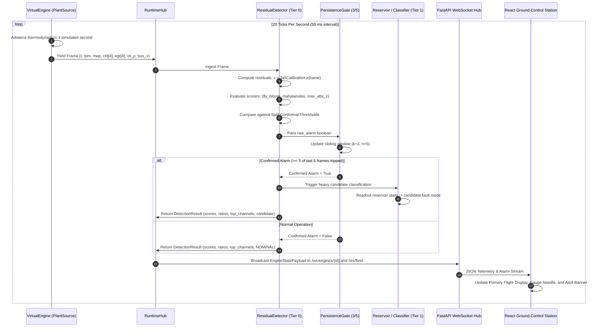
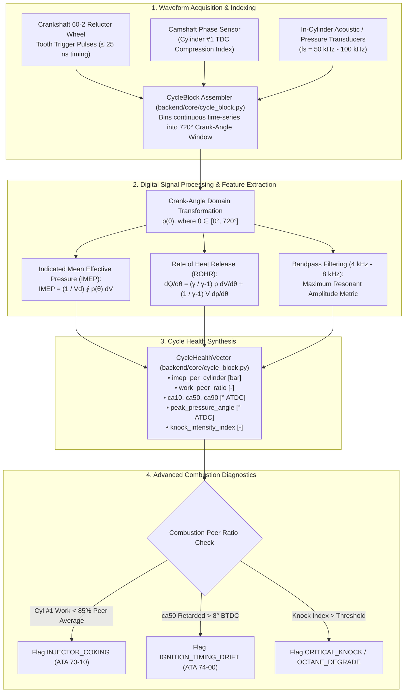
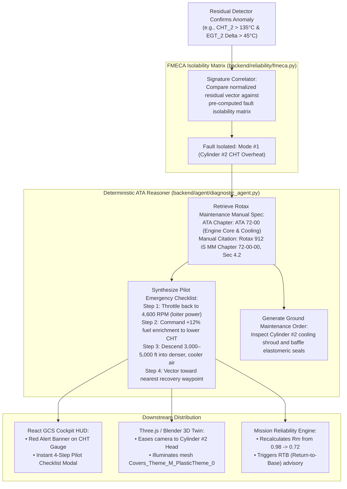
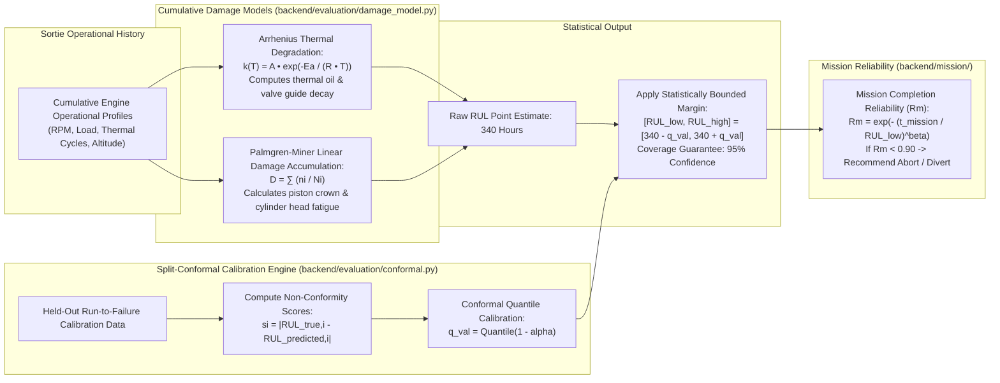
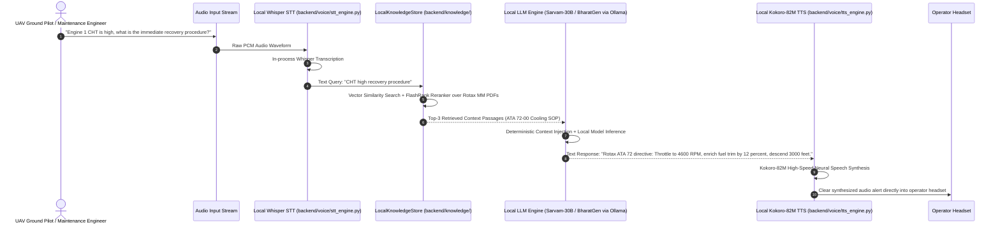

# ANUMAAN — End-to-End Data Flows & Execution Lifecycles
**DRDO / SIH Problem Statement ID: 26054**

---

## 1. The 20 Hz Telemetry & Anomaly Detection Pipeline

This sequence captures the core operational loop that executes 20 times per second across all active engines:

---

## 2. High-Speed Crank-Angle Waveform & DSP Processing Flow

For failure modes invisible to scalar telemetry (such as injector coking, needle valve bounce, and piston slap), the high-rate waveform pipeline operates on individual engine four-stroke cycles:

---

## 3. Deterministic ATA-Chapter Fault Diagnosis & Emergency Advisory Flow

When an anomaly is confirmed, ANUMAAN executes an immediate, deterministic diagnostic resolution mapped to aerospace standard ATA chapters:

---

## 4. Conformal Prediction RUL & Cumulative Damage Fatigue Flow

To solve the DRDO requirement for honest, statistically bounded Remaining Useful Life (RUL) estimation:

---

## 5. Local RAG Copilot & Voice Stream Flow

For hands-free ground control station operation during emergency scenarios:

