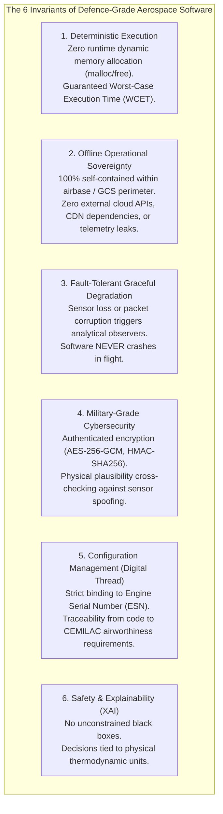
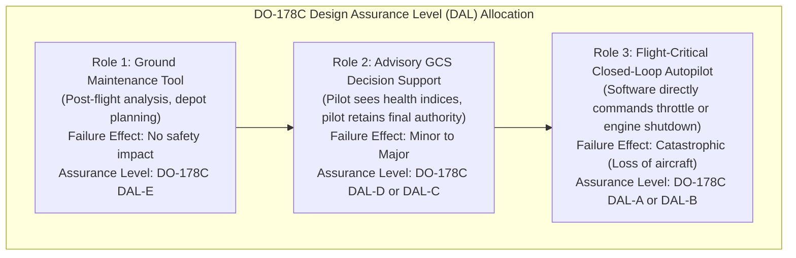
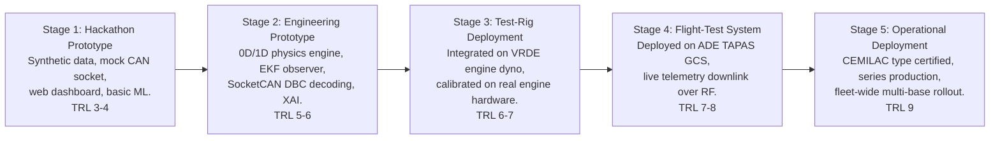
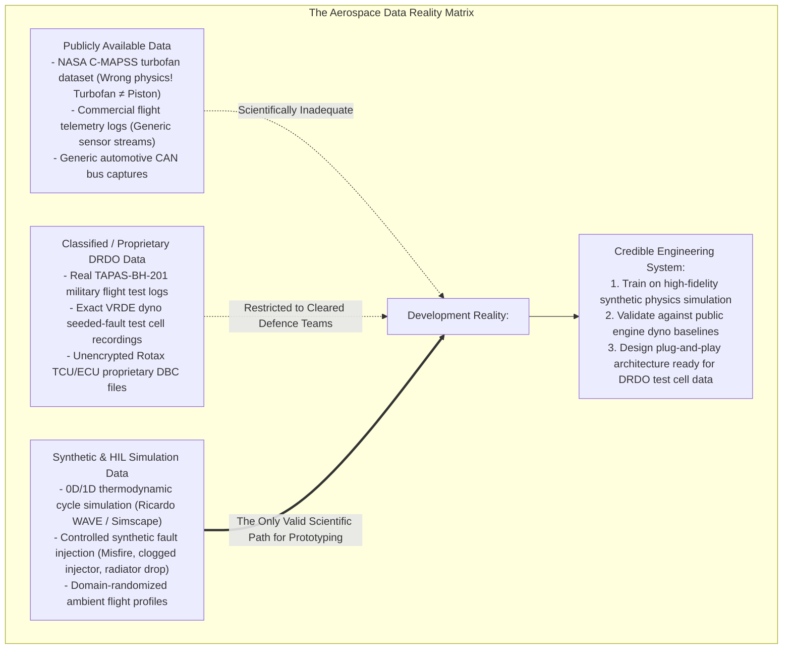

# Volume VI: Defence-Grade Engineering, Certification Pathways & The Data Reality Check
**Airworthiness Assurance, DO-178C DAL Allocation & Honest Data Feasibility**

---

## 1. What Makes a System "Defence-Grade"?

Many software developers assume that adding a dark mode theme and a military stencil font makes a system "defence-grade." In aerospace systems engineering, **defence-grade software is defined by rigorous operational, structural, and cryptographic invariants**:

---

## 2. Airworthiness Certification Pathways & DO-178C DAL Allocation

When DRDO deploys software on military UAVs, it must be certified by the **Centre for Military Airworthiness and Certification (CEMILAC)** under the **DDPMAS** (Design, Development, Production, Military Airworthiness and Security) framework.

### 2.1 The Realistic Certification Target for PS 26054
* **Expected Role**: **Role 2 (Advisory GCS Health Monitoring & Decision Support)**.
* **Target Assurance Level**: **DO-178C DAL-C** (or DAL-D).
* **Software Engineering Requirements for DAL-C**:
  1. *Requirements Traceability*: Every line of source code must trace to a documented system requirement.
  2. *Structural Code Coverage*: 100% **Statement Coverage** must be demonstrated through automated test suites.
  3. *Deterministic Timing*: Bounded execution latency with verified worst-case execution margins.
* **The EASA AI Concept Paper Level 1 Framework**:
  To certify the AI/ML component without violating aerospace determinism rules, the digital twin adopts the **Run-Time Monitor Architecture**:
  - The AI model provides advisory anomaly detection and RUL forecasting.
  - A simple, fully certified, deterministic rule-based monitor (DAL-B) continuously verifies that AI recommendations do not violate physical flight envelopes.
  - If the AI produces an erratic output, the monitor smoothly suppresses the alert and reverts to the primary deterministic Kalman observer.

---

## 3. The Prototype-to-Deployment Spectrum

It is vital to distinguish between a hackathon demonstrator and an operational defence system. The path from this problem statement to an operational squadron deployment follows five distinct evolutionary stages:

* **What DRDO Expects in this Competition**:
  DRDO does **not** expect participants to deliver a TRL 9 flight-certified binary ready to be bolted onto an active combat aircraft tomorrow. They expect a **high-fidelity Stage 2 / Stage 3 Engineering Prototype**: a system with real SocketCAN decoding, rigorous multi-physics modeling, scientifically valid AI anomaly detection, honest uncertainty quantification, and an operational GCS interface that clearly demonstrates a credible pathway toward test-rig and flight-test deployment.

---

## 4. The Brutal Data Reality Check: What Data Truly Exists?

Any engineering proposal that claims high-accuracy RUL prediction on real military flight data without understanding military data classification is scientifically fraudulent. A brutal data feasibility audit establishes what data is realistically available:

### 4.1 What Can Honestly Be Claimed vs. What Cannot
* **What CANNOT Honestly Be Claimed**:
  - *"Our deep learning model has 99.8% RUL accuracy on military MALE UAV engines."* (False: No public run-to-failure datasets exist for Rotax 914/915 aero-piston engines).
  - *"Our AI model directly controls the aircraft throttle during flight emergencies."* (False: Violates military safety protocols; requires DO-178C DAL-A clearance).
* **What CAN Honestly and Scientifically Be Demonstrated**:
  - *"Our digital twin implements verified 0D/1D Otto cycle thermodynamics and lumped-parameter heat transfer calibrated against published Rotax 914/915 engine specifications."*
  - *"Our anomaly detection pipeline is trained on nominal multi-sortie simulation logs, dynamically detects seeded faults within 3 engine cycles, and generates calibrated Conformal Prediction intervals on RUL."*
  - *"Our architecture is completely decoupled: the ingestion layer accepts real SocketCAN frames via standard DBC schemas, enabling direct drop-in integration onto VRDE engine test benches without code modification."*
