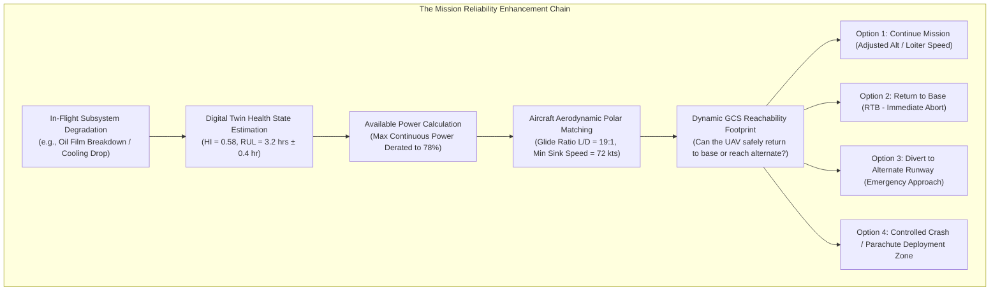
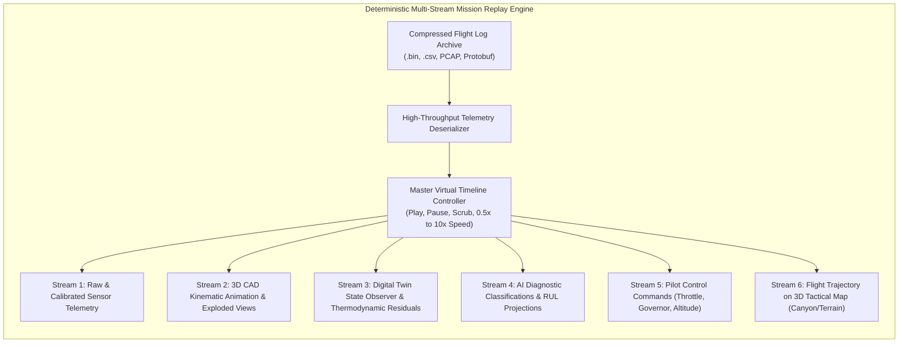
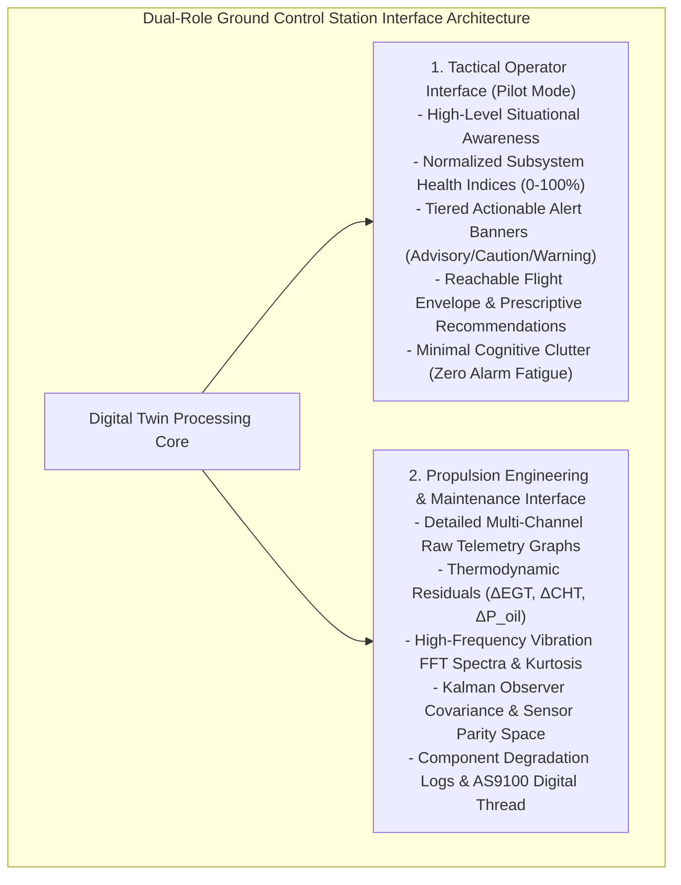
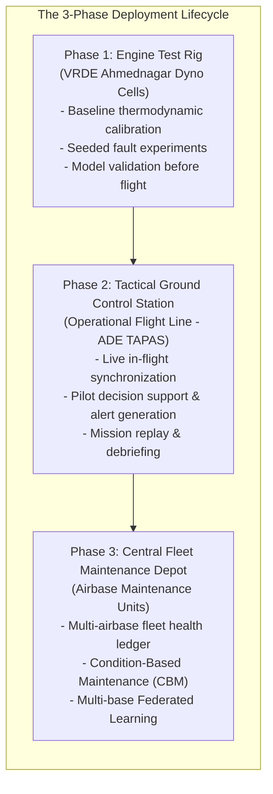

# Volume V: Mission Reliability Enhancement, Mission Replay & Deployment Ecosystems
**Tactical Decision Architecture, Multi-Stream Replay & The Test-Rig to Fleet Pipeline**

---

## 1. What "Mission Reliability Enhancement" Actually Means

In standard industrial predictive maintenance, the objective is simple: save money by avoiding unexpected machine downtime in a factory.

In military MALE UAV operations, the objective is fundamentally different. DRDO's phrase **"Mission Reliability Enhancement"** represents a critical military operational doctrine:

$$\begin{aligned}
\text{Engine Internal Health } HI(t) &\longrightarrow \text{Propulsion Reliability } R(t) \\
&\longrightarrow \text{Available Flight Envelope } (P_{\text{avail}}, \text{Ceiling}, \text{Speed}) \\
&\longrightarrow \text{Mission Risk Assessment } \mathcal{R}_{\text{risk}}(t) \\
&\longrightarrow \text{Tactical Mission Success / Asset Preservation}
\end{aligned}$$

### 1.1 Tactical Decision Support Capabilities
The digital twin enhances mission reliability by calculating **prescriptive flight profile modifications**:

1. **Active Throttle Derating to Arrest Thermal Runaway**:
   - *Scenario*: UAV is climbing at maximum throttle through hot desert air ($+48^\circ\text{C}$ in Rajasthan); CHT is climbing rapidly toward the $135^\circ\text{C}$ limit.
   - *Conventional System*: Waits until CHT hits $136^\circ\text{C}$, rings an alarm, pilot panics and pulls throttle to idle, losing airspeed.
   - *Digital Twin Decision Support*: Predicts thermal limit breach 8 minutes in advance; computes the exact throttle setpoint (e.g. 84% MAP) that arrests thermal rise, stabilizes CHT at $128^\circ\text{C}$, and maintains positive climb ($+180 \text{ ft/min}$) without aborting the mission.
2. **Cooling Descent Guidance**:
   - *Scenario*: Water pump cavitation detected at 24,000 ft altitude.
   - *Digital Twin Decision Support*: Recommends descending to 14,000 ft where atmospheric density ($\rho_{\text{air}}$) increases by 35%, restoring pump suction head and radiator convective heat rejection.
3. **Dynamic Reachability Footprint (RTB vs. Divert)**:
   - *Scenario*: Conformal RUL indicates lubricating bearing life will be exhausted in $2.5 \text{ hours}$ ($[2.1, 2.9] \text{ hrs}$).
   - *Digital Twin Decision Support*: Compares remaining flight time to home base ($t_{\text{home}} = 2.8 \text{ hours}$) against $RUL_{\text{lower}} = 2.1 \text{ hours}$. Recommends an immediate divert to an alternate military airstrip located 45 minutes away, preserving a 100-crore rupee UAV and its tactical payload.

---

## 2. Reconstructing the "Mission Replay" Requirement

Problem Statement 26054 mandates a "mission replay capability." What does DRDO actually expect this capability to be?

### 2.1 Full-Fidelity Multi-Stream Reconstruction
A superficial implementation merely plays back a recorded video or graphs a static CSV column. DRDO's requirement for a **mission replay system** requires deterministic temporal synchronization across six synchronized data streams:
1. **Raw Sensor Telemetry**: Instantaneous display of RPM, CHTs, EGTs, oil pressure, and fuel flow exactly as received during flight.
2. **3D Engine CAD Kinematics**: Synchronized rotational animation of the crankshaft, connecting rods, pistons, and reduction gearbox, visually highlighting failing components (e.g. coloring Cylinder 3 red during a misfire event).
3. **Digital Twin Internal States**: Reconstruction of unmeasured virtual parameters (in-cylinder gas temperatures, oil film thickness, compressor operating point on turbo map).
4. **AI/ML Diagnostic Ledger**: Displaying the exact instant the anomaly score spiked, which physical sensors drove the SHAP attribution, and what RUL was predicted.
5. **Pilot Command Context**: Reconstructing the throttle lever position and autopilot modes to verify whether pilot inputs contributed to thermal stress.
6. **Tactical Flight Path**: Geospatial 3D terrain rendering tracking the UAV's position, altitude, and ground track during the mission incident.

---

## 3. The Ground Control Station (GCS) HMI: Operator vs. Engineer Views

In military operations, the needs of a **tactical UAV pilot** (who is managing weapons, mission routes, and airspace deconfliction) are fundamentally different from the needs of a **propulsion maintenance engineer**.

---

## 4. The Deployment Spectrum: Engine Test Rig $\to$ GCS $\to$ Fleet Depot

Problem Statement 26054 explicitly mentions deployment across **"Ground Control Station (GCS), engine test rigs, and fleet-level health monitoring infrastructures."** Understanding this three-phase deployment pipeline reveals DRDO's long-term operational roadmap:

### 4.1 Deployment Phase 1: Engine Test Rig (VRDE Ahmednagar)
* **Operational Role**: Serves as the development and qualification testbed.
* **Capabilities**: Connected directly to high-speed dynamometer data acquisition systems, measuring in-cylinder combustion pressure, fuel mass flow via gravimetric balances, and exhaust emissions via gas analyzers.
* **Objective**: Fine-tunes the 0D/1D thermodynamic parameters, maps volumetric efficiency, and seeds controlled faults (clogged injectors, thinned oil, restricted coolant flow) to train and validate diagnostic AI models.

### 4.2 Deployment Phase 2: Tactical Ground Control Station (GCS)
* **Operational Role**: Live operational monitoring during military flight sorties.
* **Capabilities**: Ingests real-time telemetry over tactical RF/SATCOM datalinks via SocketCAN, executes the synchronized EKF observer, flags anomalies, and displays actionable decision support to the UAV flight crew.

### 4.3 Deployment Phase 3: Fleet-Level Infrastructure & Federated Learning
* **Operational Role**: Strategic lifecycle management across the Indian Air Force / Indian Navy UAV squadrons.
* **Capabilities**: Aggregates post-flight health ledgers across all operational airbases, tracks fleet-wide engine degradation trends, identifies component batch wear patterns, and coordinates **Federated Learning** model updates without compromising military operational security.
