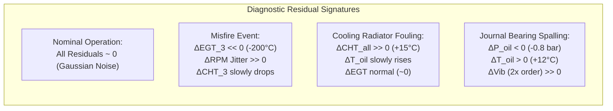
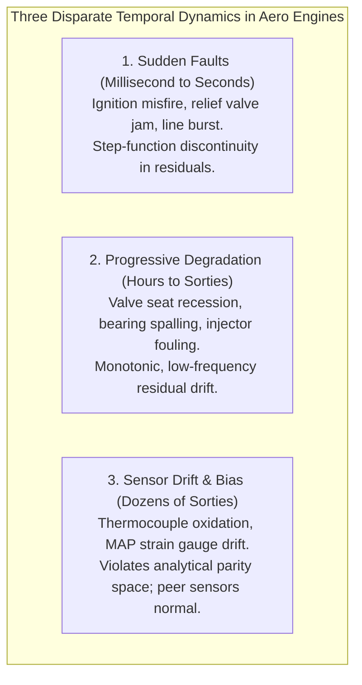
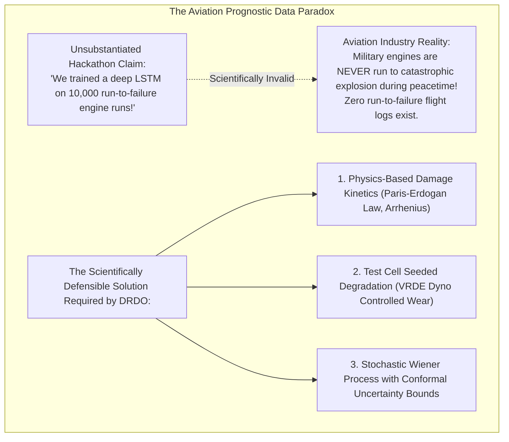

# Volume III: The Physics-AI Coupling Engine, Degradation Tracking & RUL Feasibility
**Synergistic First-Principles Modeling, Residual Generation & Prognostics under Data Scarcity**

---

## 1. The Physics-AI Coupling Architecture

DRDO Problem Statement 26054 explicitly pairs "thermodynamic behavior models" with "AI/ML based predictive analytics." Understanding **why** this combination is mandated reveals the core engineering intent:

```mermaid
graph TD
    subgraph HybridCoupling["The Two-Tier Physics-AI Coupling Pipeline"]
        subgraph Tier1["Tier 1: First-Principles Physics Observer (Deterministic & Bounded)"]
            Inputs["Flight Conditions: RPM, MAP, Altitude, Airspeed, Ambient Temp"] --> Model["0D/1D Thermodynamic Model (MVEM)"]
            Model --> Expected["Expected Nominal States: T_head*, T_egt*, P_oil*, BSFC*"]
            
            Telemetry["Real Sensor Telemetry: T_head, T_egt, P_oil, Fuel Flow"] --> Subtraction["Residual Generator (e = z_meas - z_pred)"]
            Expected --> Subtraction
            Subtraction --> Residuals["Normalized Residual Vector Δ(t)"]
        end

        subgraph Tier2["Tier 2: Machine Learning & Diagnostic Engine (Adaptive & Statistical)"]
            Residuals --> VAE["Deep Variational Autoencoder (VAE)"]
            VAE --> Anomaly["Statistical Anomaly Score"]
            
            Residuals --> XGB["XGBoost / 1D-CNN Multi-Class Classifier"]
            XGB --> FaultCat["FMECA Fault Isolation & Severity"]
            
            FaultCat --> Wiener["Wiener Degradation Process"]
            Wiener --> Conformal["Conformal Prediction Intervals"]
            Conformal --> RUL_Output["Certified RUL: 14.2 hrs [11.5, 17.8] (95% Conf)"]
        end
    end
```

### 1.1 Division of Responsibilities: Physics vs. AI
* **What Physics Does Best**:
  1. *Normalizing Flight Envelopes*: Accounting for atmospheric pressure lapse, ambient temperature variations, and throttle transitions without requiring millions of training samples.
  2. *Deterministic Baseline Generation*: Outputting expected nominal values based on conservation of mass and energy ($P_{\text{indicated}} = \dot{m}_f Q_{\text{LHV}} \eta_{\text{th}}$).
  3. *Safety Envelope Enforcement*: Preventing AI models from generating non-physical predictions (e.g. exhaust temperature colder than ambient air).
* **What AI/ML Does Best**:
  1. *Multi-Sensor Pattern Recognition*: Detecting subtle, non-linear cross-correlations across 10 sensor channels that cannot be written down as closed-form differential equations.
  2. *Degradation Trend Extraction*: Learning complex temporal decay curves in the presence of stochastic flight turbulence.
  3. *Classifying Complex Defect Signatures*: Disentangling whether a $30^\circ\text{C}$ EGT drop is caused by ignition failure, injector clogging, or an exhaust runner leak.

---

## 2. The Thermodynamic Residual Generation Pipeline

Rather than feeding raw telemetry directly into machine learning models (which creates extreme sensitivity to flight conditions), the digital twin operates on **Thermodynamic Residuals**:

$$\tilde{\mathbf{y}}(t) = \mathbf{z}_{\text{measured}}(t) - \hat{\mathbf{z}}_{\text{physics}}(\mathbf{u}(t), \mathbf{x}(t))$$

### 2.1 Mathematical Formulation of Core Residuals
1. **Exhaust Gas Temperature Residual ($\Delta T_{\text{egt}, i}$)**:
   $$\Delta T_{\text{egt}, i}(t) = T_{\text{egt}, i}^{\text{meas}}(t) - f_{\text{thermo}}\left( P_{\text{map}}(t), N(t), \lambda_i, \theta_{\text{spark}} \right)$$
   Isolates cylinder-specific combustion anomalies independent of overall engine power output.
2. **Cylinder Head Thermal Residual ($\Delta T_{\text{head}, i}$)**:
   $$\Delta T_{\text{head}, i}(t) = T_{\text{head}, i}^{\text{meas}}(t) - \left( T_{\text{ambient}}(t) + \frac{\dot{Q}_{\text{comb}, i}(t)}{U A_{\text{cooling}}(V_{\text{airspeed}}(t))} \right)$$
   Directly reveals cooling system degradation and localized pre-ignition before absolute redlines are reached.
3. **Hydrodynamic Oil Pressure Residual ($\Delta P_{\text{oil}}$)**:
   $$\Delta P_{\text{oil}}(t) = P_{\text{oil}}^{\text{meas}}(t) - \left( P_0(N) - k_{\text{visc}} \cdot \mu(T_{\text{oil}}(t)) \cdot N(t) \right)$$
   Isolates mechanical journal bearing clearance expansion from normal temperature-induced oil thinning.

---

## 3. Disentangling Degradation, Sudden Faults, and Sensor Drift

A major failure mode in aircraft health monitoring is confusing a **failing sensor** with a **failing engine**, or misdiagnosing **gradual aging** as a **sudden emergency**.

### 3.1 Analytical Redundancy & Parity Space Equations
To prove whether a measured temperature rise is real or an instrumentation artifact, the digital twin implements an **Analytical Parity Space Filter**:

$$\mathbf{P}_{\text{matrix}} \cdot \mathbf{z}_{\text{sensors}} = \mathbf{r}_{\text{parity}}$$
* If an actual cylinder is overheating:
  - CHT on that cylinder increases.
  - Coolant exit temperature rises proportionally: $\Delta T_{\text{coolant}} \propto \sum \Delta T_{\text{head}, i}$.
  - Oil temperature increases due to higher cylinder wall heat flux.
  - The parity vector $\mathbf{r}_{\text{parity}} \approx 0$ (physically consistent).
* If a thermocouple wire is corroding (Sensor Drift):
  - That specific CHT probe drifts upward by $+25^\circ\text{C}$.
  - Coolant exit temperature and oil temperature remain completely constant.
  - Parity vector $\mathbf{r}_{\text{parity}} \neq 0$ (physical inconsistency detected).
  - **Result**: The system alerts the technician: *"Sensor Fault: Cylinder 2 CHT probe bias drift detected (+25°C). Engine operating normally."* This prevents an unnecessary tactical mission abort.

---

## 4. Brutal Feasibility Analysis: RUL Estimation under Aviation Data Scarcity

A critical question must be asked: **Where does the training data for Remaining Useful Life (RUL) actually come from?**

### 4.1 The Aviation Prognostic Dilemma
In consumer IoT or manufacturing predictive maintenance (e.g. cutting tools, pump impellers), machines can be run to failure to collect thousands of labeled degradation trajectories.

In military aviation, **engines are strictly inspected and overhauled at conservative preventative intervals**. If a crack is spotted in an exhaust runner during a 100-hour inspection, the runner is replaced immediately. Consequently, **real run-to-failure flight test datasets for military aero-piston engines do not exist in the public domain**.

### 4.2 Scientifically Defensible Methodologies for PS 26054
To deliver a technically credible RUL capability that satisfies DRDO engineers without fabricating fake accuracy claims, the digital twin employs three defensible techniques:

1. **First-Principles Cumulative Damage Kinetics**:
   - *Thermal Fatigue*: Uses the **Manson-Coffin Equation** to track plastic strain cycles accumulated during high-power takeoff climb transitions:
     $$\frac{\Delta \epsilon_p}{2} = \epsilon_f' (2 N_f)^c$$
   - *Bearing Fatigue*: Uses **ISO 281 / Lundberg-Palmgren Dynamic Load Ratings** to calculate bearing life consumption based on integrated oil film pressure and RPM history:
     $$L_{10h} = \frac{10^6}{60 N} \left( \frac{C_{\text{dynamic}}}{P_{\text{equivalent}}} \right)^p$$
2. **Dynamometer Seeded Degradation (VRDE Test Rigs)**:
   - Utilizes controlled, accelerated wear testing on ground dynamometers (e.g., running high-temperature degraded oil to induce calibrated bearing wear, or installing laser-drilled fuel injector orifices to simulate nozzle erosion).
3. **Stochastic Wiener Process with Conformal Prediction Bounds**:
   - Acknowledges data sparsity honestly. Instead of claiming a false point precision (e.g. "RUL = 12.34 hours"), the model outputs a **distribution-free Conformal Prediction Interval** $[RUL_{\text{lower}}, RUL_{\text{upper}}]$ that guarantees 95% statistical coverage while expanding honestly when operating outside well-characterized flight regimes.
