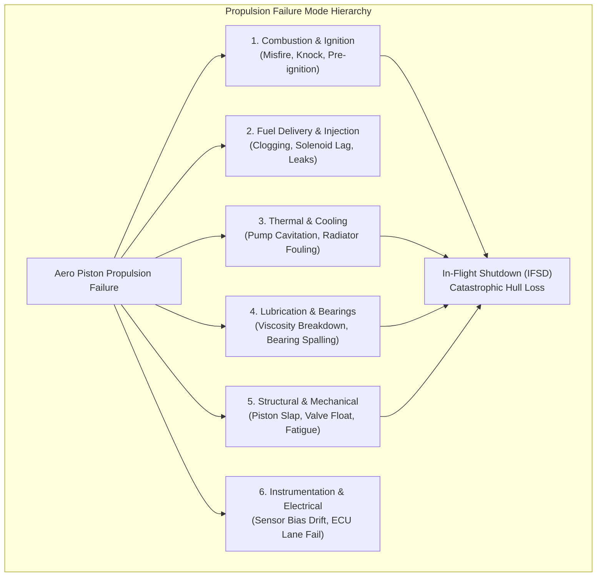
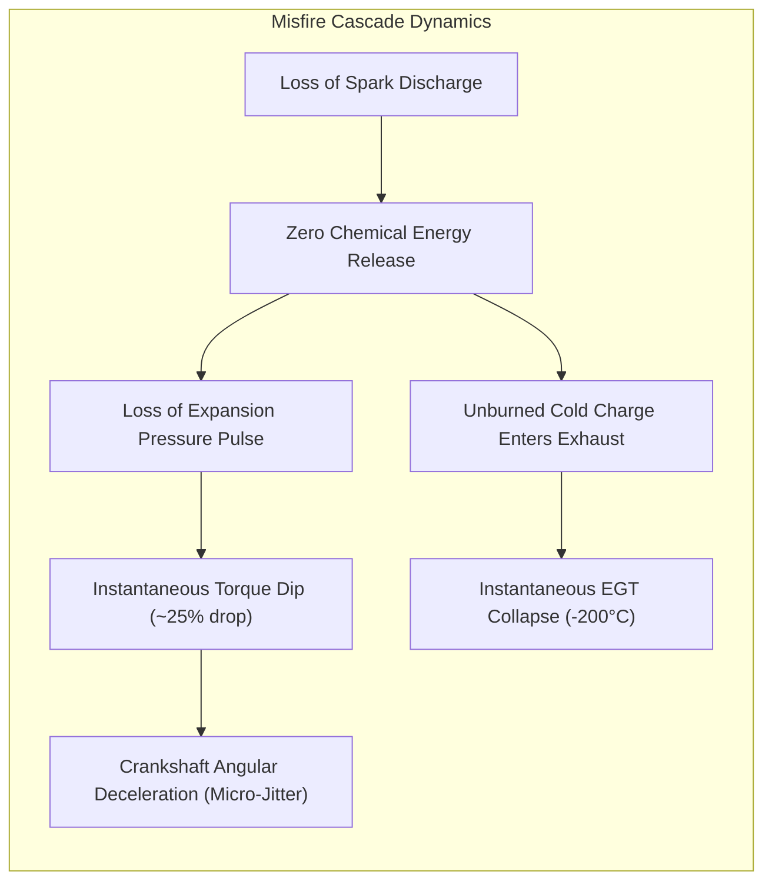
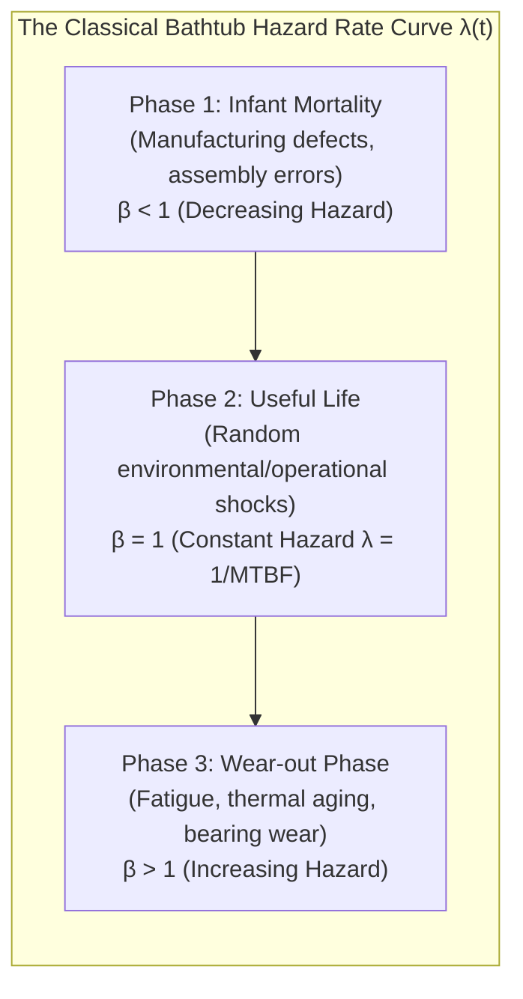

# Volume III: Failure Modes, FMECA & Reliability Engineering
**Systematic Failure Diagnostics, Prognostics & Reliability Foundations**

---

## 1. Systematic Failure Mode, Effects, and Criticality Analysis (FMEA / FMECA)

In military aviation and unmanned systems, propulsion failures account for over **55% of all in-flight catastrophic MALE UAV losses**. Conducting a rigorous Failure Mode and Effects Analysis (FMEA) and Criticality Analysis (FMECA) under MIL-STD-1629A is essential for establishing propulsion reliability. Unlike twin-engine manned aircraft with manual redundancy, single-engine MALE UAVs suffer immediate loss of control or forced glide landings when an unrecoverable engine failure occurs.

### 1.1 Structural FMECA Matrix
The following table details the core failure modes of the aero-piston propulsion system under military operational profiles:

| Subsystem | Failure Mode | Root Cause | Physical Mechanism | Observable Symptoms | Primary Sensor Signatures | Detection / Diagnostic Algorithm | Prognostic Horizon | Mitigation / Action | Mission Consequence | Criticality (MIL-STD-1629A) |
| :--- | :--- | :--- | :--- | :--- | :--- | :--- | :--- | :--- | :--- | :--- |
| **Ignition / Combustion** | **Total Single-Cylinder Misfire** | Spark plug electrode erosion, secondary coil insulation breakdown, or open spark wire. | No spark discharge occurs; compressed air-fuel mixture passes unburned through exhaust runner without heat release. | Sudden loss of thrust, rough engine sound, heavy airframe vibration. | Sudden drop in Cylinder EGT ($> 200^\circ\text{C}$ drop within 2 sec); sharp drop in CHT; half-order ($0.5\times$ RPM) vibration spike; instantaneous RPM ripple. | Multi-cylinder EGT residual cross-checking; cyclic RPM fluctuation analysis via crank encoder. | Very Short ($< 30$ seconds to detect; immediate intervention). | Enrich fuel mixture on working cylinders, adjust throttle, command emergency RTB. | Reduced cruise airspeed, inability to maintain high altitude, payload brownout risk. | **Category I (Catastrophic)** |
| **Ignition / Combustion** | **Combustion Knock / Detonation** | Excessive manifold boost pressure, high intake charge temperature, or low fuel octane rating. | End-gas autoignition ahead of flame front producing localized supersonic shockwaves ($P_{\text{peak}} > 140 \text{ bar}$). | Sharp metallic pinging (not audible in GCS), rapid temperature escalation. | High-frequency acoustic emission (5–8 kHz band); rapid, steep CHT derivative ($\frac{dT}{dt} > 2^\circ\text{C/sec}$); slight drop in EGT due to accelerated wall heat transfer. | Bandpass-filtered accelerometry thresholding; peak CHT derivative monitoring; physics-informed knock index. | Immediate ($< 5$ seconds before piston crown perforation occurs). | FADEC/TCU automatically retards ignition timing, opens turbo wastegate to reduce MAP. | Mission profile derating; forced descent to lower altitude. | **Category I (Catastrophic)** |
| **Fuel Injection** | **Injector Partial Clogging / Fouling** | Particulate contamination or thermal varnishing of micro-injector nozzle orifices. | Reduced effective flow area ($A_{\text{eff}}$); fuel mass delivery restricted on that specific cylinder; localized lean combustion. | Cylindrical power imbalance, localized high thermal stress, uneven torque delivery. | Divergent EGT rise on affected cylinder (lean peak $\lambda \approx 1.05$); CHT gradual elevation; fuel rail pressure ripple distortion. | Multi-cylinder EGT balance estimator; bank-to-bank adaptive fuel trim Kalman filter. | Medium ($15 \text{ to } 60$ minutes prior to severe valve burnout). | Pulse-width compensation increase for affected injector; throttle limitation to avoid high boost. | Increased fuel consumption, loss of high-speed dash capability. | **Category II (Critical)** |
| **Fuel Injection** | **Injector Solenoid Lag / Sticking** | Solenoid coil thermal aging, drive transistor resistance rise, or internal return spring fatigue. | Delayed needle valve opening/closing; injection timing phasing shifted relative to intake valve opening. | Misfire at high engine speeds, rough transition during rapid throttle transients. | Inconsistent EGT transients during acceleration; ECU diagnostic register reporting injection driver status. | High-speed crank-angle synchronous current sensing; dynamic time-warping on transient EGT profiles. | Short to Medium ($5 \text{ to } 30$ minutes). | Restrict rapid throttle inputs; fly conservative cruise profile back to base. | Aborted high-altitude climb; mission termination. | **Category II (Critical)** |
| **Cooling System** | **Water Pump Impeller Cavitation / Erosion** | Low system pressure, high coolant temperature, operating above critical altitude ($> 25,000$ ft). | Localized fluid vapor cavity formation collapsing against impeller blades, destroying pumping head. | Rapid monotonic rise in all 4 CHTs simultaneously while oil temperature initially lags. | All CHTs trending upward ($> 135^\circ\text{C}$); coolant pressure drop across pump; coolant temperature differential $(T_{\text{out}} - T_{\text{in}})$ collapsing. | Convective thermal model residual tracking; multi-channel CHT slope correlation. | Medium ($10 \text{ to } 25$ minutes before boiling coolant loss). | Reduce engine power; descend to lower altitude with higher atmospheric pressure. | Immediate mission abort; emergency descent. | **Category I (Catastrophic)** |
| **Cooling System** | **Radiator Matrix External Fouling** | Ingestion of desert sand, dust, insects, or salt spray during low-altitude maritime/desert loiter. | Reduced aerodynamic flow through radiator core; convective heat transfer coefficient $U$ drops by 30–50%. | Progressive engine overheating during sustained loiter or slow-speed high-angle-of-attack flight. | Steady upward drift of CHT and coolant temperature relative to indicated airspeed (IAS) and ambient temperature. | Physics-based thermal observer comparing predicted $T_{\text{head}}$ from airspeed/power against measured $T_{\text{head}}$. | Long ($2 \text{ to } 10$ flight hours). | Increase flight airspeed (lowering angle of attack) to force ram air through matrix; advisory for post-flight wash. | Precludes low-speed ISR loiter; limits mission endurance. | **Category III (Marginal)** |
| **Lubrication System** | **Hydrodynamic Journal Bearing Spalling** | Particle contamination, prolonged thermal thinning of oil, or cyclic shock loading. | Fatigue spalling of Babbitt/lead-tin overlay on con-rod big-end bearing; progressive metal loss. | Faint knocking vibration; metal flakes in oil filter (offline). | Low-frequency periodic vibration spike ($1\times$ and $2\times$ engine order); gradual decay in oil pressure at idle/cruise; oil temperature creep. | Spectral kurtosis on crankcase accelerometers; dynamic oil pressure vs. temperature/RPM regression map. | Medium ($1 \text{ to } 5$ flight hours before catastrophic rod break). | Restrict maximum engine RPM; minimize g-loading maneuvers; immediate RTB. | Total engine seizure if ignored; catastrophic hull loss. | **Category I (Catastrophic)** |
| **Lubrication System** | **Oil Pressure Relief Valve Sticking** | Carbon buildup or wear particles jamming the spring-loaded pressure regulator piston in open position. | Pressurized oil dumps directly back to oil tank rather than feeding the main engine gallery. | Sudden drop in oil pressure gauge during flight. | Oil pressure drops below minimum redline ($< 1.5 \text{ bar}$ at cruise); oil temperature stable or slowly rising. | Threshold-residual cross-validation against oil temperature and RPM; oil pressure rate-of-drop detector. | Immediate ($< 60$ seconds to mechanical seizure). | Throttle back immediately to idle/minimum power to reduce bearing load; glide to nearest runway. | Complete propulsion failure; forced landing or parachute deployment. | **Category I (Catastrophic)** |
| **Sensor Subsystem** | **Thermocouple Oxidation / Bias Drift** | Prolonged exposure of Inconel sheath to $850^\circ\text{C}$ sulfurous exhaust gases. | Metallurgy degradation shifting the Seebeck coefficient; thermocouple reads $-50^\circ\text{C}$ lower than true temperature. | None physical; engine operates normally, but instrumentation misreports state. | Gradual monotonic divergence of one cylinder's EGT from physical model and peer cylinders under identical load. | Autoencoder reconstruction residual analysis; multi-sensor parity space consistency check. | Long ($10 \text{ to } 50$ flight hours). | Digital twin re-calibrates sensor offset; flags sensor for replacement in post-flight maintenance report. | False alarms or masking of real combustion defects. | **Category IV (Minor)** |
| **Mechanical System** | **Piston Slap / Cylinder Barrel Wear** | Ovalization of cylinder bore due to side thrust wear; excessive piston-to-bore skirt clearance. | Piston rocks around wrist pin at Top Dead Center (TDC) transition, impacting cylinder wall. | Distinctive hollow ticking sound under cold start or load transitions. | High-frequency impact transients ($2\times$ engine order, around $1.5$–$3$ kHz band) coinciding with expansion stroke onset. | Angular-domain synchronous vibration averaging; envelope demodulation. | Long ($50 \text{ to } 100$ flight hours). | Schedule cylinder barrel and piston replacement during next scheduled depot phase. | Increased blow-by, oil consumption, and carbon deposition. | **Category III (Marginal)** |

---

## 2. In-Depth Failure Dynamics & Physical Verification

### 2.1 The Physics of Combustion Misfire
When Cylinder $k$ misfires:
1. **Thermodynamic Impact**: The fuel chemical energy $\dot{m}_f Q_{\text{LHV}}$ is not converted into thermal enthalpy. Indicated work $W_{i, k}$ drops from $+350 \text{ J}$ to $-40 \text{ J}$ (net negative pumping work).
2. **Thermal Signature**: The exhaust stream exiting the exhaust valve contains cold, unburned intake charge. The local exhaust gas temperature sensor plunges precipitously:
   $$\left. \frac{d T_{\text{egt}, k}}{dt} \right|_{\text{misfire}} \approx -\frac{T_{\text{egt}, k} - T_{\text{charge}}}{\tau_{\text{probe}}} \approx -150^\circ\text{C/sec to } -250^\circ\text{C/sec}$$
3. **Rotational Kinematics**: Because Cylinder $k$ produces zero expansion torque, the crankshaft slows down momentarily during its power stroke. An engine running at 5,400 RPM completes one revolution in $11.1 \text{ ms}$. By sampling crank angle teeth via a 60-2 Hall-effect sensor, the digital twin detects angular velocity drops during specific cylinder expansion windows:
   $$\Delta \omega_k = \omega(\theta_{\text{TDC}, k} + 90^\circ) - \omega(\theta_{\text{TDC}, k}) < 0$$
   This enables 100% deterministic identification of the exact faulty cylinder within a single four-stroke cycle ($22.2 \text{ ms}$).

---

### 2.2 The Physics of Lubrication Breakdown and Journal Seizure
Hydrodynamic journal bearings require an unbroken hydrodynamic wedge of pressurized oil.
* **Hydrodynamic Wedge Collapse**: The minimum oil film thickness is given by:
  $$h_{\text{min}} = c \cdot (1 - \epsilon)$$
  Where $c$ is radial clearance ($\approx 35 \text{ }\mu\text{m}$) and $\epsilon \in [0, 1)$ is eccentricity ratio. Under steady load $W$:
  $$\epsilon = f\left( \frac{\mu N}{P_{\text{unit}}} \left(\frac{R}{c}\right)^2 \right) = f(S_{\text{Sommerfeld}})$$
* **The Failure Cascade**:
  1. *Thermal Oxidation*: Oil temperature climbs beyond $130^\circ\text{C}$ due to cooling degradation.
  2. *Viscosity Collapse*: $\mu$ drops from $15 \text{ mPa}\cdot\text{s}$ to $< 4 \text{ mPa}\cdot\text{s}$.
  3. *Sommerfeld Drop*: $S \to 0$, forcing eccentricity $\epsilon \to 1.0$.
  4. *Asperity Contact*: $h_{\text{min}}$ drops below the combined surface roughness ($R_q \approx 0.8 \text{ }\mu\text{m}$). Metal-to-metal boundary friction occurs.
  5. *Thermal Catastrophe*: Friction coefficient jumps from $\mu_f \approx 0.005$ to $\mu_f \approx 0.15$ (a 30-fold increase). Localized flash temperature exceeds $350^\circ\text{C}$, melting the bearing lining, welding the rod to the crank journal, and causing instantaneous crankshaft seizure.

---

## 3. Reliability Engineering Foundations for Aero-Piston Engines

### 3.1 Reliability, Availability, Maintainability (RAM) Formulations
* **Reliability ($R(t)$)**: The probability that the aero engine operates without failure for a specified duration $t$ under defined environmental conditions:
  $$R(t) = \mathbb{P}[T > t] = \exp\left( -\int_0^t \lambda(\tau) d\tau \right)$$
* **Hazard Rate Function ($\lambda(t)$)**: Instantaneous failure rate at time $t$ given survival up to $t$:
  $$\lambda(t) \triangleq \lim_{\Delta t \to 0} \frac{\mathbb{P}[t \le T < t + \Delta t \mid T \ge t]}{\Delta t} = \frac{f(t)}{R(t)}$$
* **Mean Time Between Failures (MTBF)**:
  $$\text{MTBF} = \int_0^\infty R(t) dt$$
  For military UAV aero-piston engines, typical target operational MTBF is **$1,500 \text{ to } 2,000 \text{ flight hours}$**.
* **Mean Time to Repair (MTTR)**:
  The average time required to troubleshoot, replace, and return an engine subsystem to fully mission-capable status:
  $$\text{MTTR} = \frac{\sum (\text{Maintenance Downtime Hours})}{\text{Total Corrective Actions}}$$
  Operational target for line-replaceable units (LRUs) in field GCS deployments is $\text{MTTR} \le 2.0 \text{ hours}$.

---

### 3.2 The Weibull Degradation Distribution
The failure behavior of mechanical, reciprocating, and thermal engine components is mathematically modeled using the two-parameter **Weibull Distribution**:

$$R(t) = e^{-(t / \eta)^\beta}, \quad f(t) = \frac{\beta}{\eta} \left( \frac{t}{\eta} \right)^{\beta - 1} e^{-(t / \eta)^\beta}$$

Where:
* $\eta > 0$ is the **Scale Parameter** (Characteristic Life: the age at which 63.2% of the population fails).
* $\beta > 0$ is the **Shape Parameter** (Slope on Weibull probability paper):
  - $\beta < 1.0$: Decreasing failure rate (infant mortality, burn-in defects).
  - $\beta = 1.0$: Constant failure rate (random failures, exponential distribution).
  - $1.0 < \beta < 2.0$: Early wear-out, corrosion, low-cycle fatigue.
  - $\beta \ge 3.0$: Aging, severe thermal fatigue, mechanical friction wear-out (approaches Gaussian normal distribution).

| Component / Subsystem | Typical Weibull $\beta$ | Primary Degradation Physics | Maintenance Strategy |
| :--- | :--- | :--- | :--- |
| **Spark Plugs** | $\beta \approx 2.5 \text{ to } 3.2$ | Electrode gap spark erosion, insulator fouling. | Condition-Based Maintenance via misfire detection. |
| **Exhaust Valves** | $\beta \approx 3.0 \text{ to } 4.1$ | High-temperature oxidation, thermal seat recession. | Predictive EGT balance monitoring; boroscope inspections. |
| **Crankshaft Journal Bearings** | $\beta \approx 2.8 \text{ to } 3.5$ | Lubrication starvation, particle abrasion, fatigue spalling. | Vibration order tracking, oil analysis, idle oil pressure trending. |
| **Piston Rings / Liners** | $\beta \approx 2.2 \text{ to } 2.9$ | Abrasive boundary wear, blow-by gas scouring. | Blow-by pressure monitoring, crankcase ventilation rate. |
| **ECU / Electronics** | $\beta \approx 1.0 \text{ to } 1.2$ | Solder joint thermal cycling, random electrical overstress. | Dual-lane hardware redundancy; BIT (Built-In-Test) monitoring. |

---

### 3.3 Reliability-Centered Maintenance (RCM) & Condition-Based Maintenance (CBM)
Traditional military aviation enforces **Time-Between-Overhaul (TBO)**: regardless of actual health, an engine is completely removed, dismantled, and rebuilt at fixed intervals (e.g. 1,500 hours).
* **The Pitfalls of Fixed TBO**:
  1. *Wasteful Cost*: Engines operating under benign climates (cool, clean air) with gentle cruise profiles are rebuilt when they have 40% useful life remaining.
  2. *Infant Mortality Injection*: Disassembling and reassembling complex mechanical components re-introduces human assembly errors and infant mortality failures ($\beta < 1.0$).
* **Condition-Based Maintenance (CBM)**: By integrating a real-time digital twin, maintenance decisions are driven by the estimated **Health Index ($HI(t)$)** and **Remaining Useful Life ($RUL$)**. An engine is serviced only when physical degradation indicators cross calibrated prognostic tripwires.
