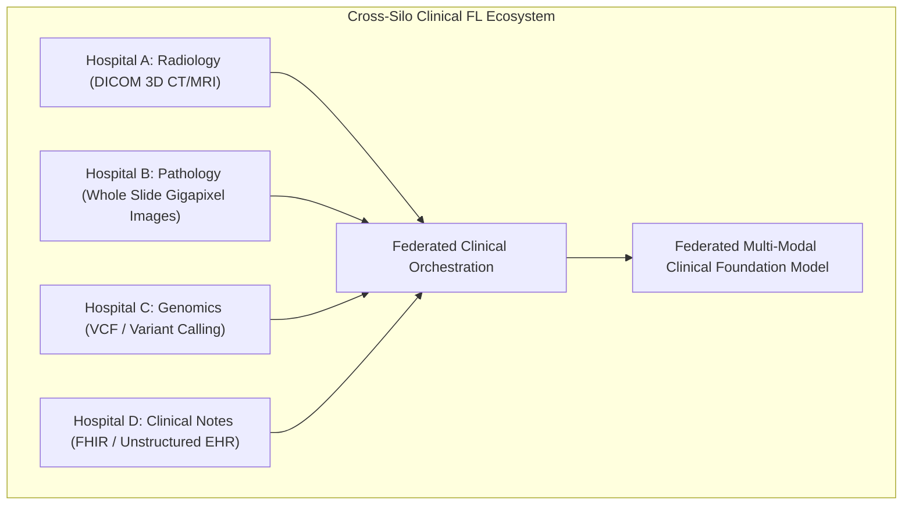
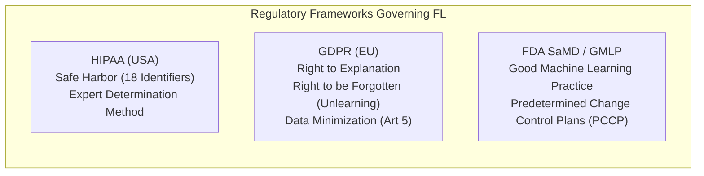
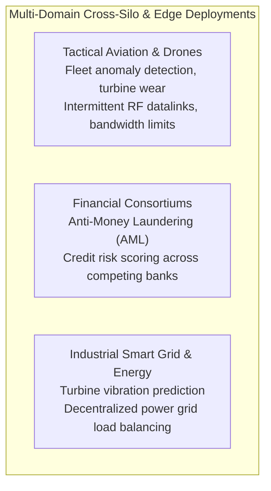
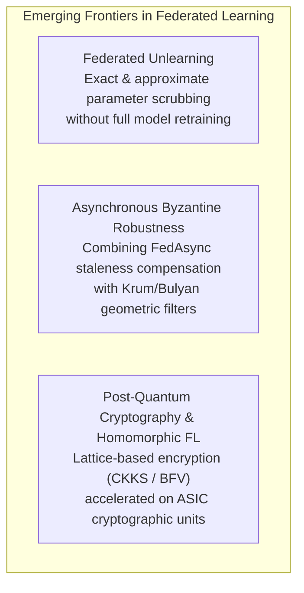

# Federated Learning: Cross-Domain Applications, Healthcare & Frontiers
**Conceptual & Theoretical Knowledge Base — Volume VI**

---

## 1. Clinical Healthcare: The Archetypal Cross-Silo Domain

Healthcare represents the primary real-world testbed and regulatory driver for Federated Learning. Medical datasets cannot be centralized due to patient privacy laws, institutional competitive value, and massive data volume.

### 1.1 Electronic Health Records (EHR) & FHIR Standardization
* **The FHIR Standard:** Fast Healthcare Interoperability Resources (FHIR) provides a standardized JSON/XML schema for clinical concepts (e.g., `Patient`, `Observation`, `Condition`, `MedicationRequest`).
* **Federated NLP on EHR:** Clinical notes contain protected health information (PHI) such as patient names and dates. FL enables training Transformer and Mamba backbones locally within hospital security perimeters, outputting generalized phenotype extraction and mortality prediction models without leaking patient transcripts.

---

### 1.2 Medical Imaging & DICOM Pipelines
* **DICOM (Digital Imaging and Communications in Medicine):** The global standard for medical imaging. Medical images are not standard 8-bit RGB JPEGs; they comprise high-bitwidth (12-bit to 16-bit) volumetric 3D arrays measuring radiological density in **Hounsfield Units (HU)**.
* **Scanner Heterogeneity:** Silos utilize scanners from different manufacturers (Siemens, GE, Philips), each with distinct slice thicknesses, reconstruction kernels, and noise profiles.
* **MONAI Integration:** Enterprise FL pipelines integrate MONAI (Medical Open Network for AI) transforms within the client runtime. Automated pre-processing pipelines (window leveling, isotropic reslicing, affine coordinate normalization) execute inside the silo before feeding 3D UNet or Swin-UNETR models.

---

## 2. Regulatory, Legal & Governance Frameworks

### 2.1 HIPAA Compliance (United States)
* **Privacy Rule:** Prohibits transmission of 18 categories of Protected Health Information (PHI).
* **FL Alignment:** Because FL transmits mathematical weights rather than patient records, it satisfies the **Data Minimization Principle**. However, compliance mandates implementing provable Differential Privacy ($\epsilon \le 1.0$) or Secure Multi-Party Computation (SMPC) to mitigate gradient inversion risks.

### 2.2 GDPR Compliance (European Union)
* **Article 5 (Data Minimization & Storage Limitation):** FL strictly minimizes data movement, ensuring personal data does not cross sovereign borders.
* **Article 17 (Right to be Forgotten):** Introduces the technical challenge of **Federated Unlearning**—if a patient revokes consent, their historical contributions must be mathematically erased from the trained global model without retraining the network from scratch.

### 2.3 FDA SaMD (Software as a Medical Device) & GMLP
* **Good Machine Learning Practice (GMLP):** Joint guidelines from the FDA, Health Canada, and UK MHRA requiring clinical ML models to demonstrate robustness across out-of-distribution demographic populations.
* **Predetermined Change Control Plans (PCCP):** Traditional medical device clearance requires a frozen, static model. The FDA's PCCP framework creates a pathway for continuous learning systems by pre-specifying monitoring boundaries, re-validation protocols, and model drift tripwires.

---

## 3. Defense, Aerospace & Multi-Domain Applications

### 3.1 Tactical Edge, Drones & Aviation Fleets
* **Operational Context:** Unmanned Aerial Systems (UAS), fighter aircraft squadrons, and commercial airline fleets generate terabytes of telemetry, engine sensor logs, and radar data.
* **Deployment Constraints:** Bandwidth is severely constrained by tactical radio frequencies or high-latency satellite uplinks. Centralizing raw engine telemetry is bandwidth-impossible and exposes flight mission secrets.
* **Federated Solution:** Aircraft train predictive maintenance models locally during flight operations and transmit lightweight LoRA adapters to ground-station edge aggregators during refueling, utilizing Hierarchical Federated Learning (HFL) across tactical wings.

### 3.2 Financial Consortiums & Anti-Money Laundering (AML)
* **The Problem:** Financial crime syndicates disperse illicit transactions across multiple independent banking institutions to evade single-bank rule engines.
* **Vertical Federated Learning (VFL):** Multiple banks collaborate on joint customer graphs using Private Set Intersection (PSI) and secure multi-party split neural networks, identifying money laundering rings without sharing client account ledgers.

---

## 4. The Open Research Frontier

1. **Federated Machine Unlearning:** Algorithms such as projected gradient unlearning and Fisher information subtraction that erase specific client updates or sample influences from trained global models while maintaining validation accuracy.
2. **Asynchronous Byzantine Robustness:** Developing provably convergent aggregation rules that simultaneously handle straggler-induced staleness $s(t - \tau)$ and malicious gradient manipulation.
3. **Quantum Federated Learning (QFL):** Distributed training of Parameterized Quantum Circuits (PQCs) across quantum nodes over quantum networks, protected by quantum key distribution (QKD).
