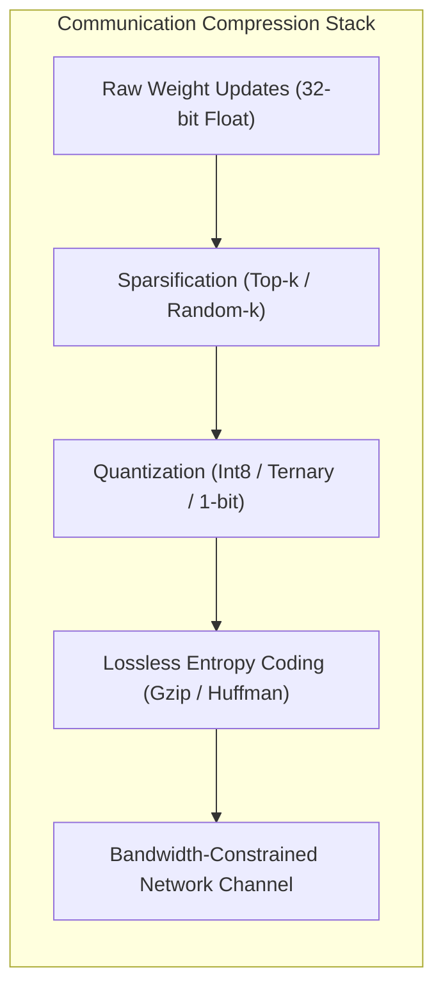
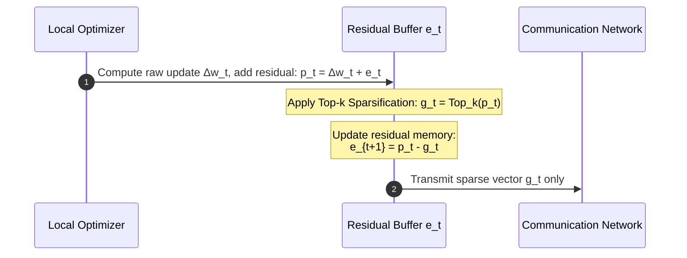
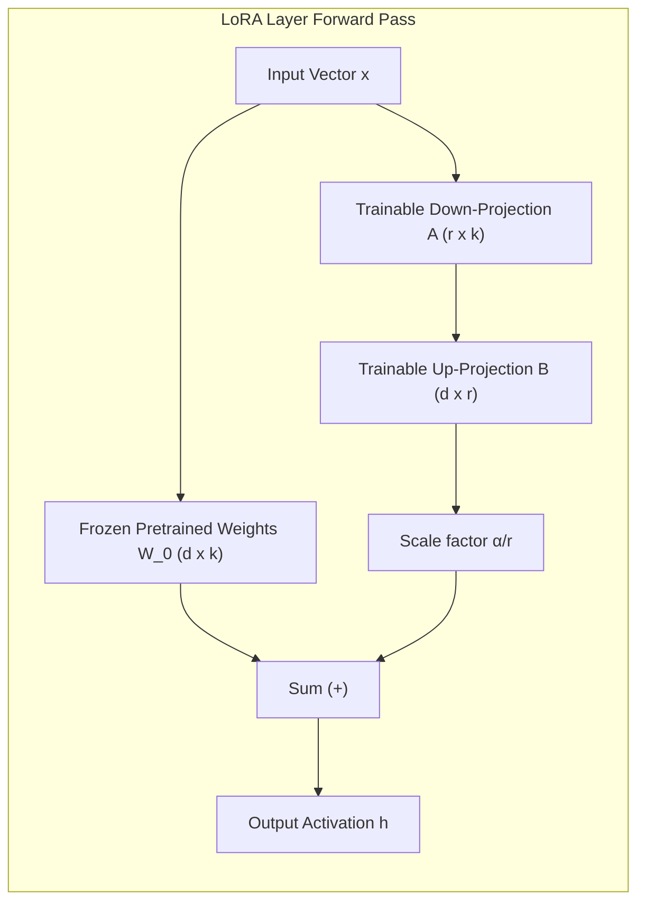
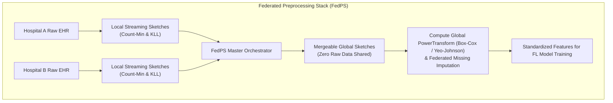

# Federated Learning: Communication Efficiency, PEFT & Federated Preprocessing
**Conceptual & Theoretical Knowledge Base — Volume IV**

---

## 1. The Communication Bottleneck

In cross-silo and cross-device federated learning, communication bandwidth represents the primary operational bottleneck. While deep neural networks contain billions of parameters (e.g., 7B parameter models require 28 GB of data transfer per client per round in FP32), uplink speeds in clinical and edge deployments are severely limited.

---

## 2. Quantization Theory & Stochastic Unbiasedness

Quantization maps continuous 32-bit floating-point parameters to low-bitwidth discrete representations.

### 2.1 Affine Quantization Formulation
$$\text{quantize}(x) = \text{round}\left( \frac{x}{S} \right) + Z$$
$$\text{dequantize}(q) = S \cdot (q - Z)$$
Where $S$ is the scale factor and $Z$ is the zero-point integer offset:
$$S = \frac{\max(x) - \min(x)}{2^b - 1}, \quad Z = \text{round}\left( -\frac{\min(x)}{S} \right)$$

---

### 2.2 Proof of Unbiasedness in Stochastic Uniform Quantization

Deterministic rounding ($\text{round}(x/S)$) introduces systematic gradient bias that accumulates over communication rounds, causing divergence in non-convex optimization. **Stochastic Quantization** resolves this by probabilistic rounding.

**Definition:** For a normalized value $\tilde{x} \in [0, 1]$ falling between discrete quantization levels $\frac{l}{L} \le \tilde{x} < \frac{l+1}{L}$:
$$Q(\tilde{x}) = \begin{cases} \frac{l+1}{L} & \text{with probability } p = L \tilde{x} - l \\ \frac{l}{L} & \text{with probability } 1 - p = 1 - (L \tilde{x} - l) \end{cases}$$

**Mathematical Proof of Unbiasedness:**
$$\mathbb{E}[Q(\tilde{x})] = \frac{l+1}{L} \cdot p + \frac{l}{L} \cdot (1 - p)$$
$$\mathbb{E}[Q(\tilde{x})] = \frac{l+1}{L}(L\tilde{x} - l) + \frac{l}{L}(1 - L\tilde{x} + l)$$
$$\mathbb{E}[Q(\tilde{x})] = \tilde{x} + \frac{l}{L} - \frac{l(l+1)}{L^2} + \frac{l}{L} - \frac{l^2}{L} + \frac{l^2}{L^2} \dots = \tilde{x}$$
$$\therefore \mathbb{E}[Q(x)] = x$$

* **Theoretical Consequence:** Because $\mathbb{E}[Q(x)] = x$, stochastic quantization introduces zero systematic gradient bias. The expected value of the aggregated model matches full-precision FedAvg: $\mathbb{E}[w_{t+1}^{\text{quantized}}] = w_{t+1}^{\text{exact}}$.

---

## 3. Gradient and Weight Sparsification

Sparsification reduces bandwidth by transmitting only a small fraction $k \ll d$ of parameter updates.

### 3.1 Top-$k$ vs. Random-$k$ Sparsification
* **Top-$k$ Sparsification:** Transmits only the $k$ elements with the largest absolute magnitudes:
  $$\text{Top}_k(v)_i = \begin{cases} v_i & \text{if } |v_i| \ge \tau_k \text{ (Top } k\% \text{ threshold)} \\ 0 & \text{otherwise} \end{cases}$$
* **Random-$k$ Sparsification:** Randomly selects $k$ coordinates and scales them by $d/k$ to maintain an unbiased estimator: $\mathbb{E}[\text{Rand}_k(v)] = v$.

---

### 3.2 Error Feedback (EF) / Memory Accumulation
While Top-$k$ yields superior empirical compression (often discarding 99% of updates), it is inherently biased ($\mathbb{E}[\text{Top}_k(v)] \neq v$), which can cause optimization to diverge. **Error Feedback** (Stich et al., 2018) solves this by maintaining a local residual memory buffer $e_t$:

**Theoretical Guarantee:** Error Feedback guarantees that all discarded gradient information is eventually transmitted in future rounds, restoring the $\mathcal{O}(1/\sqrt{T})$ convergence rate of uncompressed SGD.

---

## 4. Parameter-Efficient Fine-Tuning (PEFT): Federated LoRA & Modern Architectures

Rather than fine-tuning all $d$ parameters of a large foundation model, Parameter-Efficient Fine-Tuning freezes the pre-trained weights $W_0 \in \mathbb{R}^{d \times k}$ and updates low-rank decompositions:

### 4.1 Federated LoRA on Transformer vs. State Space Models (Mamba / SSM)
* **Attention Layers in Transformers:** LoRA is applied to query ($W_q$), key ($W_k$), and value ($W_v$) projection matrices.
* **State Space Models (Mamba / SSM):** In modern architectures like Mamba, LoRA targets the continuous-to-discrete projection parameters ($B, C, \Delta$) and linear input-output projections ($W_{\text{in}}, W_{\text{out}}$).

**Bandwidth Compression:** Transmitting rank $r=8$ adapter matrices instead of full 7B parameter matrices reduces communication payload by **$99.2\%$** (e.g., from 14 GB down to 28 MB per round).

---

## 5. Federated Preprocessing System (FedPS)

Data in clinical silos cannot be manually harmonized without violating privacy. The **Federated Preprocessing System (FedPS)** computes global data cleaning and feature transformations collaboratively using sublinear sketches and distributed statistics.

### 5.1 Streaming Data Sketches
* **Count-Min Sketch (CMS):** A sublinear space 2D array of $d$ hash functions of width $w$ tracking categorical frequencies. Merging CMS tables across clients is an exact linear addition: $\text{CMS}_{\text{global}} = \sum_k \text{CMS}_k$.
* **KLL Sketches (Karnin-Lang-Liberty):** Mergeable quantile sketches tracking continuous feature distributions to determine exact medians, interquartile ranges, and outlier boundaries without revealing individual patient records.

---

### 5.2 Federated PowerTransform: Box-Cox and Yeo-Johnson

Non-IID continuous features in healthcare often exhibit extreme skewness. Power transformations stabilize feature variance and map data toward a Gaussian distribution prior to training.

#### 1. Box-Cox Transformation (for strictly positive features $x > 0$)
$$x^{(\lambda)} = \begin{cases} \frac{x^\lambda - 1}{\lambda} & \text{if } \lambda \neq 0 \\ \ln(x) & \text{if } \lambda = 0 \end{cases}$$

#### 2. Yeo-Johnson Transformation (handling zero and negative continuous values)
$$\psi(\lambda, x) = \begin{cases} \frac{(x+1)^\lambda - 1}{\lambda} & \text{if } \lambda \neq 0, \; x \ge 0 \\ \ln(x+1) & \text{if } \lambda = 0, \; x \ge 0 \\ -\frac{(-x+1)^{2-\lambda} - 1}{2-\lambda} & \text{if } \lambda \neq 2, \; x < 0 \\ -\ln(-x+1) & \text{if } \lambda = 2, \; x < 0 \end{cases}$$

**Federated Parameter Estimation:**
The optimal parameter $\hat{\lambda}$ maximizes the profile log-likelihood:
$$L(\lambda) = -\frac{n}{2} \ln(\hat{\sigma}^2(\lambda)) + (\lambda - 1) \sum_{i=1}^n \text{sign}(x_i) \ln(|x_i| + 1)$$
FedPS computes the summary statistics $\sum_k n_k$, $\sum_k \sum_i \ln(|x_{k, i}|+1)$, and $\sum_k \hat{\sigma}_k^2(\lambda)$ through federated aggregation, enabling the server to solve for $\hat{\lambda}$ using 1D derivative-free search (Brent's method) without centralizing a single continuous feature vector.

---

### 5.3 Missing Value Imputation via Federated Bayesian Linear Regression
When clinical attributes are missing across silos, FedPS fits a **Federated Bayesian Linear Regression**:
$$\mathbb{E}[\beta \mid \mathcal{D}] = \left( \sum_{k=1}^K X_k^T X_k + \sigma^2 \Sigma_0^{-1} \right)^{-1} \left( \sum_{k=1}^K X_k^T y_k \right)$$
Clients transmit only local gram matrices $G_k = X_k^T X_k \in \mathbb{R}^{p \times p}$ and projection vectors $v_k = X_k^T y_k \in \mathbb{R}^p$. The orchestrator inverts the aggregated covariance matrix to distribute global imputation coefficients back to each silo.
