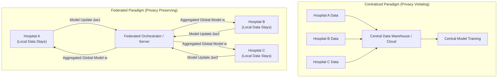
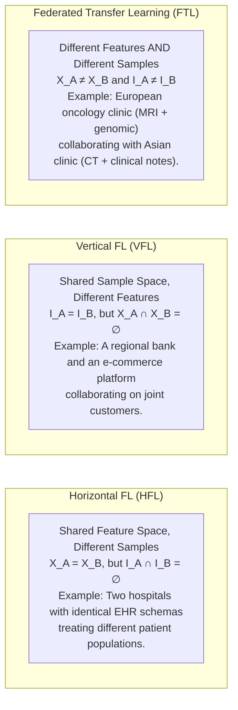
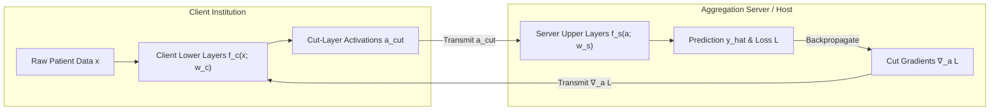
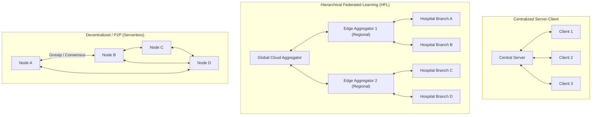
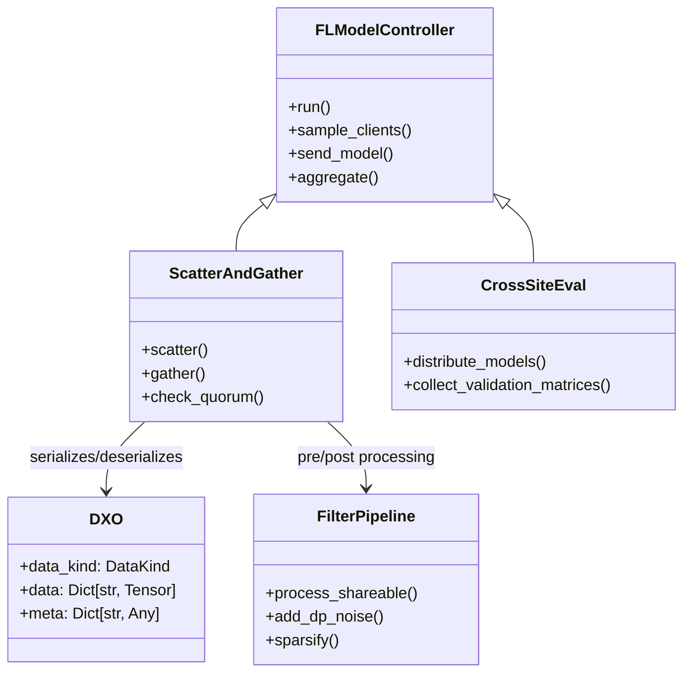
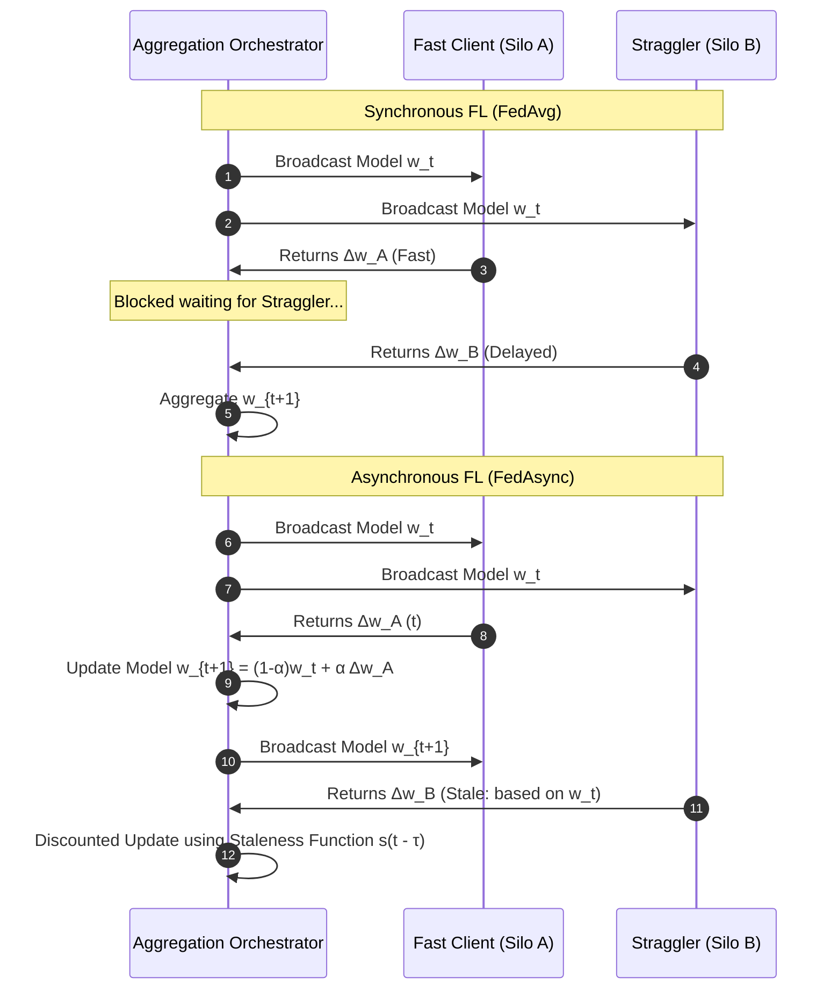

# Federated Learning: Foundations, Paradigms & System Architectures
**Conceptual & Theoretical Knowledge Base — Volume I**

---

## 1. The Core Paradigm of Federated Learning

Federated Learning (FL) is a distributed machine learning paradigm that decouples model training from direct data collection. Introduced formally by McMahan et al. (2016/2017), FL resolves the fundamental conflict between the hunger of deep neural networks for large, diverse datasets and the legal, ethical, and competitive imperatives of data privacy, confidentiality, and data governance.

### 1.1 The Centralized vs. Federated Mathematical Formulation

In standard **Centralized Machine Learning**, data from all sources $\mathcal{D} = \bigcup_{k=1}^K \mathcal{D}_k$ is pooled into a single data lake:
$$\min_{w \in \mathbb{R}^d} F(w) = \frac{1}{|\mathcal{D}|} \sum_{x_i, y_i \in \mathcal{D}} \ell(f(x_i; w), y_i)$$

In **Federated Learning**, raw data never leaves its originating silo $\mathcal{D}_k$. Instead, the global objective is formulated as a distributed optimization problem across $K$ participating institutions:
$$\min_{w \in \mathbb{R}^d} F(w) \triangleq \sum_{k=1}^K p_k F_k(w), \quad \text{where } p_k \ge 0, \; \sum_{k=1}^K p_k = 1$$
Here, $F_k(w)$ is the local empirical risk on client $k$:
$$F_k(w) \triangleq \frac{1}{n_k} \sum_{j=1}^{n_k} \ell(f(x_{k,j}; w), y_{k,j})$$
And $p_k$ is the relative importance weight of client $k$, traditionally set proportional to sample count: $p_k = n_k / \sum_{i=1}^K n_i$.

---

## 2. Structural Taxonomies of Federated Learning

Federated learning systems are categorized along three fundamental orthogonal axes: **Network Scale (Silo vs. Device)**, **Data Partitioning (Horizontal vs. Vertical vs. Transfer)**, and **Topology (Centralized vs. Hierarchical vs. Decentralized / P2P)**.

### 2.1 Cross-Silo vs. Cross-Device Federated Learning

| Characteristic | Cross-Silo Federated Learning | Cross-Device Federated Learning |
| :--- | :--- | :--- |
| **Participants** | Small number ($K \in [2, 100]$) of formal organizations (hospitals, banks, aerospace test units). | Massive number ($K \in [10^3, 10^9]$) of consumer edge devices (smartphones, IoT sensors). |
| **Data Distribution** | Large local volume per client; highly heterogeneous (non-IID) across institutions. | Small local volume per client; intermittent, sparse, highly personal. |
| **Client Reliability** | High. High-availability servers, dedicated data center connections, predictable uptime. | Low. Frequent network disconnects, battery throttling, unannounced dropouts. |
| **Computational Power**| Enterprise-grade GPUs / multi-node clusters. Can support large LLMs / PEFT. | Low-power mobile SoCs, embedded microcontrollers. Limited to tiny networks. |
| **Bottleneck** | Statistical non-IID heterogeneity, institutional compliance (HIPAA, GDPR), proprietary risk. | Communication bandwidth, stragglers, device availability, massive concurrency. |
| **Primary Domain** | Healthcare (EHR/imaging), defense fleets, multi-bank anti-fraud, industrial consortiums. | Mobile keyboard next-word prediction (GBoard), voice assistants, edge camera filters. |

---

### 2.2 Data Partitioning Matrix: Horizontal, Vertical, and Federated Transfer

The relationship between the feature space $\mathcal{X}$ and sample ID space $\mathcal{I}$ across clients determines the algorithmic structure of the federation:

1. **Horizontal Federated Learning (HFL):** Clients share the same feature representations $X$ but hold disjoint sets of user samples $I$. The model parameters are directly compatible and can be aggregated via element-wise weighted averaging (e.g., FedAvg).
2. **Vertical Federated Learning (VFL):** Participating organizations hold different feature sets for an overlapping set of entity IDs. VFL relies on **Private Set Intersection (PSI)** using cryptographic hashing or homomorphic encryption to align entity IDs without revealing unshared customers, followed by distributed split neural networks.
3. **Federated Transfer Learning (FTL):** Applicable when both feature spaces and entity IDs have minimal overlap. FTL learns a shared representation space using domain adaptation and transfer loss across domains.

---

### 2.3 Alternative Collaborative Paradigms: Split Learning vs. Federated Learning

While standard Federated Learning transmits weight tensors or gradient updates for an entire model, **Split Learning** (Gupta & Raskar, 2018) partitions the neural network architecture across the client-server boundary at a designated **cut layer**:

#### Comparison of Split Learning and Federated Learning:
* **Computational Burden:** In Split Learning, resource-constrained clients compute only forward and backward passes up to the cut layer, making it ideal for edge devices unable to store full LLMs or 3D vision backbones.
* **Network Overhead:** FL communication scales with model size $|w|$ and is independent of batch size. Split Learning communication scales with activation tensor size $|a_{\text{cut}}| \times \text{batch\_size}$, creating heavy network bottlenecks over WAN for high-throughput training.
* **Privacy Vulnerability:** Transmitting activations $a_{\text{cut}}$ exposes the client to **feature reconstruction attacks** (inverting intermediate activations back to raw images) and label leakage if the cut layer is too close to the output.
* **SplitFed (Split Federated Learning):** A hybrid architecture that executes Split Learning across multiple parallel clients while periodically aggregating the clients' lower-layer weights using FedAvg, combining data parallelism with model splitting.

---

### 2.4 Network Topology Paradigms: Centralized, Hierarchical, and Decentralized / P2P

#### 1. Centralized Server-Client Topology
* A central orchestrator controls round orchestration, client selection, update aggregation, and global model broadcast.
* **Limitation:** The server represents a Single Point of Failure (SPOF) and a high-bandwidth bottleneck.

#### 2. Hierarchical Federated Learning (HFL)
* Designed for multi-tiered edge-cloud infrastructures (e.g., base stations, regional hospital clusters, tactical flight squadrons).
* Clients execute $E_1$ local SGD iterations, aggregate locally with an **Edge Aggregator** over fast LAN/WLAN every $E_2$ steps, and the edge aggregators communicate with the **Global Cloud Aggregator** over WAN every $E_3$ rounds.
* **Optimization Benefit:** Minimizes expensive wide-area communication latency by an order of magnitude.

#### 3. Decentralized / P2P Federated Learning
* Eliminates the central orchestrator entirely. Nodes communicate strictly with topological neighbors over an adjacency graph $G = (V, E)$ via **Gossip Learning** or consensus diffusion:
  $$w_i^{(t+1)} = \sum_{j \in \mathcal{N}_i \cup \{i\}} W_{ij} w_j^{(t)}$$
* The convergence rate is governed by the spectral gap $1 - \lambda_2(W)$ of the doubly stochastic mixing matrix $W$.
* **Robustness:** Highly resilient to server outages and targeted regulatory censorship.

---

## 3. Reference Architecture: The NVFlare Enterprise FL Model Controller Pattern

In industrial and healthcare settings (such as the NVIDIA FLARE / NVFlare ecosystem), federated execution is decoupled into clean object-oriented abstraction layers:

### 3.1 Core Controller Components
* **FL Model Controller:** Server-side engine orchestrating lifecycle states, client quorum verification, timeout management, and multi-round dispatch.
* **ScatterAndGather:** Standard synchronous orchestration workflow:
  1. *Scatter:* Distribute the global model state to active, sampled clients.
  2. *Execute:* Clients run local optimization scripts.
  3. *Gather:* Wait for client return payloads, enforcing timeout deadlines and minimum participation quorums.
  4. *Aggregate:* Invoke robust aggregation logic on received model updates.
* **CrossSiteEval:** Workflow where clients evaluate both the global model and peer models against their local private test sets, generating a full cross-site validation matrix to detect domain generalization and overfitting.
* **DXO (Data Exchange Object):** Standardized, framework-agnostic payload packaging weights, gradients, metrics, differential privacy budgets, and metadata.
* **Filter Pipelines (`Filter` / `ShareableFilter`):** Bidirectional transformation hooks applied before serialization and after deserialization, enforcing Differential Privacy noise injection, Top-$k$ sparsification, and gradient clipping without altering model logic.

---

## 4. Synchronous vs. Asynchronous Federated Protocols

1. **Synchronous Protocols (FedAvg, SCAFFOLD):** The central server waits for a predefined fraction $C$ of clients to submit updates. While statistically stable, throughput is bounded by the slowest participating client ("straggler problem").
2. **Asynchronous Protocols (FedAsync):** The server updates the global model immediately upon receiving an update from any client:
   $$w_{new} = (1 - \alpha_t) w_{old} + \alpha_t \cdot s(\tau) \cdot w_{\text{received}}$$
   Where $s(\tau) = (1 + \tau)^{-a}$ is a **staleness penalty function** discounting updates computed on older global iterations.
