# Federated Learning: Master Conceptual & Theoretical Synthesis
**Comprehensive Research Knowledge Base — Master Volume**

---

## Executive Synthesis: The Science of Federated Learning

Federated Learning (FL) has matured into an interconnected systems engineering and mathematical discipline spanning distributed optimization, information theory, differential privacy, cryptography, and modern deep learning.

This master knowledge base synthesizes the complete theoretical and algorithmic landscape extracted from the `FedNeMo` research archive into six deeply connected pillars:

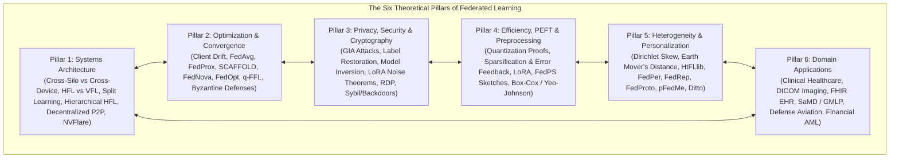

---

## The Unified Theoretical Trade-Off Space

Every federated system operates within a fundamental multi-dimensional trade-off envelope:

$$\mathcal{T}(\text{Privacy}, \text{Utility}, \text{Efficiency}, \text{Fairness}, \text{Robustness})$$

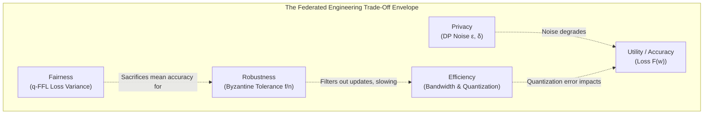

1. **Privacy vs. Utility:** Injecting Gaussian noise for $(\epsilon, \delta)$-DP establishes mathematical bounds on gradient inversion risk, but degrades global test accuracy. FedRand (StochasticLoRA) optimizes this trade-off by eliminating cross-term noise, reducing variance from $\mathcal{O}(1/\epsilon^4)$ down to $\mathcal{O}(1/\epsilon^2)$.
2. **Efficiency vs. Convergence Rate:** Aggressive compression (1-bit quantization or Top-99% sparsification) conserves bandwidth but increases optimization error. Error Feedback (EF) restores asymptotic convergence at the cost of local memory overhead.
3. **Statistical Heterogeneity vs. Consensus:** Under severe non-IID conditions (Dirichlet $\alpha \to 0$, large Earth Mover's Distance), a single consensus model fails. Personalization paradigms (FedPer, FedProto, pFedMe, Ditto) resolve this by decoupling shared representations from specialized client models.


---

# Federated Learning: Foundations, Paradigms & System Architectures
**Conceptual & Theoretical Knowledge Base — Volume I**

---

## 1. The Core Paradigm of Federated Learning

Federated Learning (FL) is a distributed machine learning paradigm that decouples model training from direct data collection. Introduced formally by McMahan et al. (2016/2017), FL resolves the fundamental conflict between the hunger of deep neural networks for large, diverse datasets and the legal, ethical, and competitive imperatives of data privacy, confidentiality, and data governance.

### 1.1 The Centralized vs. Federated Mathematical Formulation

In standard **Centralized Machine Learning**, data from all sources $\mathcal{D} = \bigcup_{k=1}^K \mathcal{D}_k$ is pooled into a single data lake:
$$\min_{w \in \mathbb{R}^d} F(w) = \frac{1}{|\mathcal{D}|} \sum_{x_i, y_i \in \mathcal{D}} \ell(f(x_i; w), y_i)$$

In **Federated Learning**, raw data never leaves its originating silo $\mathcal{D}_k$. Instead, the global objective is formulated as a distributed optimization problem across $K$ participating institutions:
$$\min_{w \in \mathbb{R}^d} F(w) \triangleq \sum_{k=1}^K p_k F_k(w), \quad \text{where } p_k \ge 0, \; \sum_{k=1}^K p_k = 1$$
Here, $F_k(w)$ is the local empirical risk on client $k$:
$$F_k(w) \triangleq \frac{1}{n_k} \sum_{j=1}^{n_k} \ell(f(x_{k,j}; w), y_{k,j})$$
And $p_k$ is the relative importance weight of client $k$, traditionally set proportional to sample count: $p_k = n_k / \sum_{i=1}^K n_i$.

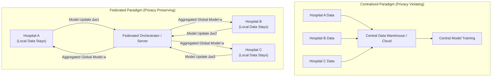

---

## 2. Structural Taxonomies of Federated Learning

Federated learning systems are categorized along three fundamental orthogonal axes: **Network Scale (Silo vs. Device)**, **Data Partitioning (Horizontal vs. Vertical vs. Transfer)**, and **Topology (Centralized vs. Hierarchical vs. Decentralized / P2P)**.

### 2.1 Cross-Silo vs. Cross-Device Federated Learning

| Characteristic | Cross-Silo Federated Learning | Cross-Device Federated Learning |
| :--- | :--- | :--- |
| **Participants** | Small number ($K \in [2, 100]$) of formal organizations (hospitals, banks, aerospace test units). | Massive number ($K \in [10^3, 10^9]$) of consumer edge devices (smartphones, IoT sensors). |
| **Data Distribution** | Large local volume per client; highly heterogeneous (non-IID) across institutions. | Small local volume per client; intermittent, sparse, highly personal. |
| **Client Reliability** | High. High-availability servers, dedicated data center connections, predictable uptime. | Low. Frequent network disconnects, battery throttling, unannounced dropouts. |
| **Computational Power**| Enterprise-grade GPUs / multi-node clusters. Can support large LLMs / PEFT. | Low-power mobile SoCs, embedded microcontrollers. Limited to tiny networks. |
| **Bottleneck** | Statistical non-IID heterogeneity, institutional compliance (HIPAA, GDPR), proprietary risk. | Communication bandwidth, stragglers, device availability, massive concurrency. |
| **Primary Domain** | Healthcare (EHR/imaging), defense fleets, multi-bank anti-fraud, industrial consortiums. | Mobile keyboard next-word prediction (GBoard), voice assistants, edge camera filters. |

---

### 2.2 Data Partitioning Matrix: Horizontal, Vertical, and Federated Transfer

The relationship between the feature space $\mathcal{X}$ and sample ID space $\mathcal{I}$ across clients determines the algorithmic structure of the federation:

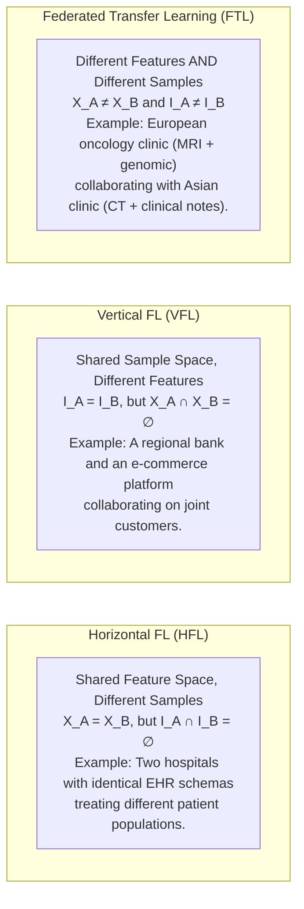

1. **Horizontal Federated Learning (HFL):** Clients share the same feature representations $X$ but hold disjoint sets of user samples $I$. The model parameters are directly compatible and can be aggregated via element-wise weighted averaging (e.g., FedAvg).
2. **Vertical Federated Learning (VFL):** Participating organizations hold different feature sets for an overlapping set of entity IDs. VFL relies on **Private Set Intersection (PSI)** using cryptographic hashing or homomorphic encryption to align entity IDs without revealing unshared customers, followed by distributed split neural networks.
3. **Federated Transfer Learning (FTL):** Applicable when both feature spaces and entity IDs have minimal overlap. FTL learns a shared representation space using domain adaptation and transfer loss across domains.

---

### 2.3 Alternative Collaborative Paradigms: Split Learning vs. Federated Learning

While standard Federated Learning transmits weight tensors or gradient updates for an entire model, **Split Learning** (Gupta & Raskar, 2018) partitions the neural network architecture across the client-server boundary at a designated **cut layer**:

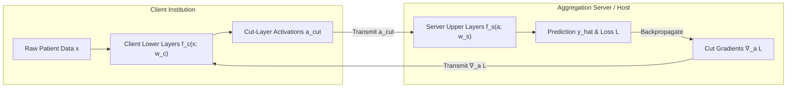

#### Comparison of Split Learning and Federated Learning:
* **Computational Burden:** In Split Learning, resource-constrained clients compute only forward and backward passes up to the cut layer, making it ideal for edge devices unable to store full LLMs or 3D vision backbones.
* **Network Overhead:** FL communication scales with model size $|w|$ and is independent of batch size. Split Learning communication scales with activation tensor size $|a_{\text{cut}}| \times \text{batch\_size}$, creating heavy network bottlenecks over WAN for high-throughput training.
* **Privacy Vulnerability:** Transmitting activations $a_{\text{cut}}$ exposes the client to **feature reconstruction attacks** (inverting intermediate activations back to raw images) and label leakage if the cut layer is too close to the output.
* **SplitFed (Split Federated Learning):** A hybrid architecture that executes Split Learning across multiple parallel clients while periodically aggregating the clients' lower-layer weights using FedAvg, combining data parallelism with model splitting.

---

### 2.4 Network Topology Paradigms: Centralized, Hierarchical, and Decentralized / P2P

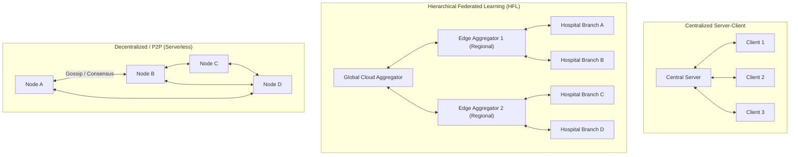

#### 1. Centralized Server-Client Topology
* A central orchestrator controls round orchestration, client selection, update aggregation, and global model broadcast.
* **Limitation:** The server represents a Single Point of Failure (SPOF) and a high-bandwidth bottleneck.

#### 2. Hierarchical Federated Learning (HFL)
* Designed for multi-tiered edge-cloud infrastructures (e.g., base stations, regional hospital clusters, tactical flight squadrons).
* Clients execute $E_1$ local SGD iterations, aggregate locally with an **Edge Aggregator** over fast LAN/WLAN every $E_2$ steps, and the edge aggregators communicate with the **Global Cloud Aggregator** over WAN every $E_3$ rounds.
* **Optimization Benefit:** Minimizes expensive wide-area communication latency by an order of magnitude.

#### 3. Decentralized / P2P Federated Learning
* Eliminates the central orchestrator entirely. Nodes communicate strictly with topological neighbors over an adjacency graph $G = (V, E)$ via **Gossip Learning** or consensus diffusion:
  $$w_i^{(t+1)} = \sum_{j \in \mathcal{N}_i \cup \{i\}} W_{ij} w_j^{(t)}$$
* The convergence rate is governed by the spectral gap $1 - \lambda_2(W)$ of the doubly stochastic mixing matrix $W$.
* **Robustness:** Highly resilient to server outages and targeted regulatory censorship.

---

## 3. Reference Architecture: The NVFlare Enterprise FL Model Controller Pattern

In industrial and healthcare settings (such as the NVIDIA FLARE / NVFlare ecosystem), federated execution is decoupled into clean object-oriented abstraction layers:

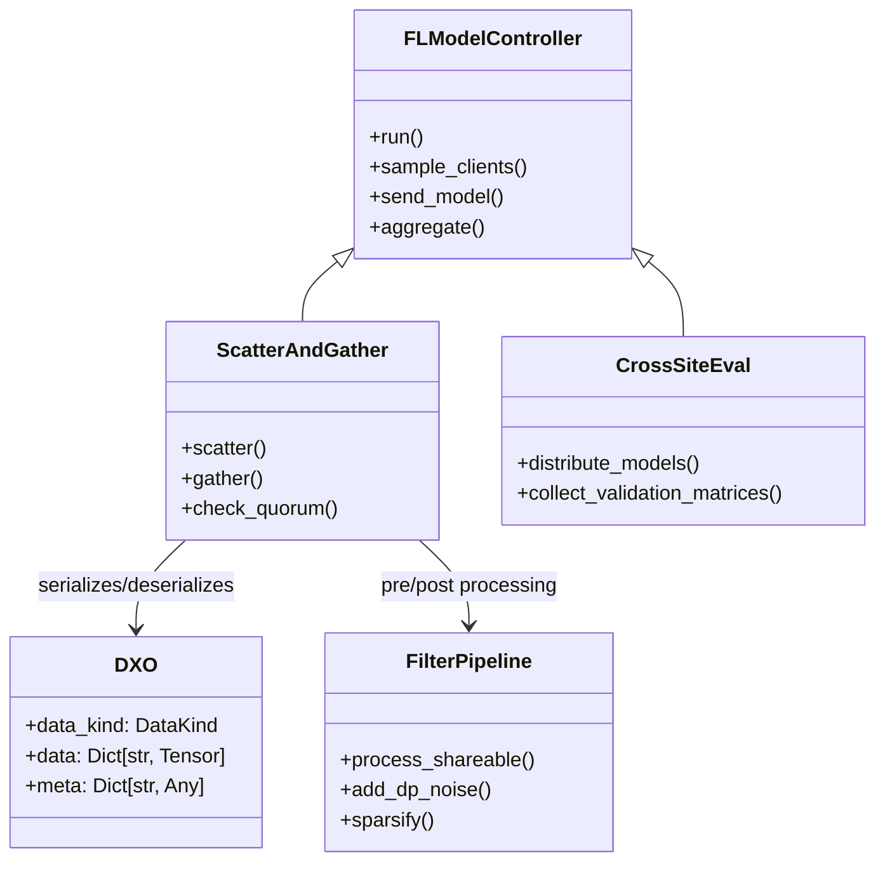

### 3.1 Core Controller Components
* **FL Model Controller:** Server-side engine orchestrating lifecycle states, client quorum verification, timeout management, and multi-round dispatch.
* **ScatterAndGather:** Standard synchronous orchestration workflow:
  1. *Scatter:* Distribute the global model state to active, sampled clients.
  2. *Execute:* Clients run local optimization scripts.
  3. *Gather:* Wait for client return payloads, enforcing timeout deadlines and minimum participation quorums.
  4. *Aggregate:* Invoke robust aggregation logic on received model updates.
* **CrossSiteEval:** Workflow where clients evaluate both the global model and peer models against their local private test sets, generating a full cross-site validation matrix to detect domain generalization and overfitting.
* **DXO (Data Exchange Object):** Standardized, framework-agnostic payload packaging weights, gradients, metrics, differential privacy budgets, and metadata.
* **Filter Pipelines (`Filter` / `ShareableFilter`):** Bidirectional transformation hooks applied before serialization and after deserialization, enforcing Differential Privacy noise injection, Top-$k$ sparsification, and gradient clipping without altering model logic.

---

## 4. Synchronous vs. Asynchronous Federated Protocols

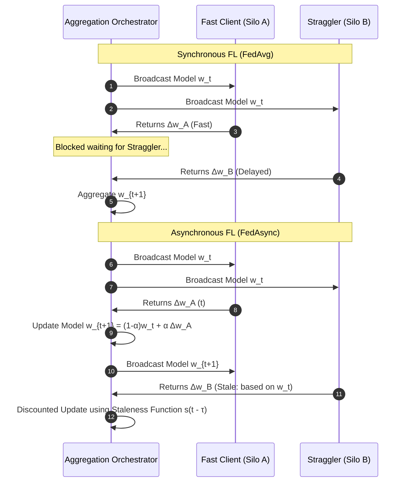

1. **Synchronous Protocols (FedAvg, SCAFFOLD):** The central server waits for a predefined fraction $C$ of clients to submit updates. While statistically stable, throughput is bounded by the slowest participating client ("straggler problem").
2. **Asynchronous Protocols (FedAsync):** The server updates the global model immediately upon receiving an update from any client:
   $$w_{new} = (1 - \alpha_t) w_{old} + \alpha_t \cdot s(\tau) \cdot w_{\text{received}}$$
   Where $s(\tau) = (1 + \tau)^{-a}$ is a **staleness penalty function** discounting updates computed on older global iterations.


---

# Federated Learning: Mathematical Foundations & Optimization Strategies
**Conceptual & Theoretical Knowledge Base — Volume II**

---

## 1. The Federated Optimization Challenge

Federated optimization fundamentally deviates from standard distributed stochastic gradient descent (SGD) due to three mathematical realities:
1. **Extreme Non-Convexity:** Deep neural network loss surfaces have millions of saddle points, local minima, and non-convex valleys.
2. **Statistical Heterogeneity (Non-IID):** $\mathbb{E}_{x \sim \mathcal{D}_i}[\nabla f(x; w)] \neq \mathbb{E}_{x \sim \mathcal{D}_j}[\nabla f(x; w)]$.
3. **Communication Constraints:** Clients must perform multiple local steps ($\tau > 1$) before communicating, leading to **Client Drift**.

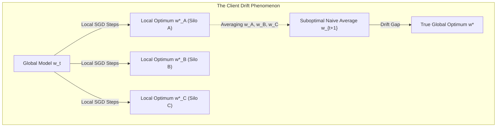

### 1.1 Bounded Dissimilarity and Gradient Variance Assumptions
Theoretical convergence proofs rely on formal bounds on client heterogeneity:
* **$G$-Bounded Gradients:** $\mathbb{E}\|\nabla F_k(w)\|^2 \le G^2$
* **$B$-Local Variance:** $\mathbb{E}\|\nabla f_k(x; w) - \nabla F_k(w)\|^2 \le \sigma_k^2$
* **Gradient Dissimilarity ($\beta$-heterogeneity):** $\sum_{k=1}^K p_k \|\nabla F_k(w)\|^2 \le \kappa_1^2 + \kappa_2^2 \|\nabla F(w)\|^2$

---

## 2. Foundational Aggregation Algorithms

### 2.1 Federated Averaging (FedAvg)
Proposed by McMahan et al. (2017), FedAvg performs local SGD on sampled clients followed by weighted averaging.

**Mathematical Formulation:**
In round $t$:
1. Orchestrator samples a subset $S_t \subseteq \{1, \dots, K\}$ with $|S_t| = \max(C \cdot K, 1)$.
2. Each client $k \in S_t$ initializes $w_{k, 0}^{(t)} = w_t$ and executes $\tau$ local SGD steps:
   $$w_{k, j+1}^{(t)} = w_{k, j}^{(t)} - \eta_L \nabla F_k(w_{k, j}^{(t)}; \xi_{k, j})$$
3. Server aggregates client updates:
   $$w_{t+1} = \sum_{k \in S_t} \frac{n_k}{\sum_{i \in S_t} n_i} w_{k, \tau}^{(t)}$$

**Convergence & Drift Limitations:**
For smooth, strongly convex objectives, FedAvg converges at rate $\mathcal{O}(1/T)$. However, under non-IID distributions, as $\tau \to \infty$, clients drift toward their individual local minima $w_k^* \neq w^*$, causing the aggregated model to oscillate and fail to converge.

---

### 2.2 FedProx: Handling Heterogeneity via the Proximal Term
Li et al. (2020) introduced **FedProx** to stabilize training under both statistical heterogeneity (non-IID) and systems heterogeneity (variable compute capabilities).

**The Proximal Term Formulation:**
FedProx modifies the client local objective by introducing an elastic **proximal term**:
$$\min_{w \in \mathbb{R}^d} h_k(w; w_t) \triangleq F_k(w) + \frac{\mu}{2} \|w - w_t\|^2$$
Where $\mu \ge 0$ is a tunable regularization parameter.

**Theoretical Impact of the Proximal Term:**
1. **Restricting Client Drift:** The quadratic penalty $\frac{\mu}{2}\|w - w_t\|^2$ tethers local updates to the current global model $w_t$, ensuring local trajectories do not diverge excessively even if $\tau$ is large.
2. **Handling Inexact Solutions ($\gamma$-inexactness):** In heterogeneous networks, weak clients cannot complete $\tau$ epochs. FedProx accommodates variable work amounts by accepting inexact solutions satisfying:
   $$\|\nabla h_k(w_k^{(t+1)}; w_t)\| \le \gamma_k \|\nabla h_k(w_t; w_t)\| = \gamma_k \|\nabla F_k(w_t)\|$$
   Where $\gamma_k \in [0, 1]$ represents the solution tolerance for client $k$.

---

### 2.3 SCAFFOLD: Variance Reduction via Control Variates
Karimireddy et al. (2020) proposed **SCAFFOLD** (Stochastic Controlled Averaging for Federated Learning) to mathematically eliminate client drift using control variates.

**Formulation:**
SCAFFOLD maintains a global control variate $c$ and local control variates $c_k$ representing the gradient direction of the client.

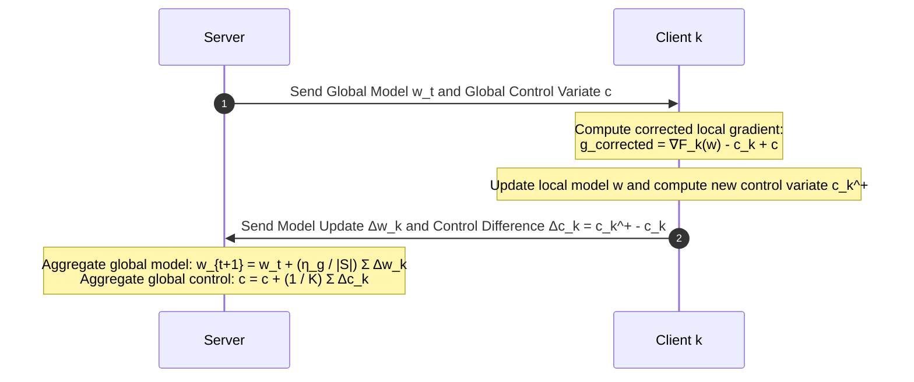

**Local Step with Control Variates:**
$$w \leftarrow w - \eta_L \left( \nabla F_k(w; \xi) - c_k + c \right)$$
The term $(c - c_k)$ acts as an estimate of the drift $( \nabla F(w) - \nabla F_k(w) )$, actively steering the client's local gradient toward the true global gradient direction.

**Theoretical Guarantee:** SCAFFOLD achieves convergence independent of client data dissimilarity $G^2$, overcoming the fundamental bottleneck of FedAvg.

---

## 3. Normalized Averaging, Fair Optimization & Server-Side Adaptivity

### 3.1 FedNova: Correcting Objective Inconsistency
When clients perform varying numbers of local epochs $\tau_k$ (due to differing compute capabilities), naive aggregation in FedAvg causes **Objective Inconsistency**—the aggregated model converges to a surrogate objective that overweights fast clients:
$$F_{\text{inconsistent}}(w) = \sum_{k=1}^K \frac{n_k \tau_k}{\sum_i n_i \tau_i} F_k(w)$$

**FedNova Resolution (Wang et al., 2020):**
FedNova scales local updates by an effective step size $a_k$:
$$d_k = \frac{1}{a_k} (w_t - w_{k, \tau_k}^{(t)}), \quad \text{where } a_k = \sum_{j=0}^{\tau_k - 1} (1 - \eta_L L)^j$$
The server then aggregates the normalized directions $d_k$, preserving convergence to the true global objective $\min \sum_k p_k F_k(w)$.

---

### 3.2 Server-Side Adaptive Optimization: The FedOpt Framework
Reddi et al. (2020) introduced **FedOpt**, treating client updates as pseudo-gradients applied to server-side adaptive optimizers:
$$\Delta_t = \sum_{k \in S_t} p_k (w_{k, \tau}^{(t)} - w_t)$$

The server updates $w_{t+1}$ using generalized momentum and adaptive preconditioners:

| Optimizer | Server Momentum Update $m_t$ | Server Variance Update $v_t$ | Global Model Update $w_{t+1}$ |
| :--- | :--- | :--- | :--- |
| **FedAdagrad** | $m_t = \Delta_t$ | $v_t = v_{t-1} + \Delta_t^2$ | $w_{t+1} = w_t + \eta_g \frac{m_t}{\sqrt{v_t} + \tau_0}$ |
| **FedYogi** | $m_t = \beta_1 m_{t-1} + (1-\beta_1)\Delta_t$ | $v_t = v_{t-1} - (1-\beta_2)\Delta_t^2 \text{sign}(v_{t-1} - \Delta_t^2)$ | $w_{t+1} = w_t + \eta_g \frac{m_t}{\sqrt{v_t} + \epsilon}$ |
| **FedAdam** | $m_t = \beta_1 m_{t-1} + (1-\beta_1)\Delta_t$ | $v_t = \beta_2 v_{t-1} + (1-\beta_2)\Delta_t^2$ | $w_{t+1} = w_t + \eta_g \frac{m_t}{\sqrt{v_t} + \epsilon}$ |

---

### 3.3 Fair Federated Learning: $q$-FFL ($q$-FedAvg)
Standard FedAvg minimizes aggregate loss $\sum_k p_k F_k(w)$, which often produces models biased toward majority clients while suffering disastrous error on minority silos.

**Mathematical Formulation (Li et al., 2020):**
The $q$-Fair Federated Learning ($q$-FFL) objective is defined as:
$$\min_{w \in \mathbb{R}^d} f_q(w) \triangleq \sum_{k=1}^K \frac{p_k}{q+1} F_k(w)^{q+1}, \quad q > 0$$

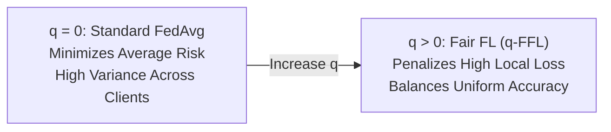

* **Dynamics:** The gradient is $\nabla f_q(w) = \sum_k p_k F_k(w)^q \nabla F_k(w)$. Clients with large local loss $F_k(w)$ receive exponentially amplified weighting $F_k(w)^q$, forcing optimization to pull up the worst-performing clients.
* **$q$-FedAvg Update Rule:**
  $$w_{t+1} = w_t - \frac{\sum_{k \in S_t} \nabla f_q(w_k)}{\sum_{k \in S_t} L_k(w_k)}$$
  Where $L_k \approx F_k(w)^q L + q F_k(w)^{q-1} \|\nabla F_k(w)\|^2$ is the dynamic local Lipschitz approximation.

---

## 4. Byzantine-Robust Aggregation Theory

In distributed networks, malicious or corrupted clients may send arbitrary or adversarial vectors $\Delta w_k$ to the central orchestrator (**Byzantine Failures**). Standard averaging is vulnerable: a single adversary sending $\Delta w_{\text{adv}} = \infty$ destroys the global model.

```mermaid
graph TD
    subgraph ByzantineAttack["Byzantine Aggregation Threat"]
        Honest1["Honest Client Δw1"] --> Agg["Server Aggregator"]
        Honest2["Honest Client Δw2"] --> Agg
        Malicious["Malicious Byzantine Client Δw_adv"] --> Agg
        
        Agg -->|Standard FedAvg (Vulnerable)| Collapse["Model Explodes / Collapses"]
        Agg -->|Robust Defense (Krum / Trimmed Mean)| Safe["Clean Global Model Update"]
    end
```

### 4.1 Geometric Defenses: Krum and Multi-Krum
Blanchard et al. (2017) formulated **Krum**, which assumes at most $f$ Byzantine clients out of $n$ ($n \ge 2f + 3$).

**Krum Scoring Function:**
For each candidate update $v_i$, compute the sum of squared Euclidean distances to its $n - f - 2$ closest neighbor vectors:
$$s(i) = \sum_{j \in \mathcal{N}_i} \|v_i - v_j\|^2, \quad \text{where } |\mathcal{N}_i| = n - f - 2$$
* **Krum Selection:** Chooses the single vector minimizing the score: $i^* = \arg\min_i s(i)$, setting $w_{t+1} = w_t + v_{i^*}$.
* **Multi-Krum:** Selects the top $m$ candidates with lowest scores and computes their coordinate-wise average, improving convergence speed while maintaining Byzantine robustness.

---

### 4.2 Bulyan: Combining Distance Elimination and Coordinate Trimming
Guerraoui et al. (2018) proved that Multi-Krum remains vulnerable to subtle poisoning attacks that slightly shift the model without being detected as Euclidean outliers. **Bulyan** resolves this by executing a two-stage defense:
1. **Candidate Selection:** Run Multi-Krum iteratively to select a trusted subset of $2f + 1$ vectors $\mathcal{B} \subset \{v_1, \dots, v_n\}$.
2. **Coordinate-wise Trimming:** Apply coordinate-wise trimmed mean on $\mathcal{B}$. For each parameter coordinate $j$, sort the values, discard the highest $\beta$ and lowest $\beta$ values, and compute the mean of the remaining $2f + 1 - 2\beta$ values.

---

### 4.3 Coordinate-Wise Robust Aggregators
* **Coordinate-wise Median:**
  $$(w_{t+1})_j = \text{median}\{(v_1)_j, (v_2)_j, \dots, (v_n)_j\}$$
  Resilient up to $f < n/2$ Byzantine clients for independent coordinate distributions.
* **Coordinate-wise Trimmed Mean:**
  Sort updates along each dimension $j$, remove the $\beta$ smallest and largest values, and average the remainder:
  $$(w_{t+1})_j = \frac{1}{n - 2\beta} \sum_{i=\beta+1}^{n - \beta} (v_{(i)})_j$$


---

# Federated Learning: Privacy, Security, Attack Vectors & Defenses
**Conceptual & Theoretical Knowledge Base — Volume III**

---

## 1. The Privacy Illusion of Gradient Sharing

Early federated learning literature operated under the foundational assumption that transmitting mathematical gradients or weight deltas $\Delta w$ rather than raw data samples $x$ preserved confidentiality. Research has comprehensively dismantled this assumption: **gradients contain dense, invertible representations of the underlying training data**.

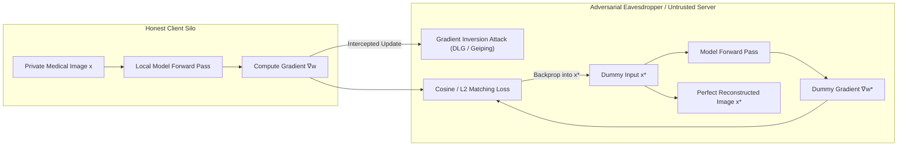

### 1.1 Gradient Inversion vs. Model Inversion Attacks

It is vital to distinguish between two distinct inversion paradigms:

| Characteristic | Gradient Inversion Attacks (GIA) | Model Inversion Attacks |
| :--- | :--- | :--- |
| **Attack Phase** | Occurs **during training** round $t$. | Occurs **post-training on deployed model**. |
| **Adversary Access** | Intercepts transient gradients $\nabla_w \mathcal{L}$ or weight updates $\Delta w$. | Black-box query access or white-box parameters $w_{\text{final}}$. |
| **Reconstruction Target** | **Specific local batch samples** processed in round $t$. | **Class prototypes / feature distributions** memorized by the network. |
| **Mechanisms** | Optimization matching: $\min_{x^*} \|\nabla f(x^*) - \Delta w\|^2$. | Optimization matching: $\max_{x^*} \log P(y_{\text{target}} \mid x^*) - \mathcal{R}(x^*)$. |
| **Key Citations** | DLG (Zhu et al.), Inverting Gradients (Geiping et al.). | Fredrikson et al., He et al. |

---

### 1.2 Mechanics of Gradient Inversion: DLG and Geiping

#### Deep Leakage from Gradients (DLG)
Zhu et al. (2019) formulated gradient inversion as an optimization problem in pixel space:
$$x^*, y^* = \arg\min_{x', y'} \|\nabla_w \ell(f(x'; w), y') - \nabla_w \mathcal{L}(x, y)\|_2^2$$

#### Inverting Gradients (Geiping et al., 2020)
Geiping et al. proved that directional cosine distance is superior to Euclidean distance, as magnitude is sensitive to batch scaling, whereas angular orientation encodes spatial features:
$$x^* = \arg\min_{x'} \left( 1 - \frac{\langle \nabla_w \ell(f(x'; w), y^*), \nabla w \rangle}{\|\nabla_w \ell(f(x'; w), y^*)\| \|\nabla w\|} \right) + \alpha_{\text{TV}} \mathcal{R}_{\text{TV}}(x')$$
Where $\mathcal{R}_{\text{TV}}(x')$ is Total Variation regularization enforcing natural image smoothness:
$$\mathcal{R}_{\text{TV}}(x) = \sum_{i, j} \sqrt{(x_{i+1, j} - x_{i, j})^2 + (x_{i, j+1} - x_{i, j})^2}$$

---

### 1.3 Analytical Label Restoration & Deep Inception Priors

#### 1. Analytical Label Restoration
Before inverting features, an attacker can analytically deduce the ground-truth classification label $c^*$ directly from the gradients of the classification layer without optimization (Zhao et al., 2020).

For cross-entropy loss with softmax activation:
$$\mathcal{L} = -\sum_{i=1}^C y_i \log p_i, \quad p_i = \frac{e^{z_i}}{\sum_j e^{z_j}}$$
The derivative with respect to logit $z_i$ is:
$$\frac{\partial \mathcal{L}}{\partial z_i} = p_i - y_i = \begin{cases} p_i - 1 < 0 & \text{if } i = c^* \text{ (True Class)} \\ p_i > 0 & \text{if } i \neq c^* \text{ (False Classes)} \end{cases}$$
Because $p_i \in (0, 1)$, **the gradient $\partial \mathcal{L}/\partial z_i$ is strictly negative if and only if $i$ is the true class**. The adversary identifies $c^* = \arg\min_i \nabla_{z} \mathcal{L}$ with 100% precision.

#### 2. Deep Inception Priors (Batch Normalization Matching)
Adversaries exploit running mean $\mu_l$ and variance $\sigma_l^2$ cached in Batch Normalization layers to penalize reconstructed features that violate feature distribution statistics:
$$\mathcal{R}_{\text{BN}}(x') = \sum_l \|\mu_l(x') - \mu_l^{\text{cached}}\|_2^2 + \|\sigma_l^2(x') - (\sigma_l^{\text{cached}})^2\|_2^2$$

---

## 2. Differential Privacy in Federated Learning

Differential Privacy (DP) provides mathematically provable protection against reconstruction by injecting calibrated noise.

### 2.1 $(\epsilon, \delta)$-Differential Privacy
A randomized mechanism $\mathcal{M}$ satisfies $(\epsilon, \delta)$-DP if for all neighboring datasets $D \simeq D'$ differing by a single patient record, and all query outcomes $\mathcal{S} \subseteq \text{Range}(\mathcal{M})$:
$$\mathbb{P}[\mathcal{M}(D) \in \mathcal{S}] \le e^\epsilon \mathbb{P}[\mathcal{M}(D') \in \mathcal{S}] + \delta$$

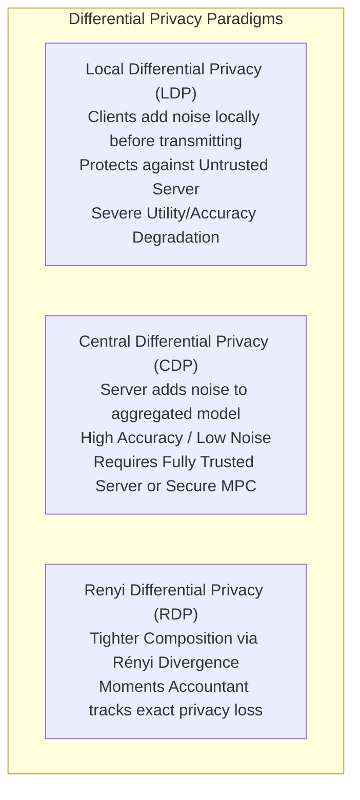

### 2.2 Renyi Differential Privacy (RDP) & The Moments Accountant
Under repeated composition over $T$ communication rounds, standard advanced composition bounds loosen significantly. **Renyi Differential Privacy (RDP)** defines privacy loss using Rényi divergence of order $\alpha > 1$:
$$D_\alpha(P \| Q) \triangleq \frac{1}{\alpha - 1} \ln \int \left( \frac{P(x)^\alpha}{Q(x)^{\alpha - 1}} \right) dx$$

For a subsampled Gaussian mechanism with sampling ratio $q = |S|/K$ and noise multiplier $\sigma$, the **Moments Accountant** computes cumulative privacy loss:
$$\alpha_{\mathcal{M}}(\lambda) \le T \cdot \mathcal{O}\left( \frac{q^2 \lambda^2}{\sigma^2} \right)$$
Converting back to $(\epsilon, \delta)$-DP via:
$$\epsilon = \min_{\alpha > 1} \left\{ D_\alpha + \frac{\ln(1/\delta)}{\alpha - 1} \right\}$$

---

## 3. LoRA DP Noise Amplification & The FedRand Defense

When Parameter-Efficient Fine-Tuning (PEFT) via Low-Rank Adaptation (LoRA) is combined with Differential Privacy, standard implementations suffer a disastrous theoretical failure: **Noise Amplification**.

### 3.1 Theorem 1: Standard DP-LoRA Product Perturbation Noise Amplification
In standard LoRA, the forward weight update is $\Delta W = B \cdot A$, where $B \in \mathbb{R}^{d \times r}$ and $A \in \mathbb{R}^{r \times k}$.
When applying Gaussian DP noise to matrices $A$ and $B$:
$$\widetilde{A} = A + \eta_A, \quad \widetilde{B} = B + \eta_B, \quad \text{where } \eta_A \sim \mathcal{N}(0, \sigma_A^2 I), \; \eta_B \sim \mathcal{N}(0, \sigma_B^2 I)$$

Expanding the reconstructed weight product:
$$\Delta \widetilde{W} = \widetilde{B} \widetilde{A} = (B + \eta_B)(A + \eta_A) = \underbrace{BA}_{\text{Signal}} + \underbrace{B\eta_A + \eta_B A}_{\text{Linear Noise } \mathcal{O}(1/\epsilon^2)} + \underbrace{\eta_B \eta_A}_{\text{Cross-Term Noise } \mathcal{O}(1/\epsilon^4)}$$

* **Theoretical Consequence:** The interaction term $\eta_B \eta_A$ produces a variance scaling as $\mathcal{O}(1/\epsilon^4)$. For strict privacy budgets ($\epsilon < 1$), this noise explodes, completely destroying model convergence.

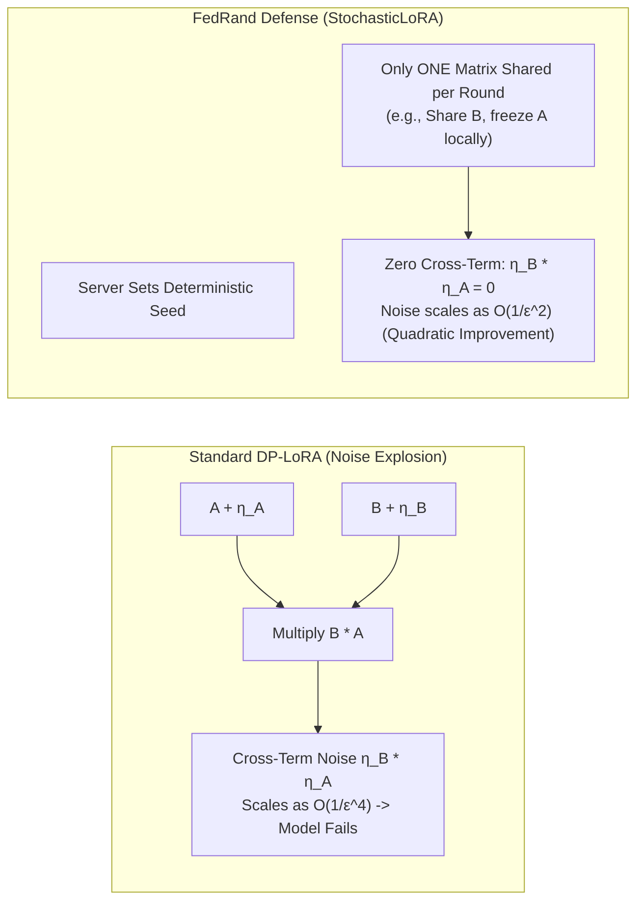

---

### 3.2 Theorem 2: The FedRand (StochasticLoRA) Quadratic Improvement
FedRand eliminates the cross-term by sharing only **one** decomposed matrix per round (or alternating $A$ and $B$ stochastically under shared pseudo-random seeds):
$$\Delta \widetilde{W}_{\text{FedRand}} = B \cdot (A + \eta_A) = BA + B \eta_A$$
Since $\eta_B = 0$, the quadratic cross-term $\eta_B \eta_A \equiv 0$. The total variance scales as $\mathcal{O}(1/\epsilon^2)$, yielding a **quadratic reduction in noise magnitude** and enabling stable convergence under rigorous differential privacy.

---

### 3.3 Theorem 3: Underdetermined GIA Defense via FedRand
In FedRand, an adversary attempting gradient inversion observes only one low-rank projection $B_t$ or $A_t$. 
The adversary faces the inverse problem:
$$\arg\min_x \| \nabla_{A} \ell(f(x; W + BA), y) - \Delta A \|_2^2$$
Because rank $r \ll \min(d, k)$, the mapping from input space $\mathbb{R}^d$ to low-rank gradient space $\mathbb{R}^{r \times k}$ has a non-trivial null space of dimension $d - r$.
* **Theoretical Guarantee:** There exist infinitely many candidate inputs $x' \in \text{Null}(\nabla_A)$ producing identical gradients. Gradient inversion is mathematically **underdetermined**, guaranteeing that the true input cannot be uniquely reconstructed.

---

## 4. Poisoning Attacks: Backdoors and Sybil Attacks

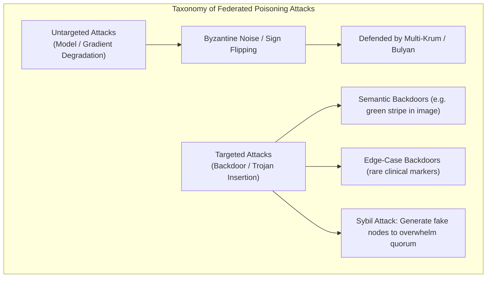

### 4.1 Model Replacement Backdoor Attacks
In a targeted backdoor attack, malicious clients train models to output an adversary-selected class $y_{\text{target}}$ whenever a trigger $\tau$ is present, while behaving normally on clean inputs:
$$f(x \oplus \tau; w) = y_{\text{target}}, \quad f(x; w) = y_{\text{clean}}$$

To overcome the dilution effect of federated averaging, Bagdasaryan et al. (2020) formulated the **Model Replacement Attack**:
$$\Delta w_{\text{adv}} = \frac{1}{\eta_g p_m} (w_{\text{target}} - w_t) + w_t$$
When the server executes FedAvg:
$$w_{t+1} = w_t + \sum_{k \neq m} p_k \Delta w_k + p_m \left( \frac{1}{p_m}(w_{\text{target}} - w_t) \right) \approx w_{\text{target}}$$
The malicious client cancels out the updates of all honest participants in a single round.

---

### 4.2 Sybil Attacks in Federated Learning
* **Threat Mechanism:** In open or cross-device federated networks, an adversary creates multiple fake identities (Sybils).
* **Byzantine Quorum Failure:** Standard Byzantine defenses (Multi-Krum, Bulyan) assume the fraction of Byzantine clients satisfies $f < n/3$ or $f < n/2$. By injecting $M \gg f$ colluding Sybils, the adversary outnumbers honest participants. The Byzantine-robust aggregation selects the Sybils' malicious updates as the legitimate geometric center.
* **Mitigation:**
  1. Cryptographic client attestation via Trusted Platform Modules (TPM) or hardware secure enclaves (Intel SGX).
  2. Proof-of-Stake or historical contribution reputation scoring.
  3. Spectral anomaly detection on client update trajectories over multiple rounds.


---

# Federated Learning: Communication Efficiency, PEFT & Federated Preprocessing
**Conceptual & Theoretical Knowledge Base — Volume IV**

---

## 1. The Communication Bottleneck

In cross-silo and cross-device federated learning, communication bandwidth represents the primary operational bottleneck. While deep neural networks contain billions of parameters (e.g., 7B parameter models require 28 GB of data transfer per client per round in FP32), uplink speeds in clinical and edge deployments are severely limited.

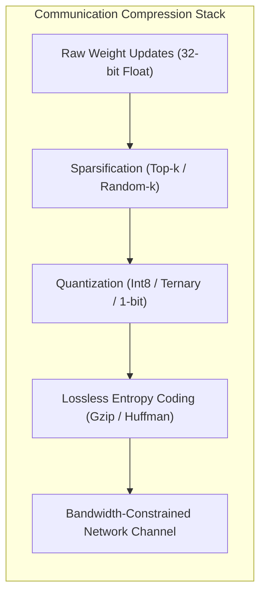

---

## 2. Quantization Theory & Stochastic Unbiasedness

Quantization maps continuous 32-bit floating-point parameters to low-bitwidth discrete representations.

### 2.1 Affine Quantization Formulation
$$\text{quantize}(x) = \text{round}\left( \frac{x}{S} \right) + Z$$
$$\text{dequantize}(q) = S \cdot (q - Z)$$
Where $S$ is the scale factor and $Z$ is the zero-point integer offset:
$$S = \frac{\max(x) - \min(x)}{2^b - 1}, \quad Z = \text{round}\left( -\frac{\min(x)}{S} \right)$$

---

### 2.2 Proof of Unbiasedness in Stochastic Uniform Quantization

Deterministic rounding ($\text{round}(x/S)$) introduces systematic gradient bias that accumulates over communication rounds, causing divergence in non-convex optimization. **Stochastic Quantization** resolves this by probabilistic rounding.

**Definition:** For a normalized value $\tilde{x} \in [0, 1]$ falling between discrete quantization levels $\frac{l}{L} \le \tilde{x} < \frac{l+1}{L}$:
$$Q(\tilde{x}) = \begin{cases} \frac{l+1}{L} & \text{with probability } p = L \tilde{x} - l \\ \frac{l}{L} & \text{with probability } 1 - p = 1 - (L \tilde{x} - l) \end{cases}$$

**Mathematical Proof of Unbiasedness:**
$$\mathbb{E}[Q(\tilde{x})] = \frac{l+1}{L} \cdot p + \frac{l}{L} \cdot (1 - p)$$
$$\mathbb{E}[Q(\tilde{x})] = \frac{l+1}{L}(L\tilde{x} - l) + \frac{l}{L}(1 - L\tilde{x} + l)$$
$$\mathbb{E}[Q(\tilde{x})] = \tilde{x} + \frac{l}{L} - \frac{l(l+1)}{L^2} + \frac{l}{L} - \frac{l^2}{L} + \frac{l^2}{L^2} \dots = \tilde{x}$$
$$\therefore \mathbb{E}[Q(x)] = x$$

* **Theoretical Consequence:** Because $\mathbb{E}[Q(x)] = x$, stochastic quantization introduces zero systematic gradient bias. The expected value of the aggregated model matches full-precision FedAvg: $\mathbb{E}[w_{t+1}^{\text{quantized}}] = w_{t+1}^{\text{exact}}$.

---

## 3. Gradient and Weight Sparsification

Sparsification reduces bandwidth by transmitting only a small fraction $k \ll d$ of parameter updates.

### 3.1 Top-$k$ vs. Random-$k$ Sparsification
* **Top-$k$ Sparsification:** Transmits only the $k$ elements with the largest absolute magnitudes:
  $$\text{Top}_k(v)_i = \begin{cases} v_i & \text{if } |v_i| \ge \tau_k \text{ (Top } k\% \text{ threshold)} \\ 0 & \text{otherwise} \end{cases}$$
* **Random-$k$ Sparsification:** Randomly selects $k$ coordinates and scales them by $d/k$ to maintain an unbiased estimator: $\mathbb{E}[\text{Rand}_k(v)] = v$.

---

### 3.2 Error Feedback (EF) / Memory Accumulation
While Top-$k$ yields superior empirical compression (often discarding 99% of updates), it is inherently biased ($\mathbb{E}[\text{Top}_k(v)] \neq v$), which can cause optimization to diverge. **Error Feedback** (Stich et al., 2018) solves this by maintaining a local residual memory buffer $e_t$:

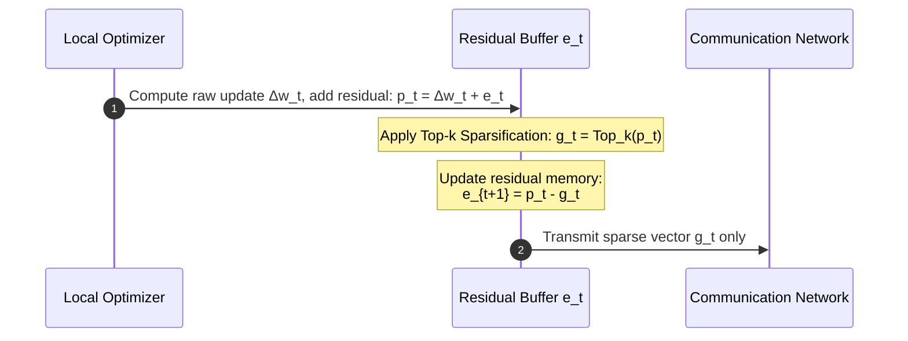

**Theoretical Guarantee:** Error Feedback guarantees that all discarded gradient information is eventually transmitted in future rounds, restoring the $\mathcal{O}(1/\sqrt{T})$ convergence rate of uncompressed SGD.

---

## 4. Parameter-Efficient Fine-Tuning (PEFT): Federated LoRA & Modern Architectures

Rather than fine-tuning all $d$ parameters of a large foundation model, Parameter-Efficient Fine-Tuning freezes the pre-trained weights $W_0 \in \mathbb{R}^{d \times k}$ and updates low-rank decompositions:

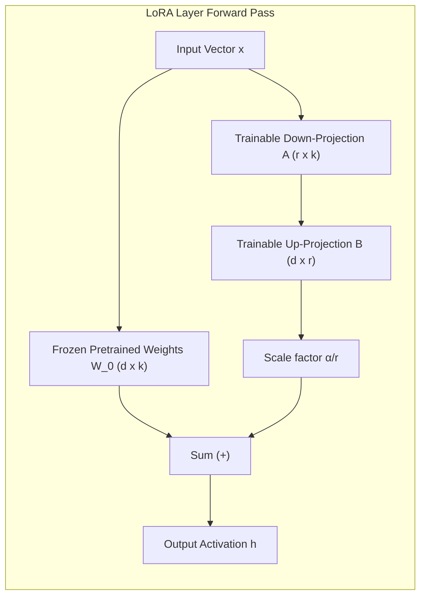

### 4.1 Federated LoRA on Transformer vs. State Space Models (Mamba / SSM)
* **Attention Layers in Transformers:** LoRA is applied to query ($W_q$), key ($W_k$), and value ($W_v$) projection matrices.
* **State Space Models (Mamba / SSM):** In modern architectures like Mamba, LoRA targets the continuous-to-discrete projection parameters ($B, C, \Delta$) and linear input-output projections ($W_{\text{in}}, W_{\text{out}}$).

**Bandwidth Compression:** Transmitting rank $r=8$ adapter matrices instead of full 7B parameter matrices reduces communication payload by **$99.2\%$** (e.g., from 14 GB down to 28 MB per round).

---

## 5. Federated Preprocessing System (FedPS)

Data in clinical silos cannot be manually harmonized without violating privacy. The **Federated Preprocessing System (FedPS)** computes global data cleaning and feature transformations collaboratively using sublinear sketches and distributed statistics.

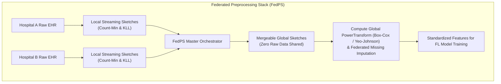

### 5.1 Streaming Data Sketches
* **Count-Min Sketch (CMS):** A sublinear space 2D array of $d$ hash functions of width $w$ tracking categorical frequencies. Merging CMS tables across clients is an exact linear addition: $\text{CMS}_{\text{global}} = \sum_k \text{CMS}_k$.
* **KLL Sketches (Karnin-Lang-Liberty):** Mergeable quantile sketches tracking continuous feature distributions to determine exact medians, interquartile ranges, and outlier boundaries without revealing individual patient records.

---

### 5.2 Federated PowerTransform: Box-Cox and Yeo-Johnson

Non-IID continuous features in healthcare often exhibit extreme skewness. Power transformations stabilize feature variance and map data toward a Gaussian distribution prior to training.

#### 1. Box-Cox Transformation (for strictly positive features $x > 0$)
$$x^{(\lambda)} = \begin{cases} \frac{x^\lambda - 1}{\lambda} & \text{if } \lambda \neq 0 \\ \ln(x) & \text{if } \lambda = 0 \end{cases}$$

#### 2. Yeo-Johnson Transformation (handling zero and negative continuous values)
$$\psi(\lambda, x) = \begin{cases} \frac{(x+1)^\lambda - 1}{\lambda} & \text{if } \lambda \neq 0, \; x \ge 0 \\ \ln(x+1) & \text{if } \lambda = 0, \; x \ge 0 \\ -\frac{(-x+1)^{2-\lambda} - 1}{2-\lambda} & \text{if } \lambda \neq 2, \; x < 0 \\ -\ln(-x+1) & \text{if } \lambda = 2, \; x < 0 \end{cases}$$

**Federated Parameter Estimation:**
The optimal parameter $\hat{\lambda}$ maximizes the profile log-likelihood:
$$L(\lambda) = -\frac{n}{2} \ln(\hat{\sigma}^2(\lambda)) + (\lambda - 1) \sum_{i=1}^n \text{sign}(x_i) \ln(|x_i| + 1)$$
FedPS computes the summary statistics $\sum_k n_k$, $\sum_k \sum_i \ln(|x_{k, i}|+1)$, and $\sum_k \hat{\sigma}_k^2(\lambda)$ through federated aggregation, enabling the server to solve for $\hat{\lambda}$ using 1D derivative-free search (Brent's method) without centralizing a single continuous feature vector.

---

### 5.3 Missing Value Imputation via Federated Bayesian Linear Regression
When clinical attributes are missing across silos, FedPS fits a **Federated Bayesian Linear Regression**:
$$\mathbb{E}[\beta \mid \mathcal{D}] = \left( \sum_{k=1}^K X_k^T X_k + \sigma^2 \Sigma_0^{-1} \right)^{-1} \left( \sum_{k=1}^K X_k^T y_k \right)$$
Clients transmit only local gram matrices $G_k = X_k^T X_k \in \mathbb{R}^{p \times p}$ and projection vectors $v_k = X_k^T y_k \in \mathbb{R}^p$. The orchestrator inverts the aggregated covariance matrix to distribute global imputation coefficients back to each silo.


---

# Federated Learning: Non-IID Skew, Personalization & Quality Filtering
**Conceptual & Theoretical Knowledge Base — Volume V**

---

## 1. Mathematical Taxonomy of Non-IID Skews

In real-world federated deployments, the Independent and Identically Distributed (IID) assumption fails. Let $x \in \mathcal{X}$ denote feature inputs and $y \in \mathcal{Y}$ denote labels. The joint distribution on client $k$ is $P_k(x, y) = P_k(x \mid y) P_k(y) = P_k(y \mid x) P_k(x)$.

```mermaid
graph TD
    subgraph NonIIDTaxonomy["Non-IID Skew Taxonomy"]
        Joint["Joint Distribution Heterogeneity: P_i(x, y) ≠ P_j(x, y)"]
        
        Joint --> Prior["1. Prior Probability Shift: P_i(y) ≠ P_j(y)<br/>Label distribution varies across hospitals (e.g. oncology vs general)."]
        Joint --> Covariate["2. Covariate Shift: P_i(x) ≠ P_j(x)<br/>Feature distribution varies (e.g. Siemens vs GE MRI scanners)."]
        Joint --> ConceptDrift["3. Concept Shift (P_i(y|x) ≠ P_j(y|x)):<br/>Same symptoms/imaging diagnosed differently across regions."]
        Joint --> Quantity["4. Unbalanced Volume: n_i >> n_j<br/>Tertiary hospitals vs rural health clinics."]
    end
```

### 1.1 Synthetic Non-IID Modeling: The Dirichlet Distribution
To benchmark federated algorithms against controllable statistical heterogeneity, researchers partition dataset classes across clients using a **Dirichlet Distribution** $\text{Dir}(\alpha)$.

**Formulation:** For class $c \in \{1, \dots, C\}$, draw proportion vector $q_c \sim \text{Dir}(\alpha \cdot \mathbf{1}_K)$:
$$p(q_{c, 1}, \dots, q_{c, K}) = \frac{\Gamma(K\alpha)}{\Gamma(\alpha)^K} \prod_{k=1}^K q_{c, k}^{\alpha - 1}$$
* As $\alpha \to \infty$, client distributions converge to identical IID splits.
* As $\alpha \to 0$, each client receives data from strictly one or two classes (extreme non-IID skew).

---

### 1.2 Quantifying Non-IID Heterogeneity: Earth Mover's Distance (EMD)

The **Earth Mover's Distance (EMD)** (Wasserstein-1 metric) quantifies the statistical divergence between client local distributions $P_k$ and the global population distribution $P$:
$$W_1(P_k, P) \triangleq \inf_{\gamma \in \Pi(P_k, P)} \mathbb{E}_{(x, y) \sim \gamma}[\|x - y\|]$$

**The Zhao et al. Weight Divergence Bound:**
Zhao et al. (2018) proved that weight divergence between FedAvg and centralized training is upper-bounded by the EMD of client distributions:
$$\|w_t - w^*\| \le \sum_{k=1}^K p_k \sum_{c=1}^C \|P_k(y=c) - P(y=c)\| \cdot \mathcal{O}(\eta_L \tau)$$
As the Dirichlet parameter $\alpha \to 0$, the EMD increases dramatically, leading directly to weight divergence, gradient cancellation, and severe accuracy loss in standard FedAvg.

---

## 2. The Heterogeneous Federated Learning (HtFLlib) Taxonomy

Beyond data skew, industrial federations encounter **Model Heterogeneity**—participating institutions cannot or will not deploy identical model architectures due to disparate hardware (e.g., Hospital A has 8x H100 GPUs and runs a 70B parameter model, while Hospital B has a single workstation GPU and runs a 7B model).

```mermaid
graph TD
    subgraph HtFLlibArchitecture["HtFLlib Heterogeneity Landscape"]
        HT["Heterogeneous FL"]
        HT --> DH["Data Heterogeneity (Non-IID)"]
        HT --> MH["Model Heterogeneity (Varying Architectures)"]
        
        MH --> RepSplit["Representation Splitting (FedPer / FedRep)"]
        MH --> Proto["Prototype Learning (FedProto)"]
        MH --> Decoupled["Decoupled Classifiers (FedGH)"]
        MH --> Distill["Federated Mutual Learning (FML)"]
    end
```

---

## 3. Personalization Paradigms

When non-IID heterogeneity is severe, a single global consensus model $w^*$ is mathematically incapable of performing optimally on all clients. **Personalized Federated Learning (pFL)** balances shared global knowledge with client-specific adaptation.

### 3.1 Model Splitting: FedPer and FedRep
The neural network is divided into a shared representation base $f_\theta$ and a localized classification head $g_\phi$:
$$f(x; \theta, \phi) = g_\phi(f_\theta(x))$$

```mermaid
graph LR
    subgraph SharedBase["Federated Aggregation"]
        Base["Base Feature Extractor f_θ<br/>(Aggregated globally across all clients)"]
    end

    subgraph PrivateHead["Local Personalization"]
        HeadA["Hospital A Head g_ϕA"]
        HeadB["Hospital B Head g_ϕB"]
    end

    Base --> HeadA
    Base --> HeadB
```

* **FedPer (Arivazhagan et al., 2019):** Base parameters $\theta$ are aggregated via FedAvg across rounds. Head parameters $\phi_k$ remain strictly on client $k$ and are trained locally to fit client-specific label skews.
* **FedRep (Collins et al., 2021):** Alternating minimization: clients train private heads $\phi_k$ for $E_\phi$ steps, freeze $\phi_k$, and then train the shared representation base $\theta$ for $E_\theta$ steps before global aggregation.

---

### 3.2 Prototype-Based Personalization: FedProto
Tan et al. (2022) introduced **FedProto** to overcome model architecture heterogeneity.
* Instead of communicating weights $\Delta w$, clients communicate **Class Prototype Vectors** $C^{(c)} \in \mathbb{R}^d$, representing the average feature embedding of class $c$ in the penultimate layer:
  $$C_k^{(c)} = \frac{1}{|\mathcal{D}_{k, c}|} \sum_{x \in \mathcal{D}_{k, c}} f_{\theta_k}(x)$$
* The server averages prototypes for each class across clients: $\bar{C}^{(c)} = \sum_k p_k C_k^{(c)}$.
* Clients train with a dual loss: standard classification cross-entropy plus an Euclidean prototype alignment loss:
  $$\mathcal{L}_{\text{total}} = \mathcal{L}_{\text{CE}}(f(x), y) + \lambda \|f_{\theta_k}(x) - \bar{C}^{(y)}\|_2^2$$
* **Key Advantage:** Clients can have completely different internal backbones (e.g., ResNet, Vision Transformer, ConvNeXt) as long as their penultimate embedding dimension $d$ matches.

---

### 3.3 Decoupled Classifiers (FedGH) & Mutual Distillation (FML)
* **FedGH (Federated Generalized Head):** Reverses FedPer by sharing the classification head globally while keeping the feature extractor local. This prevents feature collapse under label skew by enforcing a shared semantic decision boundary across private feature extractors.
* **Federated Mutual Learning (FML):** Each client holds two models: a shared global model $w$ and a private local model $v_k$. During local training, the two models mutually distill knowledge to each other via Kullback-Leibler (KL) divergence loss:
  $$\mathcal{L}_{\text{local}} = \alpha \mathcal{L}_{\text{CE}}(v_k(x), y) + (1-\alpha) D_{\text{KL}}(v_k(x) \| w(x))$$

---

### 3.4 Bi-Level Optimization for Personalization: pFedMe and Ditto

```mermaid
graph TD
    subgraph BiLevel["Bi-Level Personalization Landscape"]
        pFedMe["pFedMe (Moreau Envelopes)<br/>Smooth approximation decouples global consensus<br/>from local specialized parameter θ_k"]
        Ditto["Ditto (Fair & Robust Personalization)<br/>Global consensus w* serves as regularizer<br/>for local personalized model v_k"]
    end
```

#### 1. pFedMe (Moreau Envelopes)
Dinh et al. (2020) formulated personalized federated learning using **Moreau Envelopes**:
$$\min_{w \in \mathbb{R}^d} \sum_{k=1}^K p_k \mathcal{M}_{F_k}^\lambda(w), \quad \text{where } \mathcal{M}_{F_k}^\lambda(w) \triangleq \min_{\theta_k \in \mathbb{R}^d} \left[ F_k(\theta_k) + \frac{\lambda}{2} \|\theta_k - w\|^2 \right]$$
The Moreau envelope regularizes non-convex client objectives, producing a smooth surrogate that decouples the global model $w$ from local adapted models $\theta_k$.

#### 2. Ditto: Fair & Robust Personalization
Li et al. (2021) observed that pFL algorithms are often fragile under adversarial attacks. **Ditto** formulates personalization as a bi-level problem:
1. **Global Problem:** Train a standard global model $w^* = \arg\min_w \sum_k p_k F_k(w)$.
2. **Local Personalization Problem:** Concurrently solve a localized regularized objective for each client:
   $$\min_{v_k \in \mathbb{R}^d} h_k(v_k; w^*) \triangleq F_k(v_k) + \frac{\lambda}{2} \|v_k - w^*\|^2$$

* **Byzantine Robustness Guarantee:** Even if malicious clients perturb the global model $w^*$ by adversarial vector $\Delta$, the deviation in client $k$'s personalized model $v_k$ is mathematically bounded by $\frac{\lambda}{\mu + \lambda} \|\Delta\|$. Honest clients retain accurate, localized personal models despite global adversarial corruption.

---

## 4. Client Quality Filtering & Multi-Task Autoencoders (MTAE)

In real-world consortiums, low-quality clients (noisy labels, sensor artifacts, adversarial actors) degrade the global model.

```mermaid
graph TD
    subgraph QualityPipeline["Client Quality Filtering Pipeline"]
        Update["Client Update Δw_k"] --> MTAE["Multi-Task Autoencoder (MTAE)"]
        MTAE --> Latent["Latent Space Projection z_k"]
        Latent --> RecError["Reconstruction Error ||Δw_k - Rec(Δw_k)||"]
        
        RecError --> Check{"Exceeds Outlier Threshold?"}
        Check -->|Yes| Prune["Prune / Exclude Client from Round"]
        Check -->|No| Entropy["Compute Shannon Entropy Weighting"]
        Entropy --> Agg["Aggregate into Global Model"]
    end
```

1. **MTAE Outlier Detection:** A multi-task autoencoder compresses client weight update vectors into low-dimensional latent manifolds. Updates whose reconstruction errors exceed a statistical cutoff $\tau = \mu_{\text{rec}} + 2.5 \sigma_{\text{rec}}$ are classified as corrupt and quarantined.
2. **Shannon Entropy Weighting:** Rather than weighting solely by sample size $n_k$, the orchestrator calculates the Shannon entropy $H_k = -\sum_{c} p_{k,c} \log p_{k,c}$ of each client's label distribution, upweighting silos with balanced diversity and downweighting uninformative single-class clients.


---

# Federated Learning: Cross-Domain Applications, Healthcare & Frontiers
**Conceptual & Theoretical Knowledge Base — Volume VI**

---

## 1. Clinical Healthcare: The Archetypal Cross-Silo Domain

Healthcare represents the primary real-world testbed and regulatory driver for Federated Learning. Medical datasets cannot be centralized due to patient privacy laws, institutional competitive value, and massive data volume.

```mermaid
graph TD
    subgraph ClinicalEcosystem["Cross-Silo Clinical FL Ecosystem"]
        H1["Hospital A: Radiology (DICOM 3D CT/MRI)"] --> FL["Federated Clinical Orchestration"]
        H2["Hospital B: Pathology (Whole Slide Gigapixel Images)"] --> FL
        H3["Hospital C: Genomics (VCF / Variant Calling)"] --> FL
        H4["Hospital D: Clinical Notes (FHIR / Unstructured EHR)"] --> FL
        
        FL --> Model["Federated Multi-Modal Clinical Foundation Model"]
    end
```

### 1.1 Electronic Health Records (EHR) & FHIR Standardization
* **The FHIR Standard:** Fast Healthcare Interoperability Resources (FHIR) provides a standardized JSON/XML schema for clinical concepts (e.g., `Patient`, `Observation`, `Condition`, `MedicationRequest`).
* **Federated NLP on EHR:** Clinical notes contain protected health information (PHI) such as patient names and dates. FL enables training Transformer and Mamba backbones locally within hospital security perimeters, outputting generalized phenotype extraction and mortality prediction models without leaking patient transcripts.

---

### 1.2 Medical Imaging & DICOM Pipelines
* **DICOM (Digital Imaging and Communications in Medicine):** The global standard for medical imaging. Medical images are not standard 8-bit RGB JPEGs; they comprise high-bitwidth (12-bit to 16-bit) volumetric 3D arrays measuring radiological density in **Hounsfield Units (HU)**.
* **Scanner Heterogeneity:** Silos utilize scanners from different manufacturers (Siemens, GE, Philips), each with distinct slice thicknesses, reconstruction kernels, and noise profiles.
* **MONAI Integration:** Enterprise FL pipelines integrate MONAI (Medical Open Network for AI) transforms within the client runtime. Automated pre-processing pipelines (window leveling, isotropic reslicing, affine coordinate normalization) execute inside the silo before feeding 3D UNet or Swin-UNETR models.

---

## 2. Regulatory, Legal & Governance Frameworks

```mermaid
graph LR
    subgraph RegulatoryPillars["Regulatory Frameworks Governing FL"]
        HIPAA["HIPAA (USA)<br/>Safe Harbor (18 Identifiers)<br/>Expert Determination Method"]
        GDPR["GDPR (EU)<br/>Right to Explanation<br/>Right to be Forgotten (Unlearning)<br/>Data Minimization (Art 5)"]
        FDA["FDA SaMD / GMLP<br/>Good Machine Learning Practice<br/>Predetermined Change Control Plans (PCCP)"]
    end
```

### 2.1 HIPAA Compliance (United States)
* **Privacy Rule:** Prohibits transmission of 18 categories of Protected Health Information (PHI).
* **FL Alignment:** Because FL transmits mathematical weights rather than patient records, it satisfies the **Data Minimization Principle**. However, compliance mandates implementing provable Differential Privacy ($\epsilon \le 1.0$) or Secure Multi-Party Computation (SMPC) to mitigate gradient inversion risks.

### 2.2 GDPR Compliance (European Union)
* **Article 5 (Data Minimization & Storage Limitation):** FL strictly minimizes data movement, ensuring personal data does not cross sovereign borders.
* **Article 17 (Right to be Forgotten):** Introduces the technical challenge of **Federated Unlearning**—if a patient revokes consent, their historical contributions must be mathematically erased from the trained global model without retraining the network from scratch.

### 2.3 FDA SaMD (Software as a Medical Device) & GMLP
* **Good Machine Learning Practice (GMLP):** Joint guidelines from the FDA, Health Canada, and UK MHRA requiring clinical ML models to demonstrate robustness across out-of-distribution demographic populations.
* **Predetermined Change Control Plans (PCCP):** Traditional medical device clearance requires a frozen, static model. The FDA's PCCP framework creates a pathway for continuous learning systems by pre-specifying monitoring boundaries, re-validation protocols, and model drift tripwires.

---

## 3. Defense, Aerospace & Multi-Domain Applications

```mermaid
graph TD
    subgraph MultiDomainFL["Multi-Domain Cross-Silo & Edge Deployments"]
        Aero["Tactical Aviation & Drones<br/>Fleet anomaly detection, turbine wear<br/>Intermittent RF datalinks, bandwidth limits"]
        Fin["Financial Consortiums<br/>Anti-Money Laundering (AML)<br/>Credit risk scoring across competing banks"]
        IoT["Industrial Smart Grid & Energy<br/>Turbine vibration prediction<br/>Decentralized power grid load balancing"]
    end
```

### 3.1 Tactical Edge, Drones & Aviation Fleets
* **Operational Context:** Unmanned Aerial Systems (UAS), fighter aircraft squadrons, and commercial airline fleets generate terabytes of telemetry, engine sensor logs, and radar data.
* **Deployment Constraints:** Bandwidth is severely constrained by tactical radio frequencies or high-latency satellite uplinks. Centralizing raw engine telemetry is bandwidth-impossible and exposes flight mission secrets.
* **Federated Solution:** Aircraft train predictive maintenance models locally during flight operations and transmit lightweight LoRA adapters to ground-station edge aggregators during refueling, utilizing Hierarchical Federated Learning (HFL) across tactical wings.

### 3.2 Financial Consortiums & Anti-Money Laundering (AML)
* **The Problem:** Financial crime syndicates disperse illicit transactions across multiple independent banking institutions to evade single-bank rule engines.
* **Vertical Federated Learning (VFL):** Multiple banks collaborate on joint customer graphs using Private Set Intersection (PSI) and secure multi-party split neural networks, identifying money laundering rings without sharing client account ledgers.

---

## 4. The Open Research Frontier

```mermaid
graph TD
    subgraph Frontiers["Emerging Frontiers in Federated Learning"]
        F1["Federated Unlearning<br/>Exact & approximate parameter scrubbing<br/>without full model retraining"]
        F2["Asynchronous Byzantine Robustness<br/>Combining FedAsync staleness compensation<br/>with Krum/Bulyan geometric filters"]
        F3["Post-Quantum Cryptography & Homomorphic FL<br/>Lattice-based encryption (CKKS / BFV)<br/>accelerated on ASIC cryptographic units"]
    end
```

1. **Federated Machine Unlearning:** Algorithms such as projected gradient unlearning and Fisher information subtraction that erase specific client updates or sample influences from trained global models while maintaining validation accuracy.
2. **Asynchronous Byzantine Robustness:** Developing provably convergent aggregation rules that simultaneously handle straggler-induced staleness $s(t - \tau)$ and malicious gradient manipulation.
3. **Quantum Federated Learning (QFL):** Distributed training of Parameterized Quantum Circuits (PQCs) across quantum nodes over quantum networks, protected by quantum key distribution (QKD).
