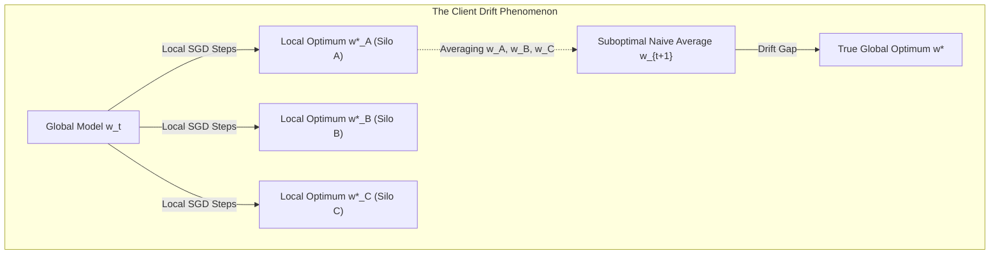
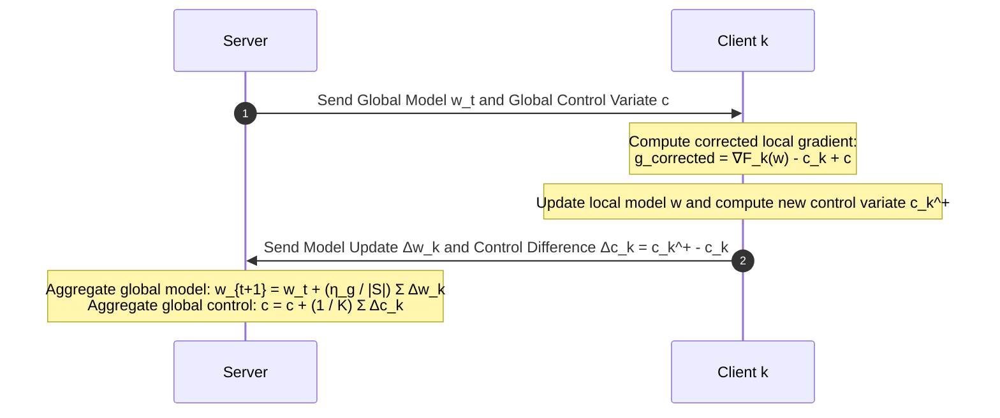
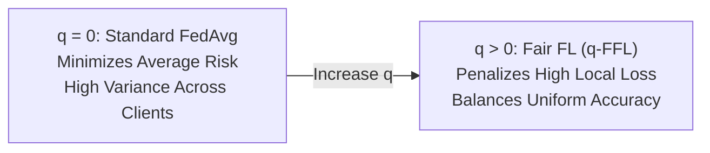

# Federated Learning: Mathematical Foundations & Optimization Strategies
**Conceptual & Theoretical Knowledge Base — Volume II**

---

## 1. The Federated Optimization Challenge

Federated optimization fundamentally deviates from standard distributed stochastic gradient descent (SGD) due to three mathematical realities:
1. **Extreme Non-Convexity:** Deep neural network loss surfaces have millions of saddle points, local minima, and non-convex valleys.
2. **Statistical Heterogeneity (Non-IID):** $\mathbb{E}_{x \sim \mathcal{D}_i}[\nabla f(x; w)] \neq \mathbb{E}_{x \sim \mathcal{D}_j}[\nabla f(x; w)]$.
3. **Communication Constraints:** Clients must perform multiple local steps ($\tau > 1$) before communicating, leading to **Client Drift**.



### 1.1 Bounded Dissimilarity and Gradient Variance Assumptions
Theoretical convergence proofs rely on formal bounds on client heterogeneity:
* **$G$-Bounded Gradients:** $\mathbb{E}\|\nabla F_k(w)\|^2 \le G^2$
* **$B$-Local Variance:** $\mathbb{E}\|\nabla f_k(x; w) - \nabla F_k(w)\|^2 \le \sigma_k^2$
* **Gradient Dissimilarity ($\beta$-heterogeneity):** $\sum_{k=1}^K p_k \|\nabla F_k(w)\|^2 \le \kappa_1^2 + \kappa_2^2 \|\nabla F(w)\|^2$

---

## 2. Foundational Aggregation Algorithms

### 2.1 Federated Averaging (FedAvg)
Proposed by McMahan et al. (2017), FedAvg performs local SGD on sampled clients followed by weighted averaging.

**Mathematical Formulation:**
In round $t$:
1. Orchestrator samples a subset $S_t \subseteq \{1, \dots, K\}$ with $|S_t| = \max(C \cdot K, 1)$.
2. Each client $k \in S_t$ initializes $w_{k, 0}^{(t)} = w_t$ and executes $\tau$ local SGD steps:
   $$w_{k, j+1}^{(t)} = w_{k, j}^{(t)} - \eta_L \nabla F_k(w_{k, j}^{(t)}; \xi_{k, j})$$
3. Server aggregates client updates:
   $$w_{t+1} = \sum_{k \in S_t} \frac{n_k}{\sum_{i \in S_t} n_i} w_{k, \tau}^{(t)}$$

**Convergence & Drift Limitations:**
For smooth, strongly convex objectives, FedAvg converges at rate $\mathcal{O}(1/T)$. However, under non-IID distributions, as $\tau \to \infty$, clients drift toward their individual local minima $w_k^* \neq w^*$, causing the aggregated model to oscillate and fail to converge.

---

### 2.2 FedProx: Handling Heterogeneity via the Proximal Term
Li et al. (2020) introduced **FedProx** to stabilize training under both statistical heterogeneity (non-IID) and systems heterogeneity (variable compute capabilities).

**The Proximal Term Formulation:**
FedProx modifies the client local objective by introducing an elastic **proximal term**:
$$\min_{w \in \mathbb{R}^d} h_k(w; w_t) \triangleq F_k(w) + \frac{\mu}{2} \|w - w_t\|^2$$
Where $\mu \ge 0$ is a tunable regularization parameter.

**Theoretical Impact of the Proximal Term:**
1. **Restricting Client Drift:** The quadratic penalty $\frac{\mu}{2}\|w - w_t\|^2$ tethers local updates to the current global model $w_t$, ensuring local trajectories do not diverge excessively even if $\tau$ is large.
2. **Handling Inexact Solutions ($\gamma$-inexactness):** In heterogeneous networks, weak clients cannot complete $\tau$ epochs. FedProx accommodates variable work amounts by accepting inexact solutions satisfying:
   $$\|\nabla h_k(w_k^{(t+1)}; w_t)\| \le \gamma_k \|\nabla h_k(w_t; w_t)\| = \gamma_k \|\nabla F_k(w_t)\|$$
   Where $\gamma_k \in [0, 1]$ represents the solution tolerance for client $k$.

---

### 2.3 SCAFFOLD: Variance Reduction via Control Variates
Karimireddy et al. (2020) proposed **SCAFFOLD** (Stochastic Controlled Averaging for Federated Learning) to mathematically eliminate client drift using control variates.

**Formulation:**
SCAFFOLD maintains a global control variate $c$ and local control variates $c_k$ representing the gradient direction of the client.



**Local Step with Control Variates:**
$$w \leftarrow w - \eta_L \left( \nabla F_k(w; \xi) - c_k + c \right)$$
The term $(c - c_k)$ acts as an estimate of the drift $( \nabla F(w) - \nabla F_k(w) )$, actively steering the client's local gradient toward the true global gradient direction.

**Theoretical Guarantee:** SCAFFOLD achieves convergence independent of client data dissimilarity $G^2$, overcoming the fundamental bottleneck of FedAvg.

---

## 3. Normalized Averaging, Fair Optimization & Server-Side Adaptivity

### 3.1 FedNova: Correcting Objective Inconsistency
When clients perform varying numbers of local epochs $\tau_k$ (due to differing compute capabilities), naive aggregation in FedAvg causes **Objective Inconsistency**—the aggregated model converges to a surrogate objective that overweights fast clients:
$$F_{\text{inconsistent}}(w) = \sum_{k=1}^K \frac{n_k \tau_k}{\sum_i n_i \tau_i} F_k(w)$$

**FedNova Resolution (Wang et al., 2020):**
FedNova scales local updates by an effective step size $a_k$:
$$d_k = \frac{1}{a_k} (w_t - w_{k, \tau_k}^{(t)}), \quad \text{where } a_k = \sum_{j=0}^{\tau_k - 1} (1 - \eta_L L)^j$$
The server then aggregates the normalized directions $d_k$, preserving convergence to the true global objective $\min \sum_k p_k F_k(w)$.

---

### 3.2 Server-Side Adaptive Optimization: The FedOpt Framework
Reddi et al. (2020) introduced **FedOpt**, treating client updates as pseudo-gradients applied to server-side adaptive optimizers:
$$\Delta_t = \sum_{k \in S_t} p_k (w_{k, \tau}^{(t)} - w_t)$$

The server updates $w_{t+1}$ using generalized momentum and adaptive preconditioners:

| Optimizer | Server Momentum Update $m_t$ | Server Variance Update $v_t$ | Global Model Update $w_{t+1}$ |
| :--- | :--- | :--- | :--- |
| **FedAdagrad** | $m_t = \Delta_t$ | $v_t = v_{t-1} + \Delta_t^2$ | $w_{t+1} = w_t + \eta_g \frac{m_t}{\sqrt{v_t} + \tau_0}$ |
| **FedYogi** | $m_t = \beta_1 m_{t-1} + (1-\beta_1)\Delta_t$ | $v_t = v_{t-1} - (1-\beta_2)\Delta_t^2 \text{sign}(v_{t-1} - \Delta_t^2)$ | $w_{t+1} = w_t + \eta_g \frac{m_t}{\sqrt{v_t} + \epsilon}$ |
| **FedAdam** | $m_t = \beta_1 m_{t-1} + (1-\beta_1)\Delta_t$ | $v_t = \beta_2 v_{t-1} + (1-\beta_2)\Delta_t^2$ | $w_{t+1} = w_t + \eta_g \frac{m_t}{\sqrt{v_t} + \epsilon}$ |

---

### 3.3 Fair Federated Learning: $q$-FFL ($q$-FedAvg)
Standard FedAvg minimizes aggregate loss $\sum_k p_k F_k(w)$, which often produces models biased toward majority clients while suffering disastrous error on minority silos.

**Mathematical Formulation (Li et al., 2020):**
The $q$-Fair Federated Learning ($q$-FFL) objective is defined as:
$$\min_{w \in \mathbb{R}^d} f_q(w) \triangleq \sum_{k=1}^K \frac{p_k}{q+1} F_k(w)^{q+1}, \quad q > 0$$



* **Dynamics:** The gradient is $\nabla f_q(w) = \sum_k p_k F_k(w)^q \nabla F_k(w)$. Clients with large local loss $F_k(w)$ receive exponentially amplified weighting $F_k(w)^q$, forcing optimization to pull up the worst-performing clients.
* **$q$-FedAvg Update Rule:**
  $$w_{t+1} = w_t - \frac{\sum_{k \in S_t} \nabla f_q(w_k)}{\sum_{k \in S_t} L_k(w_k)}$$
  Where $L_k \approx F_k(w)^q L + q F_k(w)^{q-1} \|\nabla F_k(w)\|^2$ is the dynamic local Lipschitz approximation.

---

## 4. Byzantine-Robust Aggregation Theory

In distributed networks, malicious or corrupted clients may send arbitrary or adversarial vectors $\Delta w_k$ to the central orchestrator (**Byzantine Failures**). Standard averaging is vulnerable: a single adversary sending $\Delta w_{\text{adv}} = \infty$ destroys the global model.

```mermaid
graph TD
    subgraph ByzantineAttack["Byzantine Aggregation Threat"]
        Honest1["Honest Client Δw1"] --> Agg["Server Aggregator"]
        Honest2["Honest Client Δw2"] --> Agg
        Malicious["Malicious Byzantine Client Δw_adv"] --> Agg
        
        Agg -->|Standard FedAvg (Vulnerable)| Collapse["Model Explodes / Collapses"]
        Agg -->|Robust Defense (Krum / Trimmed Mean)| Safe["Clean Global Model Update"]
    end
```

### 4.1 Geometric Defenses: Krum and Multi-Krum
Blanchard et al. (2017) formulated **Krum**, which assumes at most $f$ Byzantine clients out of $n$ ($n \ge 2f + 3$).

**Krum Scoring Function:**
For each candidate update $v_i$, compute the sum of squared Euclidean distances to its $n - f - 2$ closest neighbor vectors:
$$s(i) = \sum_{j \in \mathcal{N}_i} \|v_i - v_j\|^2, \quad \text{where } |\mathcal{N}_i| = n - f - 2$$
* **Krum Selection:** Chooses the single vector minimizing the score: $i^* = \arg\min_i s(i)$, setting $w_{t+1} = w_t + v_{i^*}$.
* **Multi-Krum:** Selects the top $m$ candidates with lowest scores and computes their coordinate-wise average, improving convergence speed while maintaining Byzantine robustness.

---

### 4.2 Bulyan: Combining Distance Elimination and Coordinate Trimming
Guerraoui et al. (2018) proved that Multi-Krum remains vulnerable to subtle poisoning attacks that slightly shift the model without being detected as Euclidean outliers. **Bulyan** resolves this by executing a two-stage defense:
1. **Candidate Selection:** Run Multi-Krum iteratively to select a trusted subset of $2f + 1$ vectors $\mathcal{B} \subset \{v_1, \dots, v_n\}$.
2. **Coordinate-wise Trimming:** Apply coordinate-wise trimmed mean on $\mathcal{B}$. For each parameter coordinate $j$, sort the values, discard the highest $\beta$ and lowest $\beta$ values, and compute the mean of the remaining $2f + 1 - 2\beta$ values.

---

### 4.3 Coordinate-Wise Robust Aggregators
* **Coordinate-wise Median:**
  $$(w_{t+1})_j = \text{median}\{(v_1)_j, (v_2)_j, \dots, (v_n)_j\}$$
  Resilient up to $f < n/2$ Byzantine clients for independent coordinate distributions.
* **Coordinate-wise Trimmed Mean:**
  Sort updates along each dimension $j$, remove the $\beta$ smallest and largest values, and average the remainder:
  $$(w_{t+1})_j = \frac{1}{n - 2\beta} \sum_{i=\beta+1}^{n - \beta} (v_{(i)})_j$$
