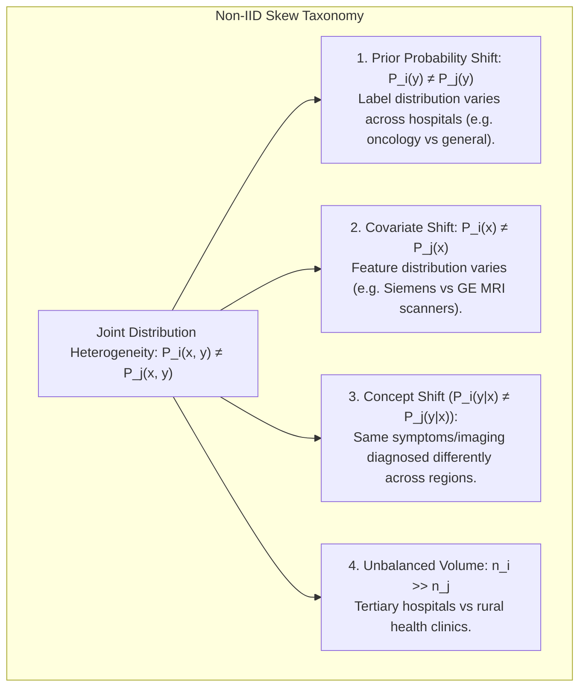
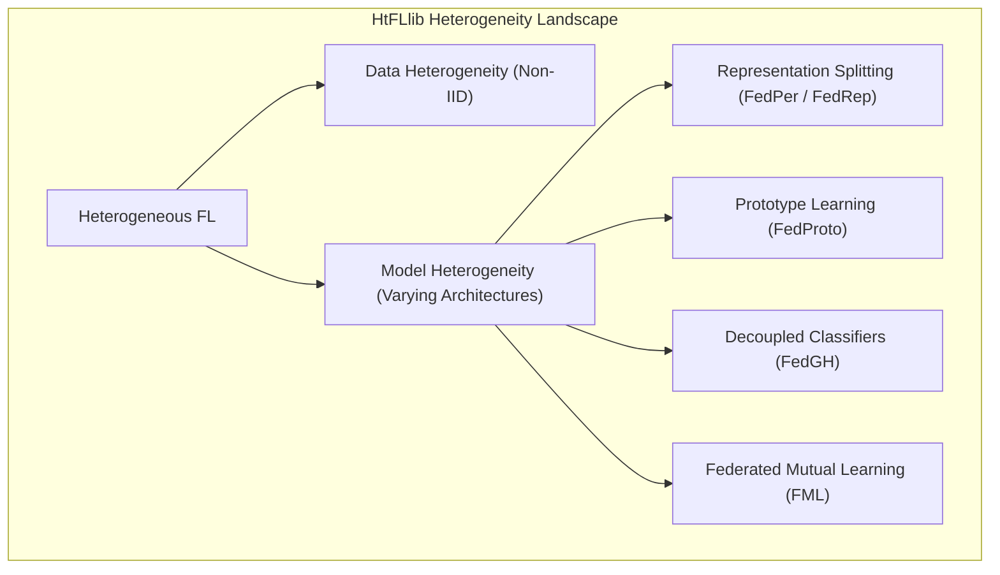
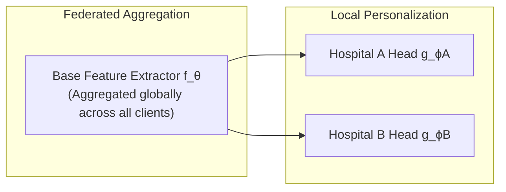
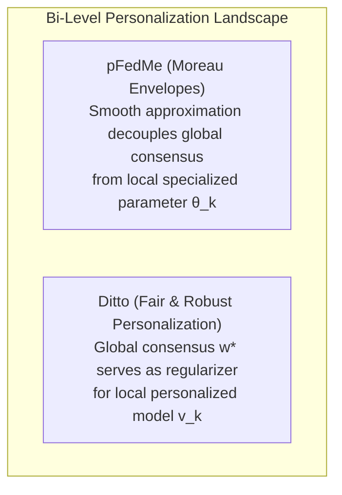
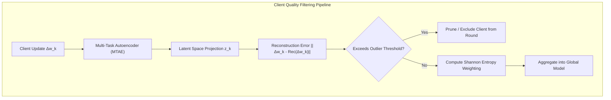

# Federated Learning: Non-IID Skew, Personalization & Quality Filtering
**Conceptual & Theoretical Knowledge Base — Volume V**

---

## 1. Mathematical Taxonomy of Non-IID Skews

In real-world federated deployments, the Independent and Identically Distributed (IID) assumption fails. Let $x \in \mathcal{X}$ denote feature inputs and $y \in \mathcal{Y}$ denote labels. The joint distribution on client $k$ is $P_k(x, y) = P_k(x \mid y) P_k(y) = P_k(y \mid x) P_k(x)$.

### 1.1 Synthetic Non-IID Modeling: The Dirichlet Distribution
To benchmark federated algorithms against controllable statistical heterogeneity, researchers partition dataset classes across clients using a **Dirichlet Distribution** $\text{Dir}(\alpha)$.

**Formulation:** For class $c \in \{1, \dots, C\}$, draw proportion vector $q_c \sim \text{Dir}(\alpha \cdot \mathbf{1}_K)$:
$$p(q_{c, 1}, \dots, q_{c, K}) = \frac{\Gamma(K\alpha)}{\Gamma(\alpha)^K} \prod_{k=1}^K q_{c, k}^{\alpha - 1}$$
* As $\alpha \to \infty$, client distributions converge to identical IID splits.
* As $\alpha \to 0$, each client receives data from strictly one or two classes (extreme non-IID skew).

---

### 1.2 Quantifying Non-IID Heterogeneity: Earth Mover's Distance (EMD)

The **Earth Mover's Distance (EMD)** (Wasserstein-1 metric) quantifies the statistical divergence between client local distributions $P_k$ and the global population distribution $P$:
$$W_1(P_k, P) \triangleq \inf_{\gamma \in \Pi(P_k, P)} \mathbb{E}_{(x, y) \sim \gamma}[\|x - y\|]$$

**The Zhao et al. Weight Divergence Bound:**
Zhao et al. (2018) proved that weight divergence between FedAvg and centralized training is upper-bounded by the EMD of client distributions:
$$\|w_t - w^*\| \le \sum_{k=1}^K p_k \sum_{c=1}^C \|P_k(y=c) - P(y=c)\| \cdot \mathcal{O}(\eta_L \tau)$$
As the Dirichlet parameter $\alpha \to 0$, the EMD increases dramatically, leading directly to weight divergence, gradient cancellation, and severe accuracy loss in standard FedAvg.

---

## 2. The Heterogeneous Federated Learning (HtFLlib) Taxonomy

Beyond data skew, industrial federations encounter **Model Heterogeneity**—participating institutions cannot or will not deploy identical model architectures due to disparate hardware (e.g., Hospital A has 8x H100 GPUs and runs a 70B parameter model, while Hospital B has a single workstation GPU and runs a 7B model).

---

## 3. Personalization Paradigms

When non-IID heterogeneity is severe, a single global consensus model $w^*$ is mathematically incapable of performing optimally on all clients. **Personalized Federated Learning (pFL)** balances shared global knowledge with client-specific adaptation.

### 3.1 Model Splitting: FedPer and FedRep
The neural network is divided into a shared representation base $f_\theta$ and a localized classification head $g_\phi$:
$$f(x; \theta, \phi) = g_\phi(f_\theta(x))$$

* **FedPer (Arivazhagan et al., 2019):** Base parameters $\theta$ are aggregated via FedAvg across rounds. Head parameters $\phi_k$ remain strictly on client $k$ and are trained locally to fit client-specific label skews.
* **FedRep (Collins et al., 2021):** Alternating minimization: clients train private heads $\phi_k$ for $E_\phi$ steps, freeze $\phi_k$, and then train the shared representation base $\theta$ for $E_\theta$ steps before global aggregation.

---

### 3.2 Prototype-Based Personalization: FedProto
Tan et al. (2022) introduced **FedProto** to overcome model architecture heterogeneity.
* Instead of communicating weights $\Delta w$, clients communicate **Class Prototype Vectors** $C^{(c)} \in \mathbb{R}^d$, representing the average feature embedding of class $c$ in the penultimate layer:
  $$C_k^{(c)} = \frac{1}{|\mathcal{D}_{k, c}|} \sum_{x \in \mathcal{D}_{k, c}} f_{\theta_k}(x)$$
* The server averages prototypes for each class across clients: $\bar{C}^{(c)} = \sum_k p_k C_k^{(c)}$.
* Clients train with a dual loss: standard classification cross-entropy plus an Euclidean prototype alignment loss:
  $$\mathcal{L}_{\text{total}} = \mathcal{L}_{\text{CE}}(f(x), y) + \lambda \|f_{\theta_k}(x) - \bar{C}^{(y)}\|_2^2$$
* **Key Advantage:** Clients can have completely different internal backbones (e.g., ResNet, Vision Transformer, ConvNeXt) as long as their penultimate embedding dimension $d$ matches.

---

### 3.3 Decoupled Classifiers (FedGH) & Mutual Distillation (FML)
* **FedGH (Federated Generalized Head):** Reverses FedPer by sharing the classification head globally while keeping the feature extractor local. This prevents feature collapse under label skew by enforcing a shared semantic decision boundary across private feature extractors.
* **Federated Mutual Learning (FML):** Each client holds two models: a shared global model $w$ and a private local model $v_k$. During local training, the two models mutually distill knowledge to each other via Kullback-Leibler (KL) divergence loss:
  $$\mathcal{L}_{\text{local}} = \alpha \mathcal{L}_{\text{CE}}(v_k(x), y) + (1-\alpha) D_{\text{KL}}(v_k(x) \| w(x))$$

---

### 3.4 Bi-Level Optimization for Personalization: pFedMe and Ditto

#### 1. pFedMe (Moreau Envelopes)
Dinh et al. (2020) formulated personalized federated learning using **Moreau Envelopes**:
$$\min_{w \in \mathbb{R}^d} \sum_{k=1}^K p_k \mathcal{M}_{F_k}^\lambda(w), \quad \text{where } \mathcal{M}_{F_k}^\lambda(w) \triangleq \min_{\theta_k \in \mathbb{R}^d} \left[ F_k(\theta_k) + \frac{\lambda}{2} \|\theta_k - w\|^2 \right]$$
The Moreau envelope regularizes non-convex client objectives, producing a smooth surrogate that decouples the global model $w$ from local adapted models $\theta_k$.

#### 2. Ditto: Fair & Robust Personalization
Li et al. (2021) observed that pFL algorithms are often fragile under adversarial attacks. **Ditto** formulates personalization as a bi-level problem:
1. **Global Problem:** Train a standard global model $w^* = \arg\min_w \sum_k p_k F_k(w)$.
2. **Local Personalization Problem:** Concurrently solve a localized regularized objective for each client:
   $$\min_{v_k \in \mathbb{R}^d} h_k(v_k; w^*) \triangleq F_k(v_k) + \frac{\lambda}{2} \|v_k - w^*\|^2$$

* **Byzantine Robustness Guarantee:** Even if malicious clients perturb the global model $w^*$ by adversarial vector $\Delta$, the deviation in client $k$'s personalized model $v_k$ is mathematically bounded by $\frac{\lambda}{\mu + \lambda} \|\Delta\|$. Honest clients retain accurate, localized personal models despite global adversarial corruption.

---

## 4. Client Quality Filtering & Multi-Task Autoencoders (MTAE)

In real-world consortiums, low-quality clients (noisy labels, sensor artifacts, adversarial actors) degrade the global model.

1. **MTAE Outlier Detection:** A multi-task autoencoder compresses client weight update vectors into low-dimensional latent manifolds. Updates whose reconstruction errors exceed a statistical cutoff $\tau = \mu_{\text{rec}} + 2.5 \sigma_{\text{rec}}$ are classified as corrupt and quarantined.
2. **Shannon Entropy Weighting:** Rather than weighting solely by sample size $n_k$, the orchestrator calculates the Shannon entropy $H_k = -\sum_{c} p_{k,c} \log p_{k,c}$ of each client's label distribution, upweighting silos with balanced diversity and downweighting uninformative single-class clients.
