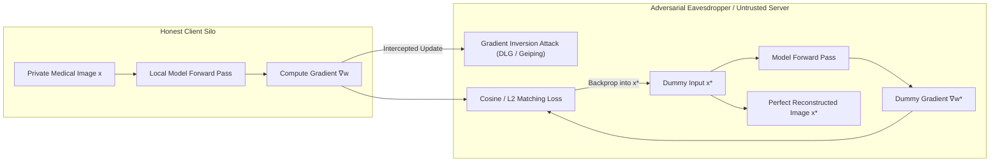
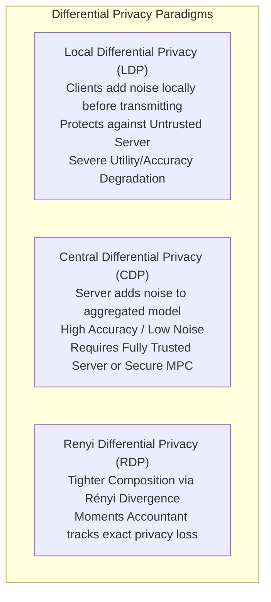
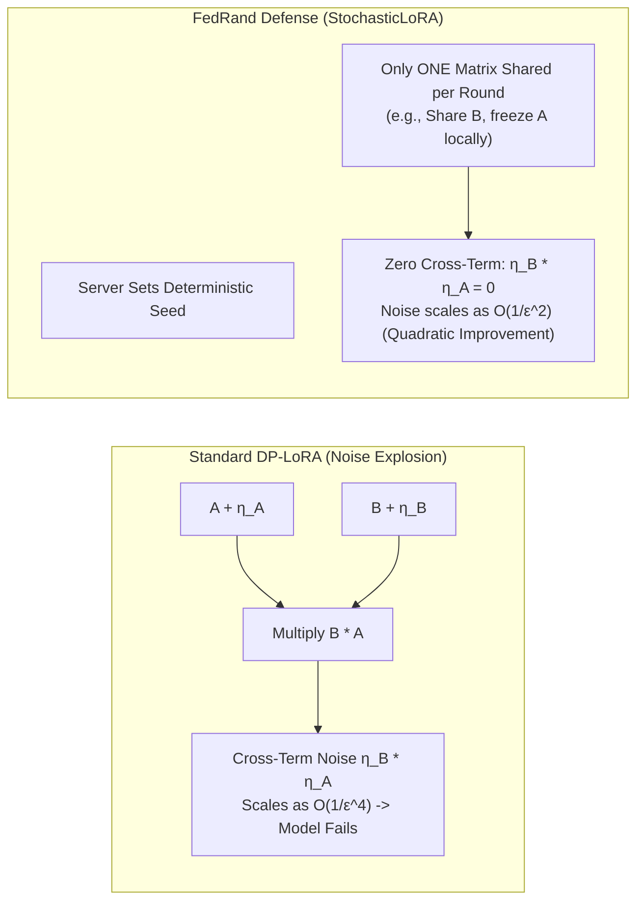
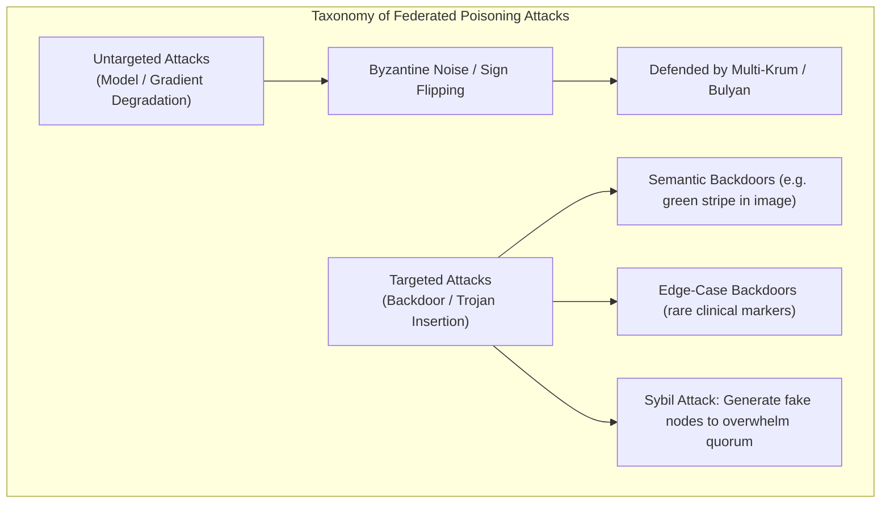

# Federated Learning: Privacy, Security, Attack Vectors & Defenses
**Conceptual & Theoretical Knowledge Base — Volume III**

---

## 1. The Privacy Illusion of Gradient Sharing

Early federated learning literature operated under the foundational assumption that transmitting mathematical gradients or weight deltas $\Delta w$ rather than raw data samples $x$ preserved confidentiality. Research has comprehensively dismantled this assumption: **gradients contain dense, invertible representations of the underlying training data**.

### 1.1 Gradient Inversion vs. Model Inversion Attacks

It is vital to distinguish between two distinct inversion paradigms:

| Characteristic | Gradient Inversion Attacks (GIA) | Model Inversion Attacks |
| :--- | :--- | :--- |
| **Attack Phase** | Occurs **during training** round $t$. | Occurs **post-training on deployed model**. |
| **Adversary Access** | Intercepts transient gradients $\nabla_w \mathcal{L}$ or weight updates $\Delta w$. | Black-box query access or white-box parameters $w_{\text{final}}$. |
| **Reconstruction Target** | **Specific local batch samples** processed in round $t$. | **Class prototypes / feature distributions** memorized by the network. |
| **Mechanisms** | Optimization matching: $\min_{x^*} \|\nabla f(x^*) - \Delta w\|^2$. | Optimization matching: $\max_{x^*} \log P(y_{\text{target}} \mid x^*) - \mathcal{R}(x^*)$. |
| **Key Citations** | DLG (Zhu et al.), Inverting Gradients (Geiping et al.). | Fredrikson et al., He et al. |

---

### 1.2 Mechanics of Gradient Inversion: DLG and Geiping

#### Deep Leakage from Gradients (DLG)
Zhu et al. (2019) formulated gradient inversion as an optimization problem in pixel space:
$$x^*, y^* = \arg\min_{x', y'} \|\nabla_w \ell(f(x'; w), y') - \nabla_w \mathcal{L}(x, y)\|_2^2$$

#### Inverting Gradients (Geiping et al., 2020)
Geiping et al. proved that directional cosine distance is superior to Euclidean distance, as magnitude is sensitive to batch scaling, whereas angular orientation encodes spatial features:
$$x^* = \arg\min_{x'} \left( 1 - \frac{\langle \nabla_w \ell(f(x'; w), y^*), \nabla w \rangle}{\|\nabla_w \ell(f(x'; w), y^*)\| \|\nabla w\|} \right) + \alpha_{\text{TV}} \mathcal{R}_{\text{TV}}(x')$$
Where $\mathcal{R}_{\text{TV}}(x')$ is Total Variation regularization enforcing natural image smoothness:
$$\mathcal{R}_{\text{TV}}(x) = \sum_{i, j} \sqrt{(x_{i+1, j} - x_{i, j})^2 + (x_{i, j+1} - x_{i, j})^2}$$

---

### 1.3 Analytical Label Restoration & Deep Inception Priors

#### 1. Analytical Label Restoration
Before inverting features, an attacker can analytically deduce the ground-truth classification label $c^*$ directly from the gradients of the classification layer without optimization (Zhao et al., 2020).

For cross-entropy loss with softmax activation:
$$\mathcal{L} = -\sum_{i=1}^C y_i \log p_i, \quad p_i = \frac{e^{z_i}}{\sum_j e^{z_j}}$$
The derivative with respect to logit $z_i$ is:
$$\frac{\partial \mathcal{L}}{\partial z_i} = p_i - y_i = \begin{cases} p_i - 1 < 0 & \text{if } i = c^* \text{ (True Class)} \\ p_i > 0 & \text{if } i \neq c^* \text{ (False Classes)} \end{cases}$$
Because $p_i \in (0, 1)$, **the gradient $\partial \mathcal{L}/\partial z_i$ is strictly negative if and only if $i$ is the true class**. The adversary identifies $c^* = \arg\min_i \nabla_{z} \mathcal{L}$ with 100% precision.

#### 2. Deep Inception Priors (Batch Normalization Matching)
Adversaries exploit running mean $\mu_l$ and variance $\sigma_l^2$ cached in Batch Normalization layers to penalize reconstructed features that violate feature distribution statistics:
$$\mathcal{R}_{\text{BN}}(x') = \sum_l \|\mu_l(x') - \mu_l^{\text{cached}}\|_2^2 + \|\sigma_l^2(x') - (\sigma_l^{\text{cached}})^2\|_2^2$$

---

## 2. Differential Privacy in Federated Learning

Differential Privacy (DP) provides mathematically provable protection against reconstruction by injecting calibrated noise.

### 2.1 $(\epsilon, \delta)$-Differential Privacy
A randomized mechanism $\mathcal{M}$ satisfies $(\epsilon, \delta)$-DP if for all neighboring datasets $D \simeq D'$ differing by a single patient record, and all query outcomes $\mathcal{S} \subseteq \text{Range}(\mathcal{M})$:
$$\mathbb{P}[\mathcal{M}(D) \in \mathcal{S}] \le e^\epsilon \mathbb{P}[\mathcal{M}(D') \in \mathcal{S}] + \delta$$

### 2.2 Renyi Differential Privacy (RDP) & The Moments Accountant
Under repeated composition over $T$ communication rounds, standard advanced composition bounds loosen significantly. **Renyi Differential Privacy (RDP)** defines privacy loss using Rényi divergence of order $\alpha > 1$:
$$D_\alpha(P \| Q) \triangleq \frac{1}{\alpha - 1} \ln \int \left( \frac{P(x)^\alpha}{Q(x)^{\alpha - 1}} \right) dx$$

For a subsampled Gaussian mechanism with sampling ratio $q = |S|/K$ and noise multiplier $\sigma$, the **Moments Accountant** computes cumulative privacy loss:
$$\alpha_{\mathcal{M}}(\lambda) \le T \cdot \mathcal{O}\left( \frac{q^2 \lambda^2}{\sigma^2} \right)$$
Converting back to $(\epsilon, \delta)$-DP via:
$$\epsilon = \min_{\alpha > 1} \left\{ D_\alpha + \frac{\ln(1/\delta)}{\alpha - 1} \right\}$$

---

## 3. LoRA DP Noise Amplification & The FedRand Defense

When Parameter-Efficient Fine-Tuning (PEFT) via Low-Rank Adaptation (LoRA) is combined with Differential Privacy, standard implementations suffer a disastrous theoretical failure: **Noise Amplification**.

### 3.1 Theorem 1: Standard DP-LoRA Product Perturbation Noise Amplification
In standard LoRA, the forward weight update is $\Delta W = B \cdot A$, where $B \in \mathbb{R}^{d \times r}$ and $A \in \mathbb{R}^{r \times k}$.
When applying Gaussian DP noise to matrices $A$ and $B$:
$$\widetilde{A} = A + \eta_A, \quad \widetilde{B} = B + \eta_B, \quad \text{where } \eta_A \sim \mathcal{N}(0, \sigma_A^2 I), \; \eta_B \sim \mathcal{N}(0, \sigma_B^2 I)$$

Expanding the reconstructed weight product:
$$\Delta \widetilde{W} = \widetilde{B} \widetilde{A} = (B + \eta_B)(A + \eta_A) = \underbrace{BA}_{\text{Signal}} + \underbrace{B\eta_A + \eta_B A}_{\text{Linear Noise } \mathcal{O}(1/\epsilon^2)} + \underbrace{\eta_B \eta_A}_{\text{Cross-Term Noise } \mathcal{O}(1/\epsilon^4)}$$

* **Theoretical Consequence:** The interaction term $\eta_B \eta_A$ produces a variance scaling as $\mathcal{O}(1/\epsilon^4)$. For strict privacy budgets ($\epsilon < 1$), this noise explodes, completely destroying model convergence.

---

### 3.2 Theorem 2: The FedRand (StochasticLoRA) Quadratic Improvement
FedRand eliminates the cross-term by sharing only **one** decomposed matrix per round (or alternating $A$ and $B$ stochastically under shared pseudo-random seeds):
$$\Delta \widetilde{W}_{\text{FedRand}} = B \cdot (A + \eta_A) = BA + B \eta_A$$
Since $\eta_B = 0$, the quadratic cross-term $\eta_B \eta_A \equiv 0$. The total variance scales as $\mathcal{O}(1/\epsilon^2)$, yielding a **quadratic reduction in noise magnitude** and enabling stable convergence under rigorous differential privacy.

---

### 3.3 Theorem 3: Underdetermined GIA Defense via FedRand
In FedRand, an adversary attempting gradient inversion observes only one low-rank projection $B_t$ or $A_t$. 
The adversary faces the inverse problem:
$$\arg\min_x \| \nabla_{A} \ell(f(x; W + BA), y) - \Delta A \|_2^2$$
Because rank $r \ll \min(d, k)$, the mapping from input space $\mathbb{R}^d$ to low-rank gradient space $\mathbb{R}^{r \times k}$ has a non-trivial null space of dimension $d - r$.
* **Theoretical Guarantee:** There exist infinitely many candidate inputs $x' \in \text{Null}(\nabla_A)$ producing identical gradients. Gradient inversion is mathematically **underdetermined**, guaranteeing that the true input cannot be uniquely reconstructed.

---

## 4. Poisoning Attacks: Backdoors and Sybil Attacks

### 4.1 Model Replacement Backdoor Attacks
In a targeted backdoor attack, malicious clients train models to output an adversary-selected class $y_{\text{target}}$ whenever a trigger $\tau$ is present, while behaving normally on clean inputs:
$$f(x \oplus \tau; w) = y_{\text{target}}, \quad f(x; w) = y_{\text{clean}}$$

To overcome the dilution effect of federated averaging, Bagdasaryan et al. (2020) formulated the **Model Replacement Attack**:
$$\Delta w_{\text{adv}} = \frac{1}{\eta_g p_m} (w_{\text{target}} - w_t) + w_t$$
When the server executes FedAvg:
$$w_{t+1} = w_t + \sum_{k \neq m} p_k \Delta w_k + p_m \left( \frac{1}{p_m}(w_{\text{target}} - w_t) \right) \approx w_{\text{target}}$$
The malicious client cancels out the updates of all honest participants in a single round.

---

### 4.2 Sybil Attacks in Federated Learning
* **Threat Mechanism:** In open or cross-device federated networks, an adversary creates multiple fake identities (Sybils).
* **Byzantine Quorum Failure:** Standard Byzantine defenses (Multi-Krum, Bulyan) assume the fraction of Byzantine clients satisfies $f < n/3$ or $f < n/2$. By injecting $M \gg f$ colluding Sybils, the adversary outnumbers honest participants. The Byzantine-robust aggregation selects the Sybils' malicious updates as the legitimate geometric center.
* **Mitigation:**
  1. Cryptographic client attestation via Trusted Platform Modules (TPM) or hardware secure enclaves (Intel SGX).
  2. Proof-of-Stake or historical contribution reputation scoring.
  3. Spectral anomaly detection on client update trajectories over multiple rounds.
