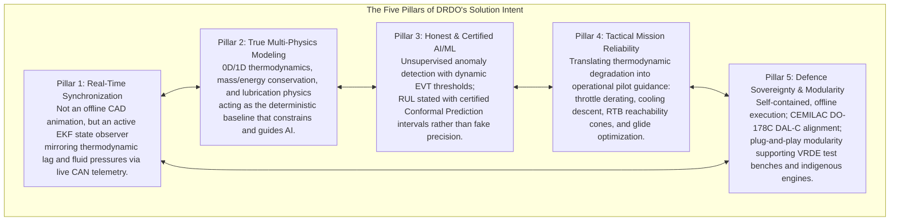

# Master DRDO Intent Synthesis & Architectural Navigation Portal
**Comprehensive Research on the Engineering Intent Behind DRDO Problem Statement 26054**
*AI-Enabled Real-Time Digital Twin System for Health Monitoring, Fault Prediction and Mission Reliability Enhancement of Aero Piston Engines used in MALE UAVs*

---

## 1. Executive Synthesis: The Reverse-Engineered Engineering Intent

By analyzing every word, requirement, physical constraint, and institutional context in DRDO Problem Statement 26054, this research establishes the **definitive answer to how DRDO expects this problem to be solved**:

---

## 2. Master Directory of Intent Research Volumes

The complete research is organized into seven modular, deeply interconnected volumes located in [`final_touch/`](file:///e:/backup-llm/backup-no-llm/3d_engine/final_touch) and [`final touch/`](file:///e:/backup-llm/backup-no-llm/3d_engine/final%20touch):

| Volume | Title & Clickable Link | Core Focus & Reverse-Engineered Insights |
| :--- | :--- | :--- |
| **Intent Volume I** | [PS Deconstruction, Semantics & Master Solution Matrix](file:///e:/backup-llm/backup-no-llm/3d_engine/final_touch/DRDO_INTENT_PS_DECONSTRUCTION_AND_SEMANTICS.md) | Word-by-word reverse-engineering of DRDO's terminology; why DRDO selected specific terms over simpler alternatives; explicit evidentiary labeling; **comprehensive 24-row central matrix** mapping every PS clause to engineering meaning, expected capability, candidate technology, validation method, and unknowns. |
| **Intent Volume II** | [End-to-End System Architecture, Real-Time & Modularity](file:///e:/backup-llm/backup-no-llm/3d_engine/final_touch/DRDO_INTENT_END_TO_END_SYSTEM_RECONSTRUCTION.md) | Reconstructed 7-layer end-to-end architecture (Sensors $\to$ Edge $\to$ Datalink $\to$ Twin Core $\to$ AI Analytics $\to$ GCS $\to$ Fleet); block-by-block engineering specifications; architectural convergence proof (why Hybrid Physics+AI is the only viable paradigm); end-to-end latency budget breakdown (170 ms total); modular class structure supporting Rotax 914, 915 iS, and VRDE Jayem 2.2L engines. |
| **Intent Volume III** | [Physics-AI Coupling Engine & RUL Feasibility](file:///e:/backup-llm/backup-no-llm/3d_engine/final_touch/DRDO_INTENT_PHYSICS_AND_AI_HYBRID_COUPLING.md) | The mathematical coupling of physics and AI; thermodynamic residual generation pipeline ($\Delta EGT, \Delta CHT, \Delta P_{\text{oil}}$); analytical parity space separating sensor drift from real engine failure; brutal aviation data reality check on RUL estimation under data scarcity; Paris-Erdogan damage kinetics and Wiener drift processes. |
| **Intent Volume IV** | [Health Monitoring Parameters & Diagnostic Spectrum](file:///e:/backup-llm/backup-no-llm/3d_engine/final_touch/DRDO_INTENT_HEALTH_MONITORING_AND_PARAM_CORRELATION.md) | Exhaustive parameter-by-parameter analysis across all 9 mandated streams (RPM, CHT 1–4, EGT 1–4, Oil P/T, Fuel Flow, Vibration, Battery/Alt, Timing); multi-dimensional cross-parameter correlation matrix; disambiguation of the diagnostic spectrum (Detection $\neq$ Diagnosis $\neq$ Prediction $\neq$ Prognosis $\neq$ Mitigation). |
| **Intent Volume V** | [Mission Reliability Enhancement, Replay & GCS](file:///e:/backup-llm/backup-no-llm/3d_engine/final_touch/DRDO_INTENT_MISSION_RELIABILITY_REPLAY_AND_GCS.md) | Engineering definition of mission reliability enhancement; tactical decision support (throttle derating, cooling descent, RTB vs divert reachability footprints); full-fidelity multi-stream mission replay architecture; dual-role GCS HMI (Tactical Pilot vs Propulsion Engineer); 3-phase deployment pipeline (VRDE Test Rig $\to$ Flight Line $\to$ Central Fleet Depot). |
| **Intent Volume VI** | [Defence-Grade Engineering, Certification & Data](file:///e:/backup-llm/backup-no-llm/3d_engine/final_touch/DRDO_INTENT_DEFENCE_GRADE_CERTIFICATION_AND_EVIDENCE.md) | The 6 invariants of defence-grade aerospace software; CEMILAC airworthiness certification and DO-178C DAL-C allocation; EASA AI Concept Paper Level 1 Run-Time Monitor framework; 5-stage prototype-to-deployment spectrum; what can honestly be claimed vs what cannot under classified data realities. |
| **Intent Volume VII** | [Credibility Engineering, Red-Team & Gap Analysis](file:///e:/backup-llm/backup-no-llm/3d_engine/final_touch/DRDO_INTENT_CREDIBILITY_REDTEAM_AND_PROJECT_GAP_ANALYSIS.md) | Analysis of the 10 superficial hackathon traps; 5 pillars of engineering credibility; red-team attack on the expected solution (and mitigations); **uncompromising gap analysis against our current codebase (`3d_engine`)**, identifying satisfied components (multi-engine CAD, SocketCAN, OSA-CBM), over-engineered aspects (camera transitions), and actionable roadmaps to close critical gaps. |
| **Master Portal** | [Master DRDO Expected Solution Synthesis](file:///e:/backup-llm/backup-no-llm/3d_engine/final_touch/MASTER_DRDO_EXPECTED_SOLUTION_SYNTHESIS.md) | Executive portal unifying all research dimensions into a coherent reference framework. |

---

## 3. The Decisive Takeaway: What Distinguishes a Winning Solution?

The difference between a superficial project and the solution DRDO is actually seeking can be summarized in three core principles:

1. **A Digital Twin is a State Observer, Not a 3D Animation**: A spinning 3D engine is visually appealing, but useless to an airworthiness certifier unless it mirrors unmeasured thermodynamic temperatures, internal fluid pressures, and mechanical wear states in real time.
2. **Physics Must Anchor AI**: Pure deep learning fails in military aviation due to extreme data scarcity and lack of certified bounds. The winning architecture uses first-principles thermodynamics to establish healthy baselines and normalize flight envelopes, letting AI focus on detecting multi-sensor residual anomalies.
3. **Actionable Mission Value Over Raw Data**: An operator in a GCS does not have time to decode raw tensor anomaly scores during a tactical crisis. The system must translate engine health into clear, prescriptive tactical actions: *derate throttle to 82%, initiate cooling descent to 14,000 ft, or divert to alternate airstrip within 45 minutes*.
