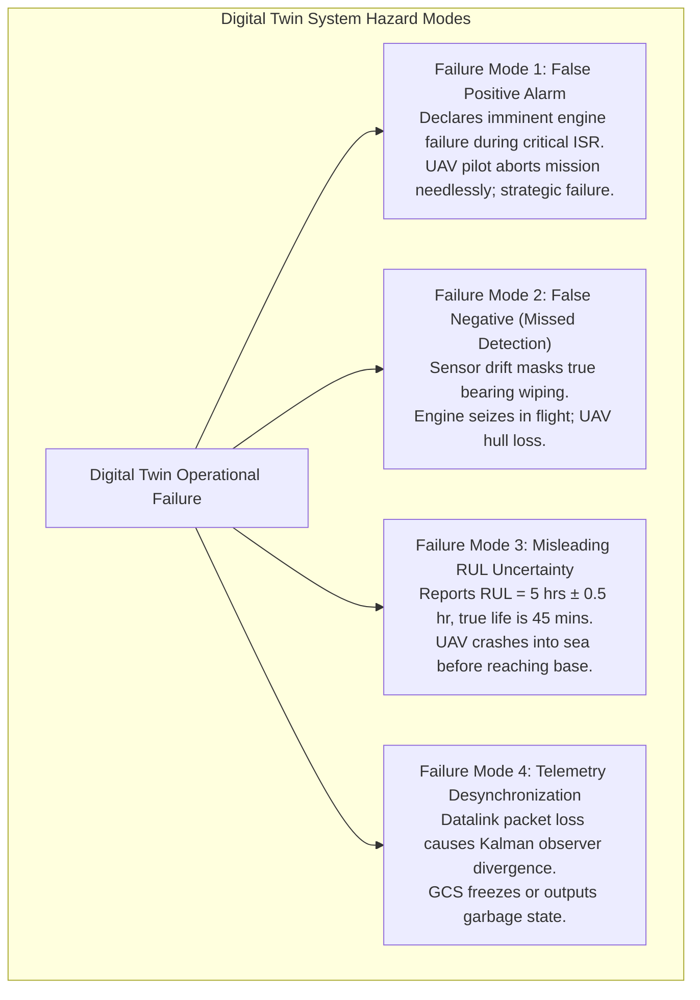
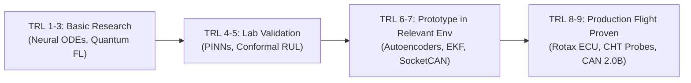
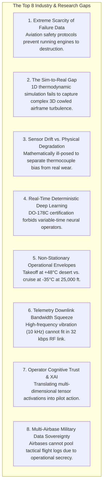

# Volume IX: Red-Team Review, Gaps, Benchmarking & Evidence Base
**Failure Analysis of the Digital Twin, Technology Readiness, Evidentiary Audit & Unknowns**

---

## 1. Red-Team Engineering Review: "What Could Go Wrong?"

A rigorous engineering investigation must subject the proposed solution to an adversarial "Red-Team" audit: **assuming the Digital Twin is deployed on an operational MALE UAV, how could the system fail, cause operational harm, or lead to catastrophic asset loss?**

### 1.1 Detailed Red-Team Vulnerability Audit

| Digital Twin Failure Mode | Trigger Mechanism | Consequence to UAV / Mission | Mitigation & Architectural Defense |
| :--- | :--- | :--- | :--- |
| **Thermocouple Detachment interpreted as Engine Fire / Explosion** | A CHT thermocouple cable fatigues and snaps, causing the ADC to read open-circuit rail voltage ($> 1,200^\circ\text{C}$). | Naive threshold system triggers immediate fire bell; pilot executes panic shutoff, causing uncommanded glide landing. | **Analytical Parity Space Observer**: Digital twin cross-checks with adjacent cylinder CHTs and coolant temperature. If only one channel spikes instantaneously ($\frac{dT}{dt} > 100^\circ\text{C/sec}$) while coolant and oil are normal, the sensor is quarantined as an open-circuit failure. |
| **Subtle Progressive Bearing Wear Masked by AI Autoencoder** | As bearing spalls, high-frequency vibration gradually rises over 20 flight hours; an online-adaptive autoencoder slowly incorporates the fault into its "normal" baseline. | The autoencoder never flags an anomaly because it continuously retrained on degraded data; engine throws a rod. | **Frozen Baseline Policy**: The core nominal autoencoder weights are **never updated online during flight**. Adaptation is restricted to certified offline depot retrainings with human engineering sign-off. |
| **False Positive Alarm During Combat Maneuver** | UAV pilot executes maximum-power climb and high-g turn to evade hostile threat; dynamic flight states fall outside calm training envelope. | Anomaly detector flags high anomaly score, flooding GCS screen with warnings during high-stress tactical moment. | **Flight-Phase Gated Detection**: Machine learning thresholds are dynamically scaled based on flight phase (Takeoff vs. Cruise vs. Tactical Maneuver), utilizing Extreme Value Theory (POT). |
| **Telemetry Dropouts Causing Kalman Filter Divergence** | Hostile electronic jamming causes 15 seconds of missing CAN telemetry downlink. | State estimator covariance $\mathbf{P}$ explodes; when telemetry resumes, numerical instability crashes the GCS twin software. | **Bounded Covariance Limiting & Dead-Reckoning**: When telemetry drops, the digital twin operates in open-loop simulation mode, freezing covariance growth and smoothly re-converging via a fading-memory filter upon signal re-acquisition. |
| **Memory Leak in GCS Dashboard During 36-Hour Sortie** | JavaScript or C++ UI framework fails to garbage-collect historical telemetry points over a continuous 36-hour mission. | GCS workstation runs out of RAM after 28 hours, freezing operator screens during final approach and landing. | **Zero-Allocation Architecture**: Fixed-size circular ring buffers; strict adherence to DO-178C guidelines prohibiting runtime heap allocations (`malloc`/`new`). |

---

## 2. Technology Readiness Level (TRL) Breakdown

Every technology component in Problem Statement 26054 must be honestly assessed on the standard aerospace **TRL 1 through TRL 9** scale:

| Subsystem / Technology Component | Current TRL | Maturity Classification | Primary Technical Barrier to Flight Deployment |
| :--- | :--- | :--- | :--- |
| **CAN Bus / SocketCAN Ingestion** | **TRL 9** | Flight Proven / Off-the-Shelf | None. Standard protocol across commercial and military avionics. |
| **Thermocouple / Pressure Transducers** | **TRL 9** | Flight Proven / Standard | Sensor degradation in high-vibration exhaust environments. |
| **0D/1D Mean Value Engine Physics Model** | **TRL 7** | System Prototype Demonstrated | Requires precise thermodynamic calibration maps for specific engine variants. |
| **Extended Kalman Filter (EKF) Observer** | **TRL 7** | High Maturity in Aerospace | Non-linearities during severe turbocharger compressor surge. |
| **Unsupervised Autoencoder Anomaly Detection**| **TRL 6** | Validated in Relevant Environment | False alarm suppression under rare weather / turbulent flight conditions. |
| **Physics-Informed Neural Networks (PINNs)** | **TRL 5** | Laboratory Validated | Computational training overhead; real-time inference optimization on edge. |
| **Conformal Prediction RUL Bounds** | **TRL 4** | Research / Component Validation | Lack of real-world run-to-failure aviation datasets for rigorous calibration. |
| **Hardware-in-the-Loop (HIL) Testbench** | **TRL 8** | System Qualified | High cost of dedicated real-time simulator hardware (dSPACE, Opal-RT). |
| **Tactical GCS Web-Based Visualization** | **TRL 7** | System Prototype Demonstrated | Memory leakage and determinism over multi-day continuous missions. |
| **Fleet-Level Federated Learning** | **TRL 4** | Research / Proof-of-Concept | Secure cross-airbase military datalinks and institutional communication protocols. |

---

## 3. Current Industry & Research Gaps

The global aerospace industry and academic research face eight unresolved technical challenges in deploying digital twins for aero-piston engines:

---

## 4. Algorithmic Benchmarking Matrix

| Feature / Dimension | Pure Physics-Based Model | Pure Data-Driven AI/ML | Proposed Hybrid Digital Twin (Physics + AI) |
| :--- | :--- | :--- | :--- |
| **Governing Principle** | First principles (Mass, momentum, energy conservation). | Statistical pattern recognition and deep learning. | Physics observer as baseline; AI learns residual discrepancies. |
| **Training Data Requirement** | Very Low (Requires physical dimensions and dyno maps). | Massive (Requires thousands of hours of labeled data). | Moderate (Calibrated on modest healthy data + synthetic HIL). |
| **Generalization Capability** | High (Extrapolates well across flight envelopes). | Poor (Fails completely outside training distribution). | **Very High** (Physics bounds constrain extrapolation). |
| **Unmodeled Dynamics Tracking**| Very Poor (Rigid equations ignore mechanical wear). | High (Captures subtle multi-variable correlations). | **High** (AI residual captures wear without violating physics). |
| **Computational Overhead** | Low to Moderate (Real-time ODE integration). | Low to High (Depends on neural architecture). | Moderate (Optimized INT8 runtime + lightweight EKF). |
| **Explainability to Pilot** | 100% Transparent (Direct physical state variables). | Opaque / Black-Box (Abstract tensor weights). | **High** (SHAP attribution tied to physical thermodynamic states). |
| **DO-178C Certifiability** | High (Deterministic mathematics). | Extremely Difficult (Non-deterministic, data-dependent).| **High** (Certified via Run-Time Monitor architecture). |
| **Early Fault Detection** | Moderate (Requires significant thermodynamic deviation). | Very High (Detects subtle micro-correlations). | **Superior** (Combines statistical sensitivity with physical validation). |
| **RUL Uncertainty Bounds** | Heuristic / Rule-based. | Overconfident point estimates. | **Mathematically Guaranteed** (Conformal Prediction intervals). |

---

## 5. Technology Compatibility & Licensing Analysis

| Software / Protocol Layer | Candidate Technology | Licensing Model | Defence / Aerospace Suitability | Strategic / Supply Chain Risk |
| :--- | :--- | :--- | :--- | :--- |
| **OS / Kernel** | Linux PREEMPT_RT / Yocto Linux | Open Source (GPLv2) | **High** (Widely used in military GCS; provides deterministic latency). | None. Complete sovereign source code ownership. |
| **CAN Subsystem** | Linux SocketCAN (`cantools`) | Open Source (LGPL / MIT) | **High** (Kernel-native, zero-copy, highly stable). | None. Universal industry standard. |
| **Neural Runtime** | ONNX Runtime / TensorRT | MIT / Proprietary NVIDIA | **High** (Optimized for edge GPUs; zero runtime licensing fees). | NVIDIA GPU hardware lock-in; mitigated by ONNX portability. |
| **Message Broker** | Eclipse Zenoh / DDS (CycloneDDS) | Open Source (Apache 2.0 / EPL) | **High** (STANAG compliant, high throughput, low memory footprint). | None. Compatible with Indian military communications. |
| **Time-Series Database** | TimescaleDB / InfluxDB | Open Source (Apache 2.0 / BSL) | **High** (Excellent for 36-hour multi-sensor telemetry archiving). | Ensure Apache 2.0 licensed core to avoid commercial lock-in. |
| **UI Framework** | React / WebGL / Qt Aerospace | Open Source (MIT / LGPLv3) | **High** (Cross-platform; runs on ruggedized military GCS laptops). | LGPL requires dynamic linking if proprietary binary is shipped. |

---

## 6. Evidentiary Audit & Unknowns Requiring DRDO Confirmation

To maintain scientific integrity, all claims in this knowledge base are classified into five strict evidentiary tiers:
* **[Confirmed]**: Formally stated in DRDO PS 26054 documentation.
* **[Strong Evidence]**: Established in published peer-reviewed aerospace literature (AIAA, IEEE, SAE, NASA).
* **[Plausible]**: Technically sound engineering extrapolation, but platform-specific data is unverified.
* **[Unknown]**: Classified, proprietary, or unpublished DRDO operational information.
* **[Assumption]**: Explicit working assumption required for software and system design.

### 6.1 Dedicated Section: Unknowns Requiring DRDO / Domain Expert Confirmation

The following critical engineering parameters cannot be determined from public sources and must be clarified by DRDO / ADE / VRDE domain specialists:

1. **Exact Engine Model Selection**:
   - *Status*: **[Unknown]**
   - *Question*: Is the system targeting the **Rotax 914 F** (carbureted, TCU boost control) or the **Rotax 915 iS** (full FADEC, dual electronic fuel injection), or the indigenous **VRDE ABHAY** engine on the TAPAS-BH-201 and Archer-NG production airframes?
2. **Proprietary ECU CAN Bus DBC Specification**:
   - *Status*: **[Unknown]**
   - *Question*: Does DRDO possess the unencrypted CAN message database (DBC file) for the engine ECU, including raw scaling factors, byte offsets, and manufacturer diagnostic registers?
3. **Telemetry Downlink Bandwidth Budget**:
   - *Status*: **[Unknown]**
   - *Question*: What is the precise bandwidth allocated for engine health telemetry over the tactical C-band / SATCOM datalink on Indian military MALE UAVs (e.g., 9.6 kbps, 32 kbps, or higher)?
4. **CEMILAC Target Design Assurance Level (DAL)**:
   - *Status*: **[Unknown]**
   - *Question*: Has CEMILAC classified the GCS-based digital twin as **DAL-D** (advisory maintenance tool) or **DAL-C** (primary pilot safety display), and is there an intention to integrate closed-loop throttle override into the Flight Control Computer (which would mandate **DAL-B**)?
5. **VRDE Dyno Test Cell Telemetry Access**:
   - *Status*: **[Unknown]**
   - *Question*: Will teams be provided with raw time-series datasets from the VRDE engine dynamometer test benches, including seeded misfire, cooling throttling, and lubrication degradation experiments?
