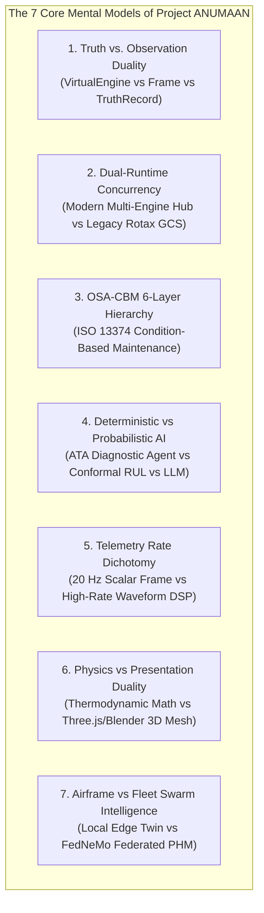
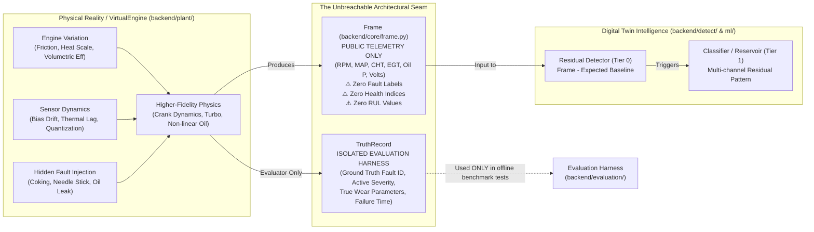
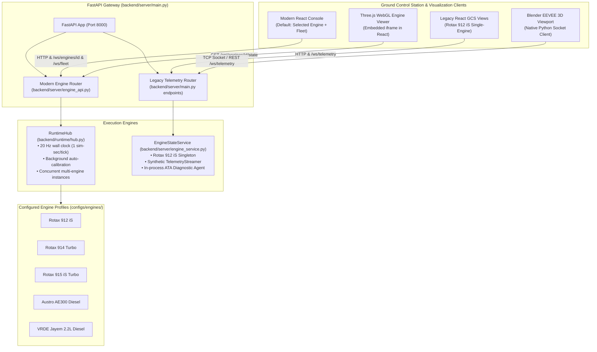
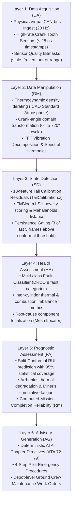
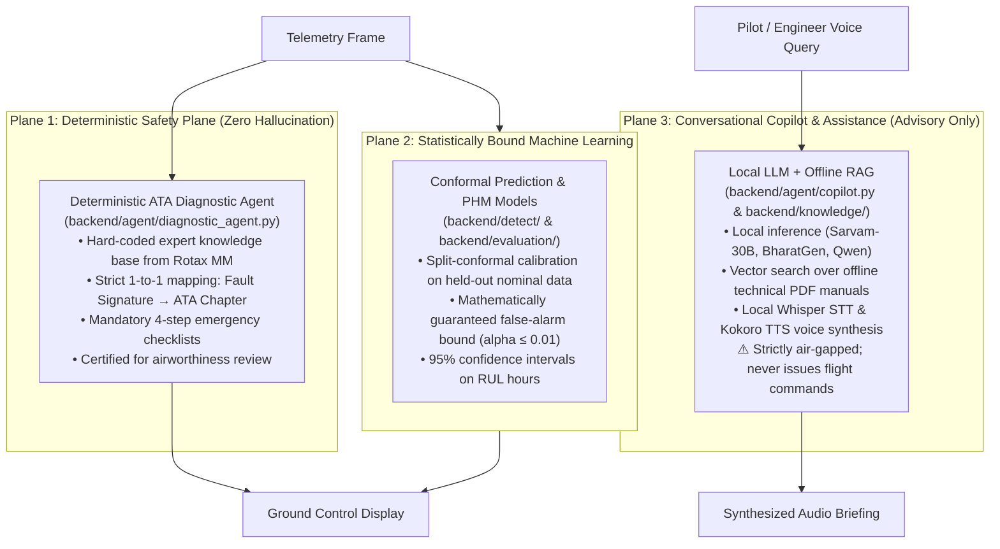
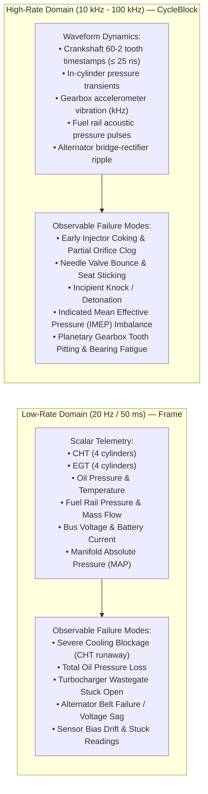
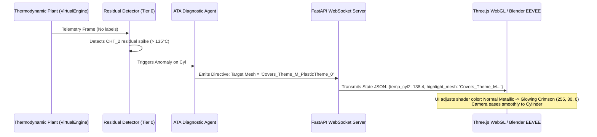

# ANUMAAN — System Architecture & Core Mental Models
**DRDO / SIH Problem Statement ID: 26054**
*AI-Enabled Real-Time Digital Twin System for Health Monitoring, Fault Prediction and Mission Reliability Enhancement of Aero Piston Engines used in MALE UAVs*

---

## Part I: The Seven Fundamental Mental Models

To understand, debug, or extend the ANUMAAN codebase, an engineer or researcher must abandon naive assumptions about "digital twins" and reason through the following seven core mental models:



---

### Mental Model 1: The Truth vs. Observation Duality (`VirtualEngine` vs. `Frame` vs. `TruthRecord`)

In flawed digital twin architectures, the "simulated sensor values" are generated by taking the twin's own internal mathematical equations, adding Gaussian white noise, and adding an artificial offset when a fault is toggled. When the digital twin evaluates the incoming telemetry, it compares the data against the exact same equations that created it. Under such an arrangement, the residual is always identically zero (plus noise), any simple threshold detects the fault, and reported accuracy figures are completely deceptive.

**In ANUMAAN, this problem is solved by establishing an unbreachable wall between Plant and Twin:**



#### Key Architectural Invariants:
1. **Model Mismatch is Real:** Because `VirtualEngine` includes manufacturing tolerances, thermal inertia, and sensor lag that the twin's observer model does not know, the nominal residuals are **non-zero and structured**.
2. **Zero Label Leakage:** The `Frame` contract strictly forbids passing `FAULT_ID`, `HEALTH_INDEX`, or `RUL_HOURS`. The detector must infer anomalies purely from sensor residuals without prior knowledge.
3. **`TruthRecord` Isolation:** The ground truth is written to a distinct stream accessible solely by the automated test suite in `tests/` and benchmarks in `backend/evaluation/`.

---

### Mental Model 2: The Concurrent Dual-Runtime Architecture

The ANUMAAN backend hosts two distinct, parallel operational runtime stacks within the same FastAPI process. Understanding which pipeline serves which consumer is essential:



#### Runtime Comparison:
| Attribute | Modern Multi-Engine Runtime | Legacy Ground-Control Stack |
|---|---|---|
| **Entry Point** | `backend/server/engine_api.py` | `backend/server/main.py` + `engine_service.py` |
| **Engine Support** | Multi-engine (Rotax 912/914/915, Austro AE300, VRDE Jayem) | Rotax 912 iS only |
| **Clock Model** | Accelerated (20 ticks/sec, each tick = 1 sim-sec) | Real-time 20 Hz wall-clock streamer |
| **Detection Scheme**| Tier 0 `ResidualDetector` + Tier 1 `Reservoir` | Heuristic rules + Multi-class neural network |
| **Primary Client** | React `EngineRuntimeConsole` (default UI) | Legacy GCS role views & Blender desktop app |

---

### Mental Model 3: The OSA-CBM / ISO 13374 Six-Layer Architecture

ANUMAAN is architected directly against the international standard for Condition-Based Maintenance (**ISO 13374 / OSA-CBM**), mapped across six logical processing layers (`backend/osacbm.py`):



---

### Mental Model 4: Deterministic Safety vs. Probabilistic Reasoning vs. RAG Copilot

A cornerstone design decision in ANUMAAN is the strict separation between safety-critical avionics logic and probabilistic artificial intelligence:



---

### Mental Model 5: Telemetry Rate Dichotomy (Scalar 20 Hz vs. High-Rate Waveform DSP)

Engine physical degradation manifests across two distinct temporal scales. A diagnostic system that only reads scalar telemetry is blind to combustion dynamics, while a system that only processes waveforms drowns in computational complexity:



---

### Mental Model 6: Presentation vs. Physics Duality

The 3D engines in ANUMAAN (Blender EEVEE and Three.js WebGL) are visualization interfaces, not physics solvers:



---

### Mental Model 7: Single-Airframe Twin vs. Squadron Swarm Fleet Intelligence (`FedNeMo`)

Project ANUMAAN is designed not merely for a single prototype UAV on a testbench, but for operational squadrons of Medium Altitude Long Endurance UAVs (e.g. TAPAS-BH-201 / Rustom-II fleet) deployed across dispersed military bases:

```mermaid
graph TB
    subgraph Airbase1["Forward Operating Base Alpha (Ladakh Sector)"]
        UAV1["UAV Tail #01 (TAPAS-BH-201)<br/>Rotax 912 iS Engine"]
        UAV2["UAV Tail #02 (TAPAS-BH-201)<br/>Rotax 914 Turbo"]
        LocalClient1["FedNeMo Local Client<br/>• Reads sortie telemetry<br/>• Local gradient update<br/>• Differential Privacy (DP) Noise Addition<br/>• 8-bit Model Quantization"]
        UAV1 --> LocalClient1
        UAV2 --> LocalClient1
    end

    subgraph Airbase2["Forward Operating Base Bravo (South Sector)"]
        UAV3["UAV Tail #03 (TAPAS-BH-201)<br/>Austro AE300 Diesel"]
        LocalClient2["FedNeMo Local Client<br/>• Reads sortie telemetry<br/>• Local gradient update<br/>• Differential Privacy (DP) Noise Addition<br/>• 8-bit Model Quantization"]
        UAV3 --> LocalClient2
    end

    subgraph CentralHQ["DRDO Defense Command Cloud / Air Headquarters"]
        FedAgg["FedNeMo Central Orchestrator<br/>(FedAvg / FedProx Aggregator)<br/>• Aggregates encrypted gradients<br/>• Updates master fleet diagnostic weights<br/>• Verifies convergence without seeing raw sortie data"]
    end

    LocalClient1 -->|Encrypted Gradient Vectors Only<br/>(No GPS, No Flight Paths, No Raw Telemetry)| FedAgg
    LocalClient2 -->|Encrypted Gradient Vectors Only<br/>(No GPS, No Flight Paths, No Raw Telemetry)| FedAgg
    FedAgg -->|Downlink Updated Global Model Weights| LocalClient1
    FedAgg -->|Downlink Updated Global Model Weights| LocalClient2
```
